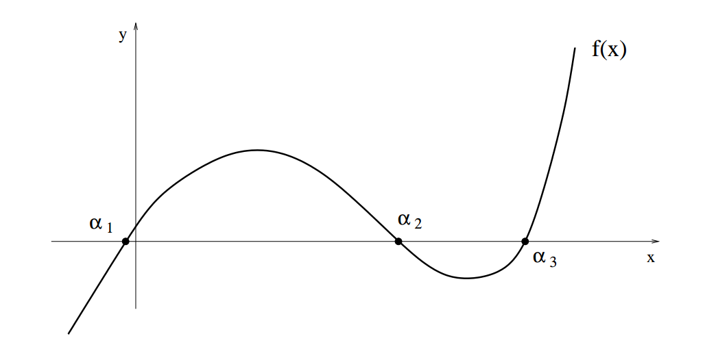
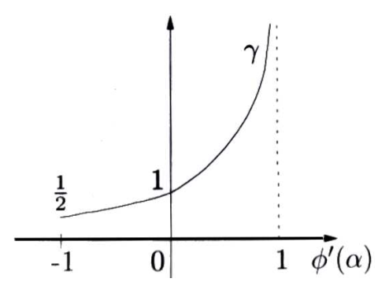

## Nonlinear equations

We may want to find the roots of scalar (or vector) non-linear functions, so find $\alpha \in \mathbb R$ s.t. $f(\alpha)=0$, in a computational way. Most common approaches are *iterative*, since there is no explicit solving formula for $p \in \mathbb R^n$ with $n \ge 5$ for Abel's theorem.

### Bisection method (Linear convergence)

This method is used to compute the root of a *continuous* function $f$ on $[a, b]$, i.e., the point $α$ such that $f(α) = 0$. We assume that $f: [a, b] \rightarrow \mathbb{R}$ and $a < b$. If $f(a)f(b) < 0$, since $f$ is continuous, we know that there exists (at least) one root $α$ of $f$ in the interval $[a, b]$, thanks to the following

**Property** (Theorem of zeros for continuous functions)**.** *Given a continuous function $f: [a, b] \to \mathbb R$, such that $f (a)f (b) < 0$, then $\exist \alpha \in (a, b)$ such that $f(\alpha) = 0$.*

Starting from $I^{(0)} = [a, b]$, the **bisection method** generates a sequence of subintervals $I^{(k)} = [a^{(k)}, b^{(k)}]$, $k \ge 0$, with $I^{(k)} \subset I^{(k-1)}$, $k \ge 1$, and enjoys the property that $f(a^{(k)}) f(b^{(k)}) < 0$. Precisely,

1. set $a^{(0)} = a$, $b^{(0)} = b$ and $x^{(0)} = \frac{a^{(0)} + b^{(0)}}{2}$,

2. then, for $k \ge 0$, if $f(x^{(k)}) = 0$, then $x^{(k)}$ is the zero.

3. if $f(x^{(k)}) \neq 0$, then:

   a.  if $f(x^{(k)})f(b^{(k)}) < 0 \Leftrightarrow f(a^{(k)})f(x^{(k)}) > 0 \Rightarrow$ the zero $\alpha \in (x^{(k)}, b^{(k)})$ and we define $a^{(k+1)} = x^{(k)}, b^{(k+1)} = b^{(k)}$,

   b.  if $f(a^{(k)})f(x^{(k)}) < 0 \Leftrightarrow f(x^{(k)})f(b^{(k)}) > 0 \Rightarrow$ the zero $\alpha \in (a^{(k)}, x^{(k)})$ and we define $a^{(k+1)} = a^{(k)}, b^{(k+1)} = x^{(k)}$,
   
   c.  finally, set $x^{(k+1)} = (a^{(k+1)} + b^{(k+1)})/2$.

We generate a sequence of intervals whose length is halved at each step, with $x^{(k)}$ being the midpoint at step $k$. By the divisions of this type, we construct the sequence $x^{(0)}, x^{(1)}, \ldots, x^{(k)}$ such that $\lim_{k \to \infty} x^{(k)} = α$ and that satisfies, for all $k$,
$$
\boxed{|e^{(k)}| = |x^{(k)} − α| ≤ \frac12 I^{(k)} = \frac{b^{(k)} - a^{(k)}}2 = \frac{b - a}{2^{k+1}}},
\nonumber
$$
which is the *absolute error*, th error of estimation, at step $k$. This implies that $\lim_{k \to \infty} |e^{(k)}| = 0$, so the bisection method is therefore **globally convergent**.

In order to ensure that the error is $|e^{(k)}| < \varepsilon$, we carry out $k_\min$ iterations at least:
$$
k_\min > \log_2 \left( \frac{b-a}\varepsilon \right) - 1
\nonumber
$$
The error doesn't decrease monotonically. The only possible stopping criterion is controlling the size of $I^{(k)}$.

### Newton’s method (Quadratic or linear convergence)

It is used to compute the root of a function $f$ by using the values of $f$ and $f'$, and thus it is more efficient than the bisection method.

Let $f: \mathbb{R} → \mathbb{R}$ be a differentiable function. Let $x^{(0)}$ be an initial guess, which is sufficiently close to $\alpha$ given $f$ (estimated maybe through the graph or the bisection method). Let us consider the equation $y(x)$ which passes through the point $(x^{(k)}, f(x^{(k)}))$ and which has slope $f′(x^{(k)})$ (*linearized* version of problem):
$$
y(x) = f′(x^{(k)})(x - x^{(k)}) + f(x^{(k)}).
\nonumber
$$
We define $x^{(k+1)}$ by the point where this line intersects the axis $x$, i.e. $y(x^{(k+1)}) = 0$, since we are trying to approximate the root of the function. We deduce that:
$$
{\color{red}{\boxed{x^{(k+1)} = x^{(k)} - \frac{f(x^{(k)})}{f′(x^{(k)})} }}}, \quad k = 0, 1, 2, \ldots
\nonumber
$$
Starting from the point $x^{(0)}$, the sequence $\{x^{(k)}\}$ converges the the root of $f$. This method is called **Newton - Rapson method**. Actually, the convergence of this method depends on the *property of the function* and on the *initial guess*.

### Secant method (Super-linear convergence)

Let $f$ be a *continuous* function with root $\alpha$ with $m = 1$ (for super-linearity) and $f'(x) \neq 0 \; \forall x \in I(\alpha)$, and let's select the initial point $x^{(0)}$ in a suitable $I(\alpha)$. In case $f'(x)$ is not available we can replace its value with an incremental ratio based on previous values:
$$
{\color{red}{\boxed{x^{(k+1)} = x^{(k)} - \left(\frac{f(x^{(k)}) - f(x^{(k-1)})}{x^{(k)} - x^{(k-1)}} \right)^{-1} f(x^{(k)}) }}}, \quad k = 0, 1, 2, \ldots
\nonumber
$$
If $m = 1$ and $f \in C^2(I(\alpha))$, $\exist c > 0$ s.t. $|x^{(k+1)} - \alpha| \le c|x^{(t)} - \alpha|^p$, with $p \approx 1.618$.

Otherwise, the method converges linearly.

### Systems of nonlinear equations

Given $f_1, \ldots, f_n$ nonlinear functions in $x_1, \ldots, x_n$, we can set $\bar f = (f_1, \ldots, f_n)^T$ and $\bar x = (x_1, \ldots, x_n)^T$ to write a system as
$$
\bar f(\bar x) = 0.
\nonumber
$$
We can extend the Newton method to this system by replacing the derivative $f'$ with the *Jacobian matrix* $J_{\bar f}$, as $(J_{\bar f})_{ij} = \frac{\partial f_i}{\partial x_j}$ for $i, j = 1, \ldots, n$.

The secant method can also be adopted by recursively defining matrices $B_k$ which are suitable approximations of $J_{\bar f}(x^{(0)})$ (**Broyden method**). This belongs to the family of **Quasi-Newton methods**.

### Fixed point iterations

A general method for finding the roots of a nonlinear equation $f(x) = 0$ is the transformation in an equivalent problem $x - \phi(x) = 0$, where the auxiliary function $\phi : [a, b] → \mathbb{R}$ must have the following property:
$$
\phi(α) = α \quad \text{if and only if} \quad  f(α) = 0.
\nonumber
$$
The point $α$ is called a **fixed point** of $\phi$, while $\phi$ is called the **iteration function**. Searching the zeros of $f$ is reduced to the problem of determining the fixed points of $\phi$.

It could be computed by the following algorithm:
$$
{\color{red}{\boxed{x^{(k+1)} = \phi(x^{(k)})}}}, \quad k \ge 0.
\nonumber
$$
Indeed, if $x^{(k)} → α$ and if $\phi$ is *continuous* on $[a, b]$, then the limit $α$ satisfies $\phi(α) = α$. So, starting from the point $x^{(0)}$, the sequence $\{x^{(k)}\}$ converges to the fixed point $α$.

The Newton method is a fixed point method: $x^{(k+1)} = \phi(x^{(k)})$ for the function
$$
\phi(x) = x - \frac{f(x)}{f′(x)}.
\nonumber
$$
Let $α$ be a zero of $f$, i.e. such that $f(α) = 0$. Note that $\phi′(α) = 0$, when $f′(α) \neq 0$. Indeed,
$$
\phi′(x) = 1 - \frac{[f′(x)]^2 - f(x)f′′(x)}{[f′(x)]^2} = 1 - 1 + \frac{f(x)f′′(x)}{[f′(x)]^2} = \frac{f(x)f′′(x)}{[f′(x)]^2}.
\nonumber
$$
**Proposition 1** (Global convergence)**.**

1. *Assume that $\phi(x)$ is continuous on $[a, b]$ and such that $\phi(x) \in [a, b]$ for all $x \in [a, b]$; then there exists at least one fixed point $α \in [a, b]$ of $\phi$.*

2. *If $\phi$ is Lipschitz continue with constant $L < 1$ (**asymptotic convergence factor**), that is, if $\exists L < 1$ such that*
   $$
   |\phi(x_1) - \phi(x_2)| \le L|x_1 - x_2| \; \forall x_1, x_2 \in [a, b],
   \nonumber
   $$
   *then there exists a unique fixed point $α \in [a, b]$ and the sequence $x^{(k+1)} = \phi(x^{(k)}), k \ge 0$ converges to $α$, for any initial guess $x^{(0)} \in [a, b]$.*

**Proof.**

1. The function $g(x) = \phi(x) - x$ is continuous in $[a, b]$ and, thanks to the assumption made on the range of $\phi$, it holds $g(a) = \phi(a) - a \ge 0$ and $g(b) = \phi(b) - b \le 0$. By applying the theorem of zeros of continuous functions, we can conclude that $g$ has at least one zero in $[a, b]$, i.e. $\exists \alpha \in [a,b]$ such that
   $$
   0 = g(\alpha) = \phi(\alpha) - \alpha \quad \Longleftrightarrow \quad \phi(\alpha) = \alpha
   \nonumber
   $$
   so $\phi$ has at least one fixed point in $[a, b]$.

2. Indeed, should two different fixed points $α_1$ and $α_2$ exist, then
   $$
   |α_1 - α_2| = |\phi(α_1) - \phi(α_2)| \le L|α_1 - α_2| < |α_1 - α_2|
   \nonumber
   $$
   (since, in order, $\alpha_i$ is a fixed point of $\phi$, $\phi$ is Lipschitz continuous and $L < 1$) which cannot be. So there exists a unique fixed point $α \in [a, b]$ of $\phi$.

   Let $x^{(0)} \in [a, b]$ and $x^{(k+1)} = \phi(x^{(k)})$. We have
   $$
   0 \le |x^{(k+1)} - α| = |\phi(x^{(k)}) - \phi(α)| \le L|x^{(k)} - α| \le \ldots \le L^{k+1} |x^{(0)} - α|,
   \nonumber
   $$
   i.e. $\forall k \ge 0$:
   $$
   \frac{|x^{(k)} - α|}{|x^{(0)} - α|} \le L^k.
   \nonumber
   $$
   For the convergence analysis and because $L < 1$, for $k \to \infty$, we obtain
   $$
   \lim_{k \to \infty} |x^{(k)} - α| \le \lim_{k \to \infty} L^k |x^{(0)} - α| = 0.
   \nonumber
   $$
   So, $\forall x^{(0)} \in [a, b]$, the sequence $\{x^{(k)}\}$ defined by $x^{(k+1)} = \phi(x^{(k)}), k \ge 0$ converges to $α$ when $k \to \infty$.

   

The [Proposition 1](#prop1) ensures the convergence of the sequence $\{x^{(k)}\}$ at the root $\alpha$ for *any* choice of the initial guess $x^{(0)} \in [a,b]$. So it is a result of **global convergence**.

**Remark.** *If $\phi(x)$ is differentiable in $[a, b]$ and $\exists K < 1$ such that $|\phi′(x)| \le K$ $\forall x \in [a, b]$, then the condition (2) of the [Proposition 1](#prop1) is satisfied. This assumption is stronger, but is more often used in practice because it is easier to check.*

**Definition.** For a sequence of real numbers $\{x^{(k)}\}$ that converges, $x^{(k)} \rightarrow α$, we say that **the convergence to $α$ is linear** if exists a constant $C < 1$ such that, for $k$ that is large enough
$$
\boxed{| x^{(k+1)} - α | \le C | x^{(k)} - α |}.
\nonumber
$$
If exists a constant $C > 0$ such that the inequality
$$
\boxed{|x^{(k+1)} - \alpha| \le C |x^{(k)} - \alpha|^2}
\nonumber
$$
is satisfied, we say that **the convergence is quadratic**.
In general, **the convergence is with order $p$**, with $p \ge 1$, if exists a constant $C > 0$ (with $C < 1$ when $p = 1$) such that the following inequality is satisfied
$$
| x^{(k+1)} - α | \le C | x^{(k)} - α |^p.
\nonumber
$$
**Proposition 2** (Ostrowski's theorem: local convergence)**.** *Let $\phi$ be a continuous and differentiable function on $[a, b]$ and $α$ be a fixed point of $\phi$. If $| \phi′(α) |< 1$, then there exists $\delta > 0$ such that, for all $x^{(0)}$, $| x^{(0)} - α | \le \delta$, the sequence $\{x^{(k)}\}$ defined by $x^{(k+1)} = \phi(x^{(k)})$ converges to $α$ when $k \to \infty$.
Moreover, it holds*
$$
\boxed{\lim_{k \to \infty} \frac{x^{(k+1)} - \alpha}{x^{(k)} - \alpha} = \phi′(\alpha)}.
\label{eq:ostrowski}
$$
**Proof.** The first parts follow directly from the previous theorem, the [Proposition 1](#prop1). Let's prove the property $\eqref{eq:ostrowski}$. For the Taylor series expansion (or for the Lagrange theorem), for any $k \ge 0$ there exists a value $\eta^{(k)}$ between $\alpha$ and $x^{(k)}$ such that
$$
x^{(k+1)} - \alpha = \phi(x^{(k)}) - \phi(\alpha) = \phi(\eta^{(k)})(x^{(k)} - \alpha).
\nonumber
$$
Since  $\eta^{(k)}$ is included between $\alpha$ and $x^{(k)}$, we have that $\lim_{k \to \infty} \eta^{(k)} = \alpha$, and remembering that $\phi'$ in continuous in a neighbourhood of $\alpha$, this implies that
$$
\lim_{k \to \infty} \frac{x^{(k+1)} - \alpha}{x^{(k)} - \alpha} = \lim_{k \to \infty} \phi'(\eta^{(k)}) = \phi′(\alpha),
\nonumber
$$
that is $\eqref{eq:ostrowski}$.

Note that, if $0 <| \phi′(α) |< 1$, then for any constant $C$ such that $|\phi′(α)| < C < 1$, if $k$ is large enough, we have:
$$
| x^{(k+1)} - \alpha| \le C | x^{(k)} - \alpha|.
\nonumber
$$
This is a way to compute $C$ locally.

**Proposition 3** (Quadratic convergence)**.** *Let $\phi$ be a twice differentiable function on $[a, b]$, so $\phi \in C^2([a,b])$, and $\alpha$ be a fixed point of $\phi$. Let us consider that $x^{(0)}$ converges locally. If $\phi′(\alpha) = 0$ and $\phi′′(α) \neq 0$, then the fixed point iterations converges with order $2$ and*
$$
\boxed{\lim_{k \to \infty} \frac{x^{(k+1)} - \alpha}{(x^{(k)} - \alpha)^2} = \frac{\phi′′(\alpha)}{2}}.
\nonumber
$$
**Proof.** Using the Taylor series for $\phi$ with $x = α$, we have
$$
x^{(k+1)} - α = \phi(x^{(k)}) - \phi(α) = \phi′(α)(x^{(k)} - α) + \frac{\phi′′(\eta^{(k)})}{2}(x^{(k)} - α)^2
\nonumber
$$
where $\eta^{(k)}$ is between $x^{(k)}$ and $α$. So, since $\phi'(\alpha) = 0$ and $\lim_{k \to \infty} \eta^{(k)} = \alpha$, we have
$$
\lim_{k \to \infty} \frac{x^{(k+1)} - α}{(x^{(k)} - α)^2} = \lim_{k \to \infty} \frac{\phi′′(η^{(k)})}{2} = \frac{\phi′′(α)}{2}.
\nonumber
$$

The value $| \phi′(α) |$ influences the convergence: if $|\phi'(\alpha)| < 1$ we have that the method diverges. If $|\phi'(\alpha)| > 1$ then for $\eqref{eq:ostrowski}$ we have that $|x^{(k+1)} - \alpha| > |x^{(k)} - \alpha|$, thus no convergence is possible. While if $|\phi'(\alpha)| = 1$ no general conclusion can be stated since both convergence and non-convergence may be possible, depending on the problem at hand.

**Convergent** cases:

**Divergent** cases:

### More about the Newton method

**Theorem 1.** *If $f$ is twice differentiable ($f \in C^2([a,b])$), $f(α) = 0$ and $f′(α) \neq 0$, then there exists $\delta > 0$ such that, if $| x^{(0)} - α | \le \delta$, the sequence defined by the Newton method converges to $α$.
Moreover, the convergence is quadratic; more precisely*
$$
\boxed{\lim_{k \to \infty} \frac{x^{(k+1)} - α}{(x^{(k)} - α)^2} = \frac{f′′(α)}{2f′(α)}}.
\nonumber
$$
**Proof.** The property of convergence comes from the [Proposition 2](#prop2), while the quadratic convergence is a consequence of the [Proposition 3](#prop3), because $\phi′(α) = 0$ and $\frac{\phi′′(α)}{2} = \frac{f′′(α)}{2f′(α)}$.

**Definition.** Let $\alpha$ be a zero of $f$. Then $α$ is said to have **multiplicity** $m$, with $m \in \mathbb{N}$, if
$$
f(\alpha) = f'(\alpha) = \ldots = f^{(m-1)}(\alpha) = 0 \text{ and } f^{(m)}(\alpha) \neq 0.
\nonumber
$$
A zero that has multiplicity $m = 1$ is called **simple zero**.

**Remark.** If the root $\alpha$ has multiplicity $m > 1$, that means $f′(α) = 0$, the convergence of the Newton method is linear, not quadratic. To restore the quadratic convergence we can use the **modified Newton method**:
$$
{\color{red}{\boxed{x^{(k+1)} = x^{(k)} - m\frac{f(x^{(k)})}{f′(x^{(k)})} }}}, \quad k = 0, 1, 2, \ldots
\nonumber
$$
where $m$ is the multiplicity of $α$.

If the multiplicity $m$ of $α$ is unknown, there are other methods, the **adaptive Newton methods**, which can recover the quadratic order of convergence.

### Stopping criteria

Suppose that $\{x^{(k)}\}$ is a sequence converging to a zero $\alpha$ of the function $f$. We provide some stopping criteria for terminating the iterative process that approximates $\alpha$. In general, for all discussed methods, we can use two different stopping criteria: the iterations is completed when
$$
|x^{(k+1)} - x^{(k)}| < \varepsilon \quad \textbf{(control of the increment),}
\nonumber
$$
or
$$
|f(x^{(k)})| < \varepsilon \quad \textbf{(control of the residual),}
\nonumber
$$
where $\varepsilon$ is a fixed tolerance.

Below, $\varepsilon$ is a fixed tolerance on the approximate calculation of $\alpha$ and $e^{(k)} = \alpha - x^{(k)}$ denotes the **absolute error** of the iteration $k$. We shall moreover assume that $f$ is continuously differentiable in a suitable neighborhood of the root.

**Control of the residual:** *the iterative process terminates at the first step $k$ such that* $|f (x^{(k)})| < \varepsilon$.

In the case of simple roots, the error is bound to the residual by the factor $1/|f'(\alpha)|$ so that the following conclusions can be drawn:

1. if $|f'(\alpha)| \simeq 1$, then $|e^{(k)}| \simeq \varepsilon$; therefore, the test provides a satisfactory indication of the error;
2. if $|f'(\alpha)| \ll 1$, the test is not reliable since $|e^{(k)}|$ could be quite large with respect to $\varepsilon$ (the test is too weak);
3. if, finally, $|f'(\alpha)| \gg 1$, we get $|e^{(k)}| \ll \varepsilon$ and the test is too restrictive (the test is too strong).

Two cases where the residual is a bad estimator of the error: $|f′(x)| ≫ 1$ (left), and $|f′(x)| ≪ 1$ (right)) with $x$ near to $α$:

**Control of the increment:** *the iterative process terminates as soon as* $|x^{(k+1)} - x^{(k)}| < \varepsilon$.

Using fixed point iterations, where $x^{(k+1)} = \phi(x^{(k)})$, we obtain the following estimation of the absolute error $e^{(k)}$ using the mean value theorem:
$$
e^{(k+1)} = \alpha - x^{(k+1)} = \phi(\alpha) - \phi(x^{(k)}) = \phi'(\xi^{(k)})(\alpha - x^{(k)}) = \phi'(\xi^{(k)}) e^{(k)},
\nonumber
$$
where $\xi^{(k)}$ lies between $x^{(k)}$ and $\alpha$. Then,
$$
x^{(k+1)} - x^{(k)} = x^{(k+1)} -\alpha + \alpha - x^{(k)} = e^{(k)} - e^{(k+1)} = \left( 1 - \phi'(\xi^{(k)}) \right) e^{(k)}
\nonumber
$$
so that, assuming that if $k$ is large enough, we have $\phi′(\xi^{(k)}) ≈ \phi′(α)$, so it follows that
$$
e^{(k)} \approx \frac{1}{(1 - \phi′(α))} (x^{(k+1)} - x^{(k)}).
\nonumber
$$
We can plot the graph of $\frac{1}{(1 - \phi′(α))}$ and comment on the relevance of the stopping criteria based on the increment:

- if $\phi′(α)$ is close to $1$ the test is unsatisfactory

- for methods of order $2$, for which $\phi′(α) = 0$, the criteria is optimal: it provides an optimal balancing between increment and error. This is the case of the Newton method, for which if $α$ is a simple zero, we have the estimation
  $$
  |x^{(k+1)} - x^{(k)}| \approx |(1- \phi'(\alpha))e^{(k)}| = |e^{(k)}|.
  \nonumber
  $$

- if $-1 < \phi′(α) < 0$ the criteria is still satisfactory. 

### Aitken's method

Consider a fixed-point iteration that is linearly converging to a zero $\alpha$ of a given function $f$. Denote by $\lambda$ an approximation of $\phi'(\alpha)$ to be suitably determined.

If $\phi$ converges linearly to $\alpha$, since for [Proposition 2](#prop2) it holds $\lim_{k \to \infty} \frac{x^{(k+1)} - \alpha}{x^{(k)} - \alpha} = \phi′(\alpha)$, there must be a $\lambda$ s.t.
$$
\phi(x^{(k)}) - \alpha = x^{(k+1)} - \alpha = \phi'(\alpha) (x^{(k)} - \alpha) \simeq \lambda(x^{(k)} - \alpha), \quad \text{for } k \ge 1.
\nonumber
$$
This allows us to obtain a better estimate of $x^{(k+1)}$ than $\phi(x^{(k)})$. Thus
$$
\alpha \simeq x^{(k)} + \frac{\phi(x^{(k)}) - x^{(k)}}{1 - \lambda}
\nonumber
$$
Let us consider, for $k \ge 2$, the following ratio
$$
\lambda^{(k)} = \frac{\phi(\phi(x^{(k)})) - \phi(x^{(k)})}{\phi(x^{(k)}) - x^{(k)}},
\nonumber
$$
and check that (see book)
$$
\lim_{k \to \infty} \lambda^{(k)} = \phi'(\alpha).
\nonumber
$$
We have that
$$
x^{(k+1)} = x^{(k)} - \frac{(\phi(x^{(k)}) - x^{(k)})^2}{\phi(\phi(x^{(k)})) - 2\phi(x^{(k)}) + x^{(k)}}, \quad k\ge 0
\nonumber
$$
that is the **Aitken’s extrapolation formula** or the **Steffenson's method**.

The derived function $\phi_\Delta(x)$ has the same $\alpha$ as $\phi(x)$, but converges faster:

- *linear* $\phi \longrightarrow$ *quadratic* $\phi_\Delta$
- $p \ge 2 \longrightarrow$ $2p- 1$ $\phi_\Delta$
- *linearly* with $m \ge 2$ $\phi \longrightarrow$ *linearly* with $L = 1 - 1/m$ $\phi_\Delta$

It may converge even if normal fixed-point iteration diverges.

### The rope method

This method is obtained by replacing $f′(x^{(k)})$ by a fixed $q$ in the Newton method:
$$
x^{(k+1)} = x^{(k)} - \frac1q f(x^{(k)}), \quad k = 0, 1, 2, \ldots
\nonumber
$$
We can take, for example, $q = f′(x^{(0)})$ or $q = \frac{f(b) - f(a)}{b - a}$, in the case when we search a zero in the interval $[a, b]$.

**Remark.** The rope method is also a fixed point method for
$$
\phi(x) = x - \frac1q f(x).
\nonumber
$$
So, we have $\phi′(x) = 1 - \frac1q f′(x)$ and thanks to the [Proposition 2](#prop2), we obtain that the method converges if the following condition is satisfied:
$$
\left| \phi'(\alpha) \right| = \left| 1 - \frac1q f′(α) \right| < 1.
\nonumber
$$
