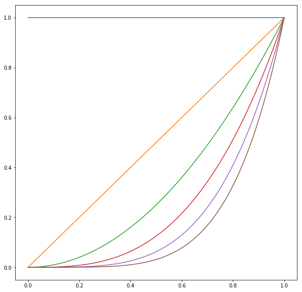
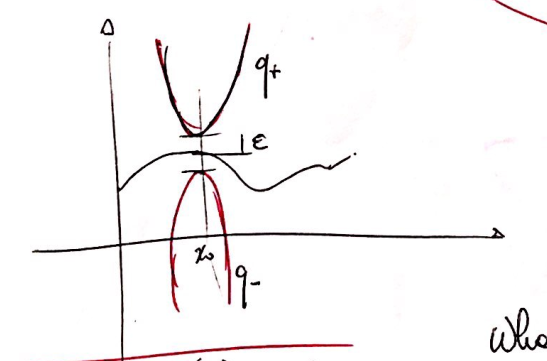

## Interpolation

This section is addressed to the approximation of a function which is known through its values at a given number of points.

Precisely, given $n+1$ distinct pairs $\{q_i = (x_i, y_i)\}_{i=0}^n$ on an interval $I$, the problem consists of finding a function $\Phi = \Phi(x)$ such that $\Phi(x_i) = y_i$ for $i = 0, \ldots,n$, the $y_i$ being some given values, and say that $\Phi$ *interpolates* $\{y_i\}$ at the *nodes* $\{x_i\}$. We speak about **polynomial interpolation** if $\Phi$ is an algebraic polynomial, **trigonometric approximation** if $\Phi$ is a trigonometric polynomial or **piecewise polynomial interpolation** (or **spline interpolation**) if $\Phi$ is only locally a polynomial. The interpolants can be *polynomial*, *trigonometric*, *rational*, etc.

The numbers $y_i$ may represent the values attained at the nodes $x_i$ by a function $f$ that is known in closed form, as well as experimental data. In the former case, the approximation process aims at replacing $f$ with a simpler function to deal with, in particular in view of its numerical integration or derivation. In the latter case, the primary goal of approximation is to provide a compact representation of the available data, whose number is often quite large. So interpolation is a form of approximation that could be used both to simplify a complex function in order to make it easier to derive, or to understand the data distribution.

#### Lagrange interpolation

The **Lagrange interpolation** is a type of interpolation where the function $\Phi$ is polynomial. Given $n+1$ couples $\{x_i, y_i\}, i=0,\ldots,n$ with $x_i$ as nodes, we want to find a polynomial $\Pi_m \in \mathbb P^m$, where $\mathbb P^m := \text{span} \{x^i\}_{i=0}^m$, called **interpolating polynomial**, such that
$$
\Pi_n(x_i) = a_n x^n_i + \ldots + a_1 x_i + a_0 = y_i, \quad i = 0, \ldots, n.
$$
The points $x_i$ are called **interpolation nodes**. If $n \neq m$ the problem is over or under-determined, while if $n = m$, the following result holds:

**Theorem 1.** *Given $n + 1$ distinct nodes $x_0, \ldots, x_n$ and $n + 1$ corresponding values $y_0, \ldots, y_n$, there exists a unique polynomial $\Pi_n \in \mathbb P^n$ such that $\Pi_n(x_i) = y_i$ for $i = 0, \ldots, n$.*

**Proof.** To prove existence, let us use a constructive approach, providing an expression for $\Pi_n$. Denoting by $\{l_i\}^n_{i=0}$ a basis for $\mathbb{P}^n$, then $\Pi_n$ admits a representation on such a basis of the form $\Pi_n (x) = \sum^n_{i=0} b_i l_i (x)$ with the property that
$$
\Pi_n (x_i) = \sum^n_{j=0} b_j l_j (x_i) = y_i, \quad i = 0, \ldots, n.
\label{eq:Pixi}
$$
If we define
$$
l_i \in \mathbb{P}_n: l_i(x) = \prod^n_{j=0\\j \neq i} \frac{x - x_j}{x_i - x_j}, \quad i = 0, \ldots, n; \quad\quad l_0 = 1,
$$
then $l_i (x_j) = \delta_{ij} = \begin{cases}1 & \text{if } i=j \\ 0 & \text{otherwise} \end{cases}$ and we immediately get from $\eqref{eq:Pixi}$ that $b_i = y_i$.
It can be proven that the polynomials $\{l_i, i = 0, \ldots, n\}$ form a basis for $\mathbb{P}^n$ (they define the whole space $\mathbb P^n$), called **Lagrange basis**. As a consequence, the interpolating polynomial exists and has the following form (called *Lagrange* form)
$$
\Pi_n (x) = \sum^n_{i=0} y_i l_i (x); \quad\quad \Pi_0(x) = y_0.
\label{eq:Lagform}
$$
To prove uniqueness, suppose that another interpolating polynomial $\Psi_m$ of degree $m \le n$ exists, such that $\Psi_m (x_i) = y_i$ for $i = 0, \ldots, n$. Then, the difference polynomial $\Pi_n - \Psi_m$ vanishes at $n + 1$ distinct points $x_i$ and thus coincides with the null polynomial: $\Pi_n - \Psi_m \equiv 0$. Therefore, $\Psi_m = \Pi_n$.

It can be checked that
$$
\Pi_n(x) = \sum^n_{i=0} \frac{\omega_{n+1}(x)}{(x - x_i) \omega'_{n+1}(x_i)} y_i,
\label{eq:Piomega}
$$
where $\omega_{n+1}$ is the nodal polynomial of degree $n + 1$ defined as
$$
\omega_{n+1}(x) = \prod^n_{i=0} (x - x_i).
\label{eq:omega}
$$
**Example.** *Linear interpolation*: we have that if $n=1$, given two nodes $(x_i, y_i)$, with $i = 0, 1$, the interpolating polynomial of degree $1$ is
$$
\Pi_1(x) = y_0 \frac{x - x_1}{x_0 - x_1} + y_1 \frac{x - x_0}{x_1 - x_0}.
\nonumber
$$
*Quadratic interpolation*: if $n=2$, given three nodes  $(x_i, y_i)$, with $i = 0, 1, 2$, the interpolating polynomial of degree $2$ is
$$
\Pi_2(x) = y_0 \frac{x - x_1}{x_0 - x_1} \frac{x - x_2}{x_0 - x_2} + y_1 \frac{x  - x_0}{x_1 - x_0} \frac{x - x_2}{x_1 - x_2} + y_2 \frac{x - x_0}{x_2 - x_0} \frac{x - x_1}{x_2 - x_0}.
\nonumber
$$

Formula $\eqref{eq:Lagform}$ is called the **Lagrange form** of the interpolating polynomial, while the polynomials $l_i (x)$ are the **(Lagrange) characteristic polynomials**. In the figure we show the Lagrange characteristic polynomials $l_2 (x)$, $l_3 (x)$ and $l_4 (x)$, in the case of degree $n = 6$, on the interval $[−1, 1]$ where equally spaced nodes are taken, including the end points.
Notice that $|l_i (x)|$ can be greater than $1$ within the interpolation interval.

If $y_i$ represents the values of a continuous function $f \in C^0([a,b])$, so $y_i = f (x_i)$ for $i = 0, \ldots, n$,  we want that $\Pi_n(x_i) = y_i = f(x_i)$. We say that  interpolating polynomial $\Pi_n (x)$ is the interpolant of $f$, and will be denoted by $\Pi_n f (x)$.

### Another formulation

Given $n+1$ distinct points $\{q_i\}_{i=0}^n$ in the interval $[0,1]$, we define the **Lagrange interpolation** operator $\mathcal{L}^n$ the operator
$$
\mathcal{L}^n : C^0([0,1]) \mapsto \mathcal{P}^n
\nonumber
$$
which satisfies
$$
(\mathcal{L}^n f)(q_i) = f(q_i), \qquad i=0,\dots,n.
\nonumber
$$

This operator is used to approximate the infinitely dimensional space $C^0([0,1])$ with a finite dimensional one, $\mathcal{P}^n$, which is the space of polynomials of order $n$. 

Such a space has dimension $n+1$, and can be constructed using linear combinations of monomials of order $\leq n$:
$$
\mathbb{P}^n = \text{span}\{p_i := x^i\}_{i=0}^{n}
\label{eq:Pspan}
$$
If we want to construct the Lagrange interpolation of a given function on $n+1$ equispaced points in $[0,1]$, then we are actively looking for an element of $\mathcal{P}^n$ that coincides with the function at these given points.

Given a basis $\{v_i\}_{i=0}^n$, any element of $\mathbb{P}^n$ can be written as a linear combination of 
the basis, i.e., 
$$
\forall u \in \mathcal{P}^n, \quad  \exists! \{u^i\}_{i=0}^n  \quad| \quad u(x) = \sum_{i=0}^n u^i v_i(x)
$$

in what follows, we'll use [Einstein summation convention](https://en.wikipedia.org/wiki/Einstein_notation), and call $u$ both the function of $\mathbb{P}^n$, or the $\mathbb R^{n+1}$ vector representing its coefficients. 

**Remark on the notation (advanced topic. Ignore if you don't understand it)**

We use upper indexes to indicate both "contravariant" coefficients and the *canonical basis of the dual space*, i.e., the linear functionals in $(\mathbb{P}^n)^*$ such that 

$$
(\mathbb{P}^n)^* := \text{span}\{v^i\}_{i=0}^{n} \qquad | \qquad v^i(v_j) = \delta^i_j\qquad i,j = 0, \ldots, n
\nonumber
$$

With this notation, we have that the coefficients of a polynomial are uniquely determined by

$$
u^i = v^i(u)
\nonumber
$$

where the $u$ on the right hand side is an element of $\mathbb{P}^n$ (not its coefficients).

If we want to solve the interpolation problem above, then we need to find the coefficients $u^i$ of the polynomial $u$ that interpolates $f$ at the points $q_i$:

$$
v_j(q_i) u^j = f(q_i)
\nonumber
$$

(Remember Einstein summation convention)

This can be written as a linear problem $A u = F$, with system matrix $A_{ij} :=  v_j(q_i)$ and right hand side $F_i = f(q_i)$.

#### Condition number of interpolation

What is the condition number of this problem? 

Given a set of $n+1$ (distinct) points $\{q_i\}_{i=0}^{n}$, and a basis $\{p_i\}_{i=0}^{n}$ for the polynomial space $\mathbb P^n([0,1])$ (that has dimension $n+1$), we would like to estimate the condition number of the interpolation problem, defined as

> Given a function $g \in C^0([0,1])$, find the polynomial $p \in \mathbb P^n([0,1])$ such that $p(q_i) = g(q_i)$ for all $i=0,\dots,n$.

**Parameters of the problem: the points $q_i$**

**Input of the problem: the function $g$**

**Output of the problem: the polynomial $p$ in $\mathbb P^n$, where $n=len(q)-1$**

If we have a basis $v_i$ for $\mathbb P^n$, any polynomial in $\mathbb P^n$ can be written as

$$
p(x) = p^i v_i(x)
\nonumber
$$
A possible algorithm for the interpolation problem then can obtained as:

- Define a basis of $\mathbb P^n$ (basis = set of $n+1$ linearly independent functions, whose linear combination covers the entire space $\mathbb P^n$). For example: $p_i = x^i$
- Evaluate the function we want to interpolate in $q_i$. Call the resulting vector $g_i: g(q_i)$ for $i=0,\dots,n$
- Write $p(x) = p^i v_i$ (sum is implied for repeated indexes), and impose that $p(q_i) = g(q_i)$, i.e.: $p^j v_j(q_i) = g(q_i)$ or:
  - Construct the **interpolation matrix**: $A_{ij} = v_j(q_i)$
  - Solve the linear system $A_{ij} p^j = g(q_i)$

**NOTATION:** We indicate the coefficients of the inverse of the matrix with coefficients $A_{ij}$ using the following notation: $A^{ij} = (A^{-1})_{ij}$, that is, we define 
$$
A^{ij} A_{jk} = \delta^i_k
\nonumber
$$
 Where $\delta^i_k$ is one if $i = j$ and zero otherwise (the identity, or Kronecker delta).

#### How do we estimate the absolute condition number of the problem? 

Given a perturbation function $\delta g$, the interpolation of $g+\delta g$ results in a perturbed polynomial $p+\delta p$, where, by linearity, $\delta p$ interpolates $\delta g$, i.e., $\delta p^i = A^{ij} \delta g(q_j)$.

We would like to estimate 

$$
K_{abs} := \sup_{\delta g \in C^0([0,1])} \frac{\|\delta p\|_{\infty}}{\|\delta g\|_{\infty}} 
\nonumber
$$
 where $\| v \|_{\infty} := \max_{x\in[0,1]} |v(x)|$ is the $L^\infty$ norm of the function $v$.

We start by estimating the numerator:

$$
\begin{align*}
\|\delta p\|_\infty &= \|\delta p^i v_i \|_\infty \leq \max_i |\delta p^i| \quad \left\|\sum_i |v_i|\right\|_\infty \\
&\leq  \max_i |A^{ij}\delta g^j| \quad \left\|\sum_i |v_i|\right\|_\infty \\
&\leq C \|A\| \quad \max_i |\delta g^j| \quad \left\|\sum_i |v_i|\right\|_\infty
\end{align*}
$$
Now we observe that the second term is always bounded by $\max_{x\in[0,1]}|g(x)|$, i.e., 

$$
\sup_{\delta g \in C^0([0,1])} \frac{\max_i |\delta g^j|}{\|\delta g\|_\infty} \leq 1
\nonumber
$$
and therefore:

$$
K_{abs} := \sup_{\delta g \in C^0([0,1])} \frac{\|\delta p\|_{\infty}}{\|\delta g\|_{\infty}} \leq C \|A\| \quad \left\|\sum_i |v_i|\right\|_\infty.
\nonumber
$$
The condition number depends on three parts: 

- the constant $C$, depending on the norm type we chose for $A$ and on $n$
- the norm of the matrix $A$
- the quantity $\left\|\sum_i |v_i|\right\|_\infty$

Let's start by evaluating the norm of $A$ for the monomial basis, and the norm of the last term when we increase $n$:

As we see, the condition number of this matrix explodes as $n$ increases. Since the interpolation problem reduces to solving the matrix constructed as $A_{ij} := p_j(x_i)$, one way to ensure a good condition number (of the matrix!) is to choose the basis such that $A$ is the identity matrix, i.e., to choose the basis such that $v_j(x_i) = \delta_{ij}$. Such a basis is called the **Lagrange basis**, and it is constructed explicitly as:

$$
l^n_i(x) := \prod_{j=0, j\neq i}^n \frac{(x-x_j)}{(x_i-x_j)}  \qquad
i = 0, \dots, n
$$

With this basis, no matrix inversion is required, and we can simply write the **Lagrange interpolant** as
$$
\mathcal{L}^n f := \sum_{i=0}^n f(x_i) l^n_i(x),
$$

**Theorem.** *Given a set of $(n+1)$ distinct points $\{x_i\}_{i=0}^n$ , there exist a unique Lagrange interpolation of order $n$.*

The *Lagrange basis* is especially fit for good approximations, since other polynomial sets may be ill-conditioned for the approximation task. The definition of $\mathbb P^n$ as in $\eqref{eq:Pspan}$ generates the **Vandermonde matrix**
$$
B = (q_i)^j = \begin{bmatrix}
1 & q_0 & q_0^2 & \cdots & q_0^n \\
1 & q_1 & q_1^2 & \cdots & q_1^n \\
\vdots & & & \ddots & \vdots \\
1 & q_n & q_n^2 & \cdots & q_n^n
\end{bmatrix},
\nonumber
$$
which is ill-conditioned since for $n$ large, the rightmost columns will be very similar, inducing the matrix hardly invertible.

## Two dimensional Lagrange interpolation

To extend to the two dimensional case, we start from two sets of distinct points, say $(n+1)$ points in the $x$ direction, and $m+1$ points in the $y$ direction, in the interval $[0,1]$.

A two dimensional version of the the Lagrange interpolation is then used to construct polynomial approximations of functions of two dimensions. A polynomial from $\Omega := [0,1]\times[0,1]$ to $R$ is defined as:

$$
\mathcal{P}^{n,m} : \text{span}\{p_i(x) p_j(y) \}_{i,j=0}^{n,m}
\nonumber
$$

and each *multi-index* $(i,j)$ represents a polynomial of order $i+j$, $i$ along $x$, and $j$ along $y$. For convenience, we define

$$
p_{i,j}(x,y) :=  p_i(x)p_j(y) \qquad i = 0,\ldots,n \qquad j=0,\ldots,m
\nonumber
$$

Alternatively we can construct a basis starting from the Lagrange polynomials:

$$
l_{i,j}(x,y) := l_i(x) l_j(y)  \qquad i = 0,\ldots,n \qquad j=0,\ldots,m
\nonumber
$$

where we use the same symbol for the polynomials along the two directions for notational convenience, even though they are constructed from two different sets of points.

We define the *Lagrange interpolation* operator $\mathcal{L}^{n,m}$ the operator
$$
\mathcal{L}^{n,m} : C^0([0,1]\times[0,1]) \mapsto \mathcal{P}^{n,m}
\nonumber
$$
which satisfies
$$
(\mathcal{L}^{n,m} f)(q_{i,j}) = f(q_{i,j}), \qquad i=0,\dots,n, \qquad q_{i,j} := (x_i, y_j)
\nonumber
$$

### The interpolation error

In this section we estimate the **interpolation error** that is made when replacing a given function $f$ with its interpolating polynomial $\Pi_n f$ at the nodes $x_0, x_1, \ldots, x_n$.

**Theorem 2.** *Let $x_0, x_1, \ldots, x_n$ be $n + 1$ distinct nodes and let $x$ be a point belonging to the domain of a given function $f$. Assume that $f \in C^{n+1} (I_x)$, where $I_x$ is the smallest interval containing the nodes $x_0, x_1, \ldots, x_n$ and $x$.
Then the interpolation error at the point $x$ is given by*
$$
E_n(x) = f(x) - \Pi_n f(x) = \frac1{(n + 1)!} f^{(n+1)}(\xi) \omega_{n+1}(x),
\label{eq:error}
$$
*where $\xi \in I_x$ and $\omega_{n+1}$ is the nodal polynomial of degree $n + 1$, defined in $\eqref{eq:omega}$.*

**Proof.** The result is obviously true if $x$ coincides with any of the interpolation nodes (since $f(x_i) = \Pi_n f(x_i)$ and also $\omega_{n+1}(x_i) = 0$ by definition). Otherwise, define, for any $t \in I_x$, the function
$$
G(t) = E_n (t) - \omega_{n+1}(t)E_n(x)/\omega_{n+1}(x)
\nonumber
$$
(or $G(t) = E_n(t)\omega(x) - E_n(x)\omega(t) = (f(t) - \Pi_nf(t))\omega(x) - (f(x) - \Pi_nf(x))\omega(t)$). Since $f \in C^{(n+1)} (I_x)$ and $\omega_{n+1}$ is a polynomial (so $\omega_{n+1} \in C^\infty(I_x)$), then $G \in C^{(n+1)} (I_x)$ and it has at least $n + 2$ distinct zeros in $I_x$, since:
$$
\begin{align*}
G(x_i) &= E_n (x_i) - \omega_{n+1}(x_i) E_n(x)/\omega_{n+1}(x) = 0, \quad i = 0, \ldots, n, \\
G(x) &= E_n(x) - \omega_{n+1}(x) E_n(x)/\omega_{n+1}(x) = 0.
\end{align*}
$$
Then, thanks to the mean value theorem, $G'$ has at least $n + 1$ distinct zeros and, by recursion, $G^{(j)}$ admits at least $n+2-j$ distinct zeros. As a consequence, $G^{(n+1)}$ has at least one zero, which we denote by $\xi$ (Rolle). On the other hand, since $E_n^{(n+1)}(t) = f^{(n+1)} (t)$ and $\omega_{n+1}^{(n+1)} (t) = (n + 1)!$ we get
$$
G^{(n+1)}(t) = E_n^{(n+1)}(t) - \frac{\omega_{n+1}^{(n + 1)}(t)}{\omega_{n+1} (x)} E_n (x) = f^{(n+1)}(t) - \frac{(n + 1)!}{\omega_{n+1} (x)} E_n (x),
\nonumber
$$
which, evaluated at $t = \xi$, gives the desired expression for $E_n (x)$.

Since the norm $||\cdot||_\infty$ represents the highest value (the $\sup$) of a function, and we have that $f(x) - \Pi_nf(x) = \frac1{(n+1)!}f^{(n+1)}(\xi)\omega_{n+1}(x)$, we can bound the error as
$$
||f(x) - \Pi_nf(x)||_\infty \le \frac1{(n+1)!} ||f^{(n+1)}||_\infty ||\omega_{n+1}(x)||
\nonumber
$$
**Theorem.** *If $f$ is analytically extendible in an oval $O(a,b,R)$ with $R>0$ and the $x_i$ are $n+1$ distinct points in $[a,b]$, we have that*
$$
|f^{(n+1)}(\xi)| \le \frac{(n+1)!}{R^{n+1}}||f||_{\infty, \bar B(\xi, R)}
\nonumber
$$
*that is $||f - \Pi_n f||_{\infty, [a,b]} = ||f - \mathcal L^n f||_{\infty, [a,b]} \le ||f||_{\infty, O(a,b,R)} \left(\frac{b-a}R\right)^{n+1}$.*

This means that increasing the degree $n$ of the interpolation *does not guarantee* a better approximation of $f$. Indeed, we may have that
$$
\lim_{n\to\infty} ||f - \Pi_nf||_\infty = ||f-\mathcal L^nf||_\infty = \infty
\nonumber
$$

### Drawbacks of polynomial interpolation on equally spaced nodes and Runge’s counterexample

In this section we analyze the behavior of the interpolation error $\eqref{eq:error}$ as $n$ tends to infinity. For this purpose, for any function $f \in C^0([a, b])$, define its **maximum norm**
$$
||f||_\infty = \max_{x \in [a,b]} |f(x)|.
$$
Then, let us introduce a lower triangular matrix $X$ of infinite size, called the **interpolation matrix** on $[a, b]$, whose entries $x_{ij}$, for $i, j = 0, 1, \ldots$, represent the interpolation points of $[a, b]$, with the assumption that on each row the entries are all distinct. So $X$ is an infinite triangular matrix of interpolation points and is like
$$
X = \begin{bmatrix}
0 & 0 & 0 & \cdots & 0 \\
x_0 & 0 & 0 & \cdots & 0 \\
x_0 & x_1 & 0 & \cdots & 0 \\
\vdots & & & \ddots & \vdots \\
x_0 & x_1 & x_2 & \cdots & x_n
\end{bmatrix}
\nonumber
$$
Thus, for any $n \ge 0$, the $n+1$-th row of $X$ contains $n+1$ distinct values that we can identify as nodes, so that, for a given function $f$, we can uniquely define an interpolating polynomial $\Pi_ n f$ of degree $n$ at those nodes (any polynomial $\Pi_n f$ depends on $X$, as well as on $f$).

Having fixed $f$ and an interpolation matrix $X$, let us define the interpolation error
$$
E_{n,\infty}(X) = ||f - \Pi_n f||_\infty, \quad n = 0, 1, \ldots
$$
Next, denote by $p^*_n \in \mathbb{P}_n$ the **best approximation polynomial**, for which
$$
E_n^* = ||f - p^*_n||_\infty \le ||f - q_n||_\infty \quad \forall q_n \in \mathbb{P}_n.
\nonumber
$$
The following comparison result holds:

**Property 1.** *Let $f \in C^0([a, b])$ and $X$ be an interpolation matrix on $[a, b]$. Then*
$$
E_{n,\infty}(X) \le E_n^*(1 + \Lambda_n(X)), \quad n = 0, 1, \ldots,
$$
*where $\Lambda_n (X)$ denotes the **Lebesgue constant** of $X$, defined as*
$$
\Lambda_n (X) = \left\| \sum^n_{j=0} |l^{(n)}_j| \right\|_\infty,
\label{eq:lebconst}
$$
*and where $l_j^{(n)} \in \mathbb P^n$ is the $j$-th characteristic polynomial associated with the $n + 1$-th row of $X$, that is, satisfying $l_j (x_{nk}) = \delta_{jk}, \; j, k = 0, 1, \ldots$.*

**Proof.** How distant are we from the best approximation (B.A.)? Let us define
$$
||\mathcal L^n||:= \sup_{f \in C(I) \\ ||f||_\infty<1} \left|\left|\mathcal L^n f\right|\right|_\infty = \sup_{f \in C(I) \\ ||f||_\infty<1} \left|\left|\sum_i l_i^n f(x_i)\right|\right|_\infty
$$
Then, since $\forall q \in \mathbb P^n$ we have that $\mathcal L^nq = q$, we have
$$
\begin{align*}
E_{n,\infty}(X) &= ||f - \mathcal L^n f|| = ||f - \mathcal L^n f + \mathcal L^n q - q || \\
&= ||f-q-\mathcal L^n(f-q)|| \le ||f-q|| + ||\mathcal L^n(f-q)|| \\
&\le ||f-q|| - ||\mathcal L^n|| \;||f-q|| = (1-||\mathcal L^n||)||f-q|| \\
&\le (1-||\mathcal L^n||)||f-p_n^*||
\end{align*}
$$
since it is valid $\forall q \in \mathbb P^n$ and so also for the polynomial $p_n^* = BA(f)$, the best approximation of $f$.

Since $E_n^*$ does not depend on $X$, all the information concerning the effects of $X$ on $E_{n,\infty}(X)$ must be looked for in $\Lambda_n(X)$. Although there exists an interpolation matrix $X^*$ such that $\Lambda_n(X)$ is minimized, it is not in general a simple task to determine its entries explicitly. We shall see that the zeros of the Chebyshev polynomials provide on the interval $[-1, 1]$ an interpolation matrix with a very small value of the Lebesgue constant.

Besides, we have that
$$
||\mathcal L^nf||:= \sup_{f \in C(I)\\||f||_\infty<1} ||\sum_i l_i^n f(x_i)||_\infty \le ||\sum_i |l_i^n(x)|\;||_\infty =: \Lambda_n(X)
\nonumber
$$
On the other hand, for any possible choice of $X$, there exists a constant $C > 0$ such that
$$
\Lambda_n(X) > \frac2\pi \log(n + 1) - C, \quad n = 0, 1, \ldots
\nonumber
$$
**Erdos' theorem.** *For each infinite triangular matrix of interpolation points $X$, $\exists C>0$ such that*
$$
||\mathcal L^n|| \ge \frac2\pi \log(n+1) - C.
\nonumber
$$
This property shows that $\Lambda_n(X) \to \infty$ as $n \to \infty$. This fact has important consequences: in particular, it can be proved that, given an interpolation matrix $X$ on an interval $[a, b]$, there always exists a continuous function $f$ in $[a, b]$, such that $\Pi_n f$ does not converge uniformly (that is, in the maximum norm) to $f$.

**Faber's theorem.** *For all $X$, $\exists f \in C^0([a,b])$ such that $||f - \mathcal L^n f||_\infty \not\to 0$.*

Thus, polynomial interpolation does not allow for approximating any continuous function, as demonstrated by the following example.

**Runge’s counterexample.** Suppose we approximate the following function
$$
f(x) = \frac{1}{1 + x^2}, \quad x \in I=[-5, 5],
$$
using Lagrange interpolation on equally spaced nodes $x_i = -5 + \frac{10i}n$. It can be checked that some points $x$ exist within the interpolation interval such that
$$
\lim_{n \to \infty} |f(x) - \Pi_n f(x)| \neq 0.
\nonumber
$$
In particular, Lagrange interpolation diverges for $|x| > 3.63\ldots$ . This phenomenon is particularly evident in the neighborhood of the end points of the interpolation interval, as shown in the following figure, and is due to the choice of equally spaced nodes.

The presence of sever oscillations of $\Pi_n f$ w.r.t. $f$, especially near the endpoints, indicates a lack of convergence. This is also called **Runge's phenomenon**.

We shall see that resorting to suitably chosen nodes will allow for uniform convergence of the interpolating polynomial to the function $f$ to hold.

### Stability of Polynomial Interpolation

Let $f \in C^0([a, b])$ and $X$ be an interpolation matrix on $[a, b]$. Let us consider a set of function values $\{ \tilde{f}(x_i) \}$ which is a perturbation of the data $f(x_i)$ relative to the nodes $x_i$, with $i = 0, \ldots, n$, in an interval $[a, b]$. The perturbation may be due, for instance, to the effect of rounding errors, or may be caused by an error in the experimental measure of the data.

We want to estimate the impact of the perturbed values $\tilde f(x_i)$ on the interpolant $\Pi_n f = \mathcal L^n f$. Denoting by $\Pi_n \tilde{f}$ the interpolating polynomial on the set of values $\tilde{f}(x_i)$, we have
$$
\begin{align*}
||\Pi_n f - \Pi_n \tilde{f}||_\infty &= \max_{j=0} \left| \sum^n_{a \le x \le b} (f(x_j) - \tilde{f}(x_j))l_j(x) \right| \\
&\le \Lambda_n (X) \max_{i=0,\ldots,n} |f(x_i) - \tilde{f}(x_i)|,
\end{align*}
$$
where $\Lambda_n (X)$ denotes the **Lebesgue constant** of $X$, depending on the interpolation nodes, defined in $\eqref{eq:lebconst}$.

As a consequence, small changes on the data give rise to small changes on the interpolating polynomial only if the Lebesgue constant is small. This constant plays the role of the **condition number** for the interpolation problem.

As previously noticed, $\Lambda_n$ grows as $n \to \infty$ and in particular, in the case of Lagrange interpolation on equally spaced nodes, it can be proved that
$$
\Lambda_n(X) \simeq \frac{2^{n+1}}{en \log n},
\label{eq:equispnodes}
$$
where $e \simeq 2.7183$ is the Euler's number. This shows that, for $n$ large, this form of interpolation can become unstable. Notice also that so far we have completely neglected the errors generated by the interpolation process in constructing $\Pi_n f$. However, it can be shown that the effect of such errors is generally negligible.

**Example 2.** On the interval $[-1, 1]$ let us interpolate the function $f(x) = \sin(2 \pi x)$ at $22$ equally spaced nodes $x_i$. Next, we generate a perturbed set of values $\tilde{f}(x_i)$ of the function evaluations $f(x_i) = \sin(2 \pi x_i)$ with $\max_{i=0,\ldots,21} |f(x_i) - \tilde{f}(x_i)| \simeq 9.5 \cdot 10^{-4}$. In the following figure we compare the polynomials $\Pi_{21} f$ and $\Pi_{21} \tilde{f}$: notice how the difference between the two interpolating polynomials, around the end points of the interpolation interval, is much larger than the impressed perturbation (actually, $||\Pi_{21} f - \Pi_{21} \tilde{f}||_\infty \simeq 1.5926$).

#### Chebyshev nodes

In order to minimize the Lebesgue constant $\Lambda_n(X)$ and thus avoid Runge's phenomenon, we can use the **Chebyshev nodes** on the interval $[a,b]$, defined as
$$
x_i = \frac{a+b}2 + \frac{b-a}2\hat x_i, \quad \text{where } \hat x_i = \cos\left(\frac{(2i+1)}{2(n+1)}\pi\right), \quad\quad i=0,\ldots,n
\nonumber
$$

The nodes are equispaced on the semi-circumference of diameter $[a,b]$ while they are clustered toward the endpoints of the interval. For the Chebyshev nodes, if $f$ is continuously differentiable in $[a,b]$ then $\mathcal L^n f$ converges to $f$ as $n \to \infty$.

The Gauss-Lobatto nodes instead are
$$
x_i = \frac{a+b}2 + \frac{b-a}2\hat x_i, \quad \text{where } \hat x_i = \cos\left(\frac{\pi i}n\right), \quad\quad i=0,\ldots,n
\nonumber
$$

For the Chebyshev nodes we have that $||\mathcal L^n||_\infty \le \frac2\pi \log(n+1)+1$, so for the Erdos' theorem we have that $\exists c$ such that
$$
\frac2\pi \log(n+1)-c \le ||\mathcal L^n||_\infty \le \frac2\pi \log(n+1)+1
\nonumber
$$
Instead, for the Lagrange equispaced nodes we have that, as seen in $\eqref{eq:equispnodes}$,
$$
\Lambda_n(X) \le \frac{2^{n+1}}{en \log n},
\nonumber
$$
The Faber's theorem proves that, even on Chebyshev nodes not all continuous functions will converge when used for interpolation.

So we have that interpolation does not work well... Is all lost? NO! Let's give one positive result:

**Weierstrass approximation theorem.** *Suppose that $f \in C^0([a,b])$. Then, $\forall \varepsilon > 0$ there exist $n$ and a polynomial $p \in \mathbb P^n$ such that $||f - p||_\infty \le \varepsilon$, $\forall x \in [a,b]$.*

It shows that polynomial functions are dense in $C^0([a,b])$, and each polynomial can be uniformly approximated by one with rational coefficients.

### Bernstein polynomials

The $n+1$ **Bernstein (basis) polynomials** of degree $n$ over the interval $[0, 1]$ are defined as
$$
b_{n,k} (x) = \binom nk x^k (1-x)^{n-k}, \quad\quad n= 0, 1, \ldots \, ,\quad k=0,\ldots, n,
$$
They can be obtained by the following recursive formula
$$
\begin{cases}
b_{n,0}(t) = (1 - t)^n, \\
b_{n,k}(t) = (1 - t)b_{n-1,k}(t) + tb_{n-1,k-1}(t), & k = 1, \ldots, n, \; t \in [0, 1].
\end{cases}
\nonumber
$$
It is easily seen that $\{b_{n,k}, k = 0, \ldots, n\}$ provides a basis for $\mathbb P^n$. A linear combination of $b_{n,k}$ is called a **Bernstein polynomial** or **polynomial in Bernstein form** of degree $n$ based on function $f$:
$$
B_n f(x) = \sum_{k=0}^n f\left(\frac kn\right) b_{n,k}(x) = \sum_{k=0}^n f\left(\frac kn\right) \binom nk x^k (1-x)^{n-k}.
$$
We have that $\forall x$, $B_n f(x)$ is a weighted average of the $n+1$ values $f\left(\frac kn\right)$, called **Bernstein coefficients**.

**Properties:**

- $\sum_{k=0}^n b_{n,k}(x) = \sum_{k=0}^n \binom nk x^k (1-x)^{n-k} = (x + 1-x)^n = 1^n = 1 \; \forall x \in [a,b]$, thanks to the *binomial theorem*.
- $b_{n,k} \ge 0, \; \forall x \in [0,1]$ and $b_{n,k} \in \mathbb P^n$ for $k=0,\ldots,n$.
- $B_n$ is a **linear positive operator**: $B_n f \ge 0$ if $f \ge 0$.
- $b_{n,k}(\frac jn) \neq \delta_{kj}$, so they are different from the Lagrange basis!
- $B_n f \left(\frac kn\right) \neq f\left(\frac kn\right)$ and if $f \in C^0([0,1])$ we have that $B_n f(x) \to f(x)$ as $n \to \infty$.
- $\forall p \in \mathbb P^2, B_n p \to p$, so we have that $\mathcal L^n p \equiv p$ for $n < 2$.

We have then that the convergence is **not pointwise** as in the interpolation, but it is **uniform**:
$$
\lim_{n\to\infty} ||f(x) - B_nf(x)||_\infty = 0 \quad \text{with } 0 \le x \le 1
\nonumber
$$
Direct computations: $\forall f_0 \in \mathbb P^0, f_1 \in \mathbb P^1, f_2 \in \mathbb P^2, f_i = x^i$ we have that:
$$
\begin{align*}
n \ge 2 \quad &B_n f_0 = f_0, \quad &B_n f_1 = f_1, \quad\quad\quad &B_nf_2 = \frac{n-1}nf_2 \\
&B_n 1 = 1, \quad & B_n x = x, \quad\quad\quad &B_n x^2 = \frac{n-1}n x^2 + \frac1n x \color{red} \neq x^2
\end{align*}
$$
**Theorem.** *Let $B_n$ be a sequence of linear positive operators such that $B_n f$ converges uniformly to $f$, $\forall f \in \mathbb P^2$. Then $B_n f$ converges uniformly to $f$, $\forall f \in C(I)$.*

**Idea of proof.** We have that $\forall f \in C(I), \forall x_0 \in I$, we can find a quadratic function $q > f$ but such that $q(x_0)$ is close to $f(x_0)$: $|q(x_0) - f(x_0)| < \varepsilon$. The same can be done with $q < f$.
For $n > \bar n$, $|B_n q(x_0) - q(x_0)| < \varepsilon$, that is $|B_n q(x_0) - f(x_0)| < \varepsilon$. 

**Qualitative proof of Weierstrass theorem.** Let $f \in C(I)$, with $I$ compact. Then we have that $f$ is uniformly continuous, so $x_1, x_2 \in I$
$$
\forall \varepsilon > 0, \exists \delta > 0 \text{ s.t.  if } |x_1 - x_2| < \delta \text{ then } |f(x_1) - f(x_2)| \le \varepsilon
\nonumber
$$
For any $x_0$, let's set
$$
q_\pm(x) = f(x_0) \pm \left( \varepsilon + \frac{2||f||_\infty}{\delta^2}(x-x_0)^2 \right)
\nonumber
$$

We have that $q_+(x) \ge f(x) \; \forall x$, while $q_-(x) \le f(x) \; \forall x$.

We have that $q(x) = a + bx + cx^2$, with $|a|, |b|, |c| \le M$, where $M$ depends on $||f||, \varepsilon, \delta$ but *not* on $x_0$.

Then we choose $n$ large enough such that $||B_n x^i - x^i||_\infty \le \frac\varepsilon M$ for $i=0,1,2$. So with the triangle inequality  we get $||B_n q_\pm - q_\pm||_\infty \le 3\varepsilon$. Then we have that
$$
B_n f(x_0) \le B_n q_+(x_0) \le q_+(x_0) + 3\varepsilon = f(x_0) + 4 \varepsilon\\
B_n f(x_0) \ge B_nq_-(x_0) \ge q_-(x_0) - 3\varepsilon = f(x_0) - 4\varepsilon
\nonumber
$$
that is
$$
-4\varepsilon \le B_n f(x_0) - f(x_0) \le 4 \varepsilon \quad \Longrightarrow \quad ||B_nf - f||_\infty \le 4\varepsilon
\nonumber
$$

This is very robust but very slow.
$$
|| f - B_n f||_\infty = O\left(\frac1n\right)
\nonumber
$$
This hold also for all $C^2$ functions! $||f - B_n f||_\infty \le \frac1{f_n} ||f''||_\infty$.

### Piecewise Lagrange Interpolation

We can build a piecewise linear interpolant of $f$ to avoid Runge's effect when the number of nodes increases. $f$ is a piecewise linear continuous function also called **finite element interpolant**.

We have outlined the fact that, for equally spaced interpolating nodes, uniform convergence of $\Pi_n f$ to $f$ is not guaranteed as $n \to \infty$. On the other hand, using equally spaced nodes is clearly computationally convenient and, moreover, Lagrange interpolation of low degree is sufficiently accurate, provided sufficiently small interpolation intervals are considered.

Therefore, it is natural to introduce a partition $\mathcal T_h$ of $[a, b]$ into $K$ subintervals $I_j = [x_j, x_{j+1}]$ of length $h_j$, with $h = \max_{0 \le j \le K-1} h_j$, such that $[a, b]= \bigcup^{K-1}_{j=0} I_j$ and then to employ Lagrange interpolation on each $I_j$ using $k + 1$ equally spaced nodes $\left\{ x_j^{(i)}, 0 \le i \le k \right\}$ with a small $k$.

For $k \ge 1$, we introduce on $\mathcal T_h$ the piecewise polynomial space
$$
X_h^k = \left\{ v \in C^0([a, b]): v|_{I_j} \in \mathbb P^k(I_j) \; \forall I_j \in \mathcal T_h \right\}
\nonumber
$$
which is the space of the continuous functions over $[a, b]$ whose restrictions on each $I_j$ are polynomials of degree $\le k$. Then, for any continuous function $f$ in $[a, b]$, the **piecewise interpolation polynomial** $\Pi^k_h f$ coincides on each $I_j$ with the interpolating polynomial of $f |_{I_j}$ at the $k + 1$ nodes $\left\{ x_j^{(i)}, 0 \le i \le k \right\}$. As a consequence, if $f \in C^{k+1}([a, b])$, using $\eqref{eq:error}$ within each interval we obtain the following error estimate
$$
||f - \Pi^k_h f||_\infty \le Ch^{k+1} ||f^{(k+1)}||_\infty.
\label{eq:picewiseerror}
$$
Note that a small interpolation error can be obtained even for low $k$ provided that $h$ is sufficiently "small".

**Example.** We have that if $n = 1$, then the piecewise interpolation polynomial is
$$
\Pi^1_h f(x) = f(x_{j-1}) \frac{x - x_j}{x_{j-1} - x_j} + f(x_j) \frac{x - x_{j-1}}{x_j - x_{j-1}} \quad \text{if } x \in I_j.
\nonumber
$$

Besides estimate $\eqref{eq:picewiseerror}$, convergence results in integral norms exist. For this purpose, we introduce the following space
$$
L^2(a,b) = \left\{ f: (a,b) \rightarrow \mathbb R, \int_a^b |f(x)|^2 dx < + \infty \right\}.
\label{eq:L2ab}
$$
with
$$
||f||_{L^2(a,b)} = \left( \int_a^b |f(x)|^2 dx \right)^{1/2}.
\label{eq:L2abnorm}
$$
Formula $\eqref{eq:L2abnorm}$ defines a norm for $L^2(a, b)$. We warn the reader that the integral of the function $|f |^2$ in $\eqref{eq:L2ab}$ has to be intended in the Lebesgue sense. In particular, $f$ needs not be continuous everywhere.

**Theorem.** *Let $0 \le m \le k + 1$, with $k \ge 1$ and assume that $f^{(m)} \in L^2(a, b)$ for $0 \le m \le k + 1$; then there exists a positive constant $C$, independent of $h$, such that*
$$
||(f - \Pi^k_h f)^{(m)}||_{L^2(a,b)} \le Ch^{k+1-m}||f^{(k+1)}||_{L^2(a,b)}.
\nonumber
$$
*In particular, for $k = 1$, and $m = 0$ or $m = 1$, we obtain*
$$
\begin{align*}
&||f - \Pi^1_h f||_{L^2(a,b)} \quad\ \le C_1 h^2 ||f''||_{L^2(a,b)},\\
&||(f - \Pi^1_h f )''||_{L^2(a,b)} \le C_2 h ||f''||_{L 2 (a,b)},
\end{align*}
$$
*for two suitable positive constants $C_1$ and $C_2$.*

### More on interpolation

- We can perform interpolation by cubic splines, which are piecewise cubic functions $f \in C^2$.
- While the **minmax approximation** we used so far is based on the norm $||\cdot||_\infty$, the **least squares approximation** uses the Euclidean norm $||\cdot||_2$ to minimize the $MSE = \sum_{i=0}^n (y_i - \Pi_nf(x_i))^2$.
- Piecewise linear and splines are well suited to approximate data and functions in several dimensions.
- Trigonometric interpolation is well suited to approximate periodic functions. We have that $\Pi_n f$ is a linear combination of $\sin$ and $\cos$ functions. The FFT algorithm (Fast Fourier transform) and the IFFT algorithm (Inverse Fast Fourier transform) allow for an efficient computation of Fourier coefficients for a trigonometric interpolant from node values.