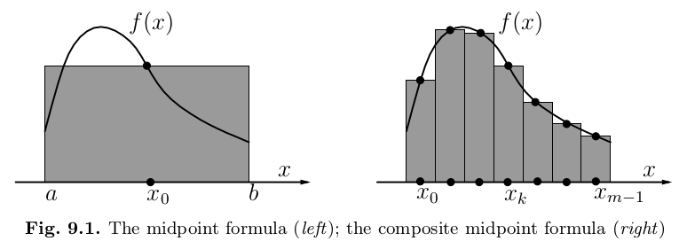
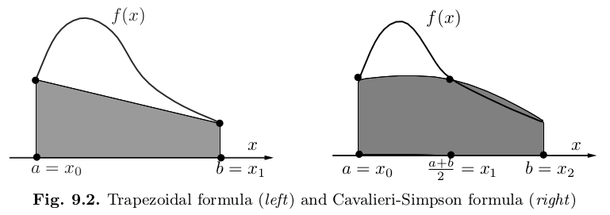

## Integration

Let $f$ be a real integrable function over the interval $[a, b]$: $f: [a, b] \rightarrow \mathbb R$. Computing explicitly the definite integral
$$
I(f) = \int_a^b f(x)dx
\label{eq:integ}
$$
may be difficult or even impossible. Integration is very expensive from a numerical point of view if $f$ is complicated. Our purpose is to make it simpler. Any explicit formula that is suitable for providing an approximation of $I(f)$ is said to be a **quadrature formula** or **numerical integration formula**.

An example can be obtained by replacing $f$ with an approximation $f_n$, depending on the integer $n \ge 0$, then computing $I(f_n)$ instead of $I(f)$. Letting $I_n(f) = I(f_n)$, we have
$$
I_n(f) = \int_a^b f_n(x) dx, \quad n \ge 0.
\nonumber
$$
The dependence on the end points $a, b$ is always understood, so we write $I_n(f)$ instead of $I_n(f; a, b)$.

If $f \in C^0 ([a, b])$, the **quadrature error** $E_n(f) = I(f) - I_n(f)$ satisfies
$$
\begin{align*}
|E_n(f)| &= |I(f) - I_n(f)| = \left|\int_a^bf(x)dx - \int_a^b f_n(x)dx \right|\\
&\le \int_a^b |f(x) - f_n(x)|dx \le (b - a) ||f - f_n||_{\infty}.
\end{align*}
$$
Therefore, if for some $n$, $||f - f_n||_\infty < \varepsilon$, then $|E_n(f)| \le \varepsilon(b - a)$.

The approximant $f_n$ must be easily integrable, which is the case if, for example, $f_n \in \mathbb P^n$. In this respect, a natural approach consists of using $f_n = \Pi_n f$, the interpolating Lagrange polynomial of $f$ over a set of $n + 1$ distinct nodes $\{x_i\}$, with $i = 0, \ldots, n$. By doing so, from $\eqref{eq:integ}$ it follows that
$$
I_n(f) = \sum_{i=0}^n f(x_i) \int_a^b l_i(x)dx,
\label{eq:laginteg}
$$
where $l_i$ is the characteristic Lagrange polynomial of degree $n$ associated with node $x_i$ (see the [Interpolation](##Interpolation) section). We notice that $\eqref{eq:laginteg}$ is a special instance of the following quadrature formula
$$
I_n(f) = \sum_{i=0}^n \alpha_i f(x_i),
\label{eq:weiginteg}
$$
where the coefficients $\alpha_i$ of the linear combination are given by $\int_a^b l_i(x)dx$.

Formula $\eqref{eq:weiginteg}$ is a weighted sum of the values of $f$ at the points $x_i$, for $i = 0, \ldots, n$. These points are said to be the **nodes** of the quadrature formula, while the numbers $\alpha_i \in \mathbb R$ are its **coefficients** or **weights**. Both weights and nodes depend in general on $n$; again, for notational simplicity, this dependence is always understood.

The formula $\eqref{eq:laginteg}$, called **Lagrange quadrature formula**, can be generalized to the case where also the values of the derivative of $f$ are available. This leads to the **Hermite quadrature formula**
$$
I_n(f) = \sum_{k=0}^1 \sum_{i=0}^n \alpha_{ik} f^{(k)}(x_i),
\label{eq:herminteg}
$$
where the weights are now denoted by $\alpha_{ik}$.

Both $\eqref{eq:laginteg}$ and $\eqref{eq:herminteg}$ are **interpolatory quadrature formula**, since the function $f$ has been replaced by its interpolating polynomial (Lagrange and Hermite polynomials, respectively). We define the **degree of exactness** of a quadrature formula as the maximum integer $r \ge 0$ for which
$$
I_n(f) = I(f), \quad \forall f \in \mathbb P^r.
\nonumber
$$
Any interpolatory quadrature formula that makes use of $n + 1$ distinct nodes has degree of exactness equal to at least $n$. Indeed, if $f \in \mathbb P^n$, then $\Pi_n f = f$ and thus $I_n(\Pi_n f) = I(\Pi_n f) = I(f)$. The converse statement is also true, that is, a quadrature formula using $n + 1$ distinct nodes and having degree of exactness equal at least to $n$ is necessarily of interpolatory type.

As we will see, the degree of exactness of a Lagrange quadrature formula can be as large as $2n + 1$ in the case of the so-called Gaussian quadrature formulae.

#### The Midpoint or Rectangle Formula

This formula is obtained by replacing $f$ over $[a, b]$ with the constant function equal to the value attained by $f$ at the midpoint of $[a, b]$.
This yields
$$
I_0(f) = \int_a^b \Pi_0(x)dx = (b - a) \, f \left(\frac{a + b}2\right),
\label{eq:rect}
$$
with weight $\alpha_0 = b - a$ and node $x_0 = (a + b)/2$. If $f \in C^2([a, b])$, the quadrature error is

$$
E_0(f) = \frac{(b-a)^3}{24} f''(\xi) = \frac{h^3}3 f''(\xi), \quad h = \frac{b - a}2,
\label{eq:errrect}
$$
where $\xi$ lies within the interval $(a, b)$.

Indeed, expanding $f$ in a Taylor's series around $c = (a + b)/2$ and truncating at the second-order, we get
$$
f(x) = f(c) + f'(c)(x - c) + f''(\xi(x, c))(x - c)^2/2,
\nonumber
$$
from which, integrating on $(a, b)$ and using the mean-value theorem we have that:
$$
\begin{align*}
\int_a^b f(x) dx &= \int_a^b [ f(c) + f'(c)(x - c) + f''(\xi(x, c))(x - c)^2/2] dx \\
&= f(c)(b-a) + f'(c) \left.\frac{(x-c)^2}2\right|_a^b + f''(\xi) \left.\frac{(x-c)^3}6\right|_a^b \\
&= f(c)(b-a) + f'(c) \left[ \frac{(b - c)^2}2 - \frac{(a-c)^2}2 \right] + f''(\xi) \left[ \frac{(b - c)^3}6 - \frac{(a-c)^3}6 \right]
\end{align*}
$$
We have that $b-c = b - \frac{a+b}2 = \frac{2b-a-b}2 = \frac{b-a}2$ and $a- c = a - \frac{a+b}2 = \frac{2a-a-b}2 = \frac{a-b}2$, so
$$
\begin{align*}
&= f(c)(b-a) + f'(c) \left[ \frac{((b - a)/2)^2}2 - \frac{((a-b)/2)^2}2 \right] + f''(\xi) \left[ \frac{((b - a)/2)^3}6 - \frac{((a-b)/2)^3}6 \right] \\
&= f(c)(b-a) + f''(\xi) \left[ \frac{(b - a)^3}{6\cdot8} - \frac{(a-b)^3}{6\cdot8} \right] = f(c)(b-a) + f''(\xi) \left[ \frac{(b - a)^3}{48} + \frac{(b-a)^3}{48} \right] \\
&= f(c)(b-a) + f''(\xi) \frac{2(b - a)^3}{48} = f(c)(b-a) + \frac{(b - a)^3}{24}f''(\xi).
\end{align*}
$$
Also, we have that $\int_a^b f'(c)(x-c)dx = 0$ since $f'(c)(x-c)$ is the line passing through $(c,0)$ with inclination $f'(c)$, with $c$ the midpoint of $[a,b]$, so there are two equal regions one above the $x$-axis and one below that cancels out.

So $\eqref{eq:errrect}$ follows form the following passages:
$$
\begin{align*}
E_0(f) &= I(f) - I_0(f) = \int_a^b f(x) dx - (b-a)f(c) \\
&= f(c)(b-a) + \frac{(b - a)^3}{24}f''(\xi) - (b-a)f(c) \\
&= \frac{(b - a)^3}{24}f''(\xi) = \frac{h^3}3 f''(\xi), \quad h = \frac{b - a}2
\end{align*}
$$
From this, it turns out that $\eqref{eq:rect}$ is exact for constant and affine functions (since in both cases $f''(\xi) = 0$ for any $\xi \in(a, b)$), so that the midpoint rule has degree of exactness equal to $1$.

It is worth noting that if the width of the integration interval $[a, b]$ is not sufficiently small, the quadrature error $\eqref{eq:errrect}$ can be quite large. This drawback is common to all the numerical integration formulae that will be described in the two forthcoming sections and can be overcome by resorting to their composite counterparts.

Suppose now that we approximate the integral $I(f)$ by replacing $f$ over $[a, b]$ with its composite interpolating polynomial of degree zero, constructed on $m$ subintervals of width $H = (b - a)/m$, for $m \ge 1$ (see Figure 9.1, right). Introducing the quadrature nodes $x_k = a + (2k + 1)H/2$, for $k = 0, \ldots, m - 1$, we get the composite midpoint formula
$$
I_{0,m}(f) = \sum_{k=0}^{m-1} \int_{x_j}^{x_{j+1}} \Pi^0_H(x)dx = H \sum_{k=0}^{m-1} f(x_k), \quad m \ge 1.
\label{eq:rectmulti}
$$
The quadrature error $E_{0,m}(f) = I(f) - I_{0,m} (f)$ is given by
$$
E_{0,m}(f) = \frac{b − a}{24} H^2 f''(\xi), \quad H =\frac{b - a}m
\label{eq:errrectmulti}
$$
provided that $f \in C^2([a, b])$ and where $\xi \in (a, b)$. From $\eqref{eq:errrectmulti}$ we conclude that $\eqref{eq:rectmulti}$ has degree of exactness equal to $1$; $\eqref{eq:errrectmulti}$ can be proved by recalling $\eqref{eq:errrect}$ and using the additivity of integrals. Indeed, for $k = 0, \ldots, m - 1$ and $\xi_k \in (a + kH, a + (k + 1)H)$,

$$
E_{0,m}(f) = \sum_{k=0}^{m-1} f''(\xi_k )(H/2)^3/3 = \sum_{k=0}^{m-1} f''(\xi_k) \frac{H^2}{24} \frac{b - a}m = \frac{b - a}{24} H^2 f''(\xi).
\nonumber
$$
The last equality is a consequence of the following theorem, that is applied letting $u = f''$ and $\delta_j = 1$ for $j = 0, \ldots, m - 1$.

**Theorem 1** (Discrete mean-value theorem)**.** *Let $u \in C^0([a, b])$ and let $x_j$ be $s + 1$ points in $[a, b]$ and $\delta_j$ be $s + 1$ constants, all having the same sign. Then there exists $\eta \in [a, b]$ such that*
$$
\sum^s_{j=0} \delta_j u(x_j) = u(\eta) \sum^s_{j=0} \delta_j.
\label{eq:udelta}
$$
**Proof.** Let $u_m = \min_{x\in[a,b]} u(x) = u(\bar x)$ and $u_M = \max_{x\in[a,b]} u(x) = u(\bar{\bar x})$, where $\bar x$ and $\bar{\bar x}$ are two points in $(a, b)$. Then
$$
u_m \sum_{j=0}^s \delta_j \le \sum_{j=0}^s \delta_j u(x_j) \le u_M \sum_{j=0}^s \delta_j.
\label{eq:sumdelta}
$$
Let $\sigma_s = \sum_{j=0}^s \delta_j u(x_j)$ and consider the continuous function $U(x) = u(x) \sum_{j=0}^s \delta_j$. Thanks to $\eqref{eq:sumdelta}$, $U(\bar x) \le \sigma_s \le U(\bar{\bar x})$. Applying the mean-value theorem, there exists a point $\eta$ between $a$ and $b$ such that $U(\eta) = \sigma_s$, which is $\eqref{eq:udelta}$. A similar proof can be carried out if the coefficients $\delta_j$ are negative.

#### The Trapezoidal Formula

This formula is obtained by replacing $f$ with $\Pi_1 f$, its Lagrange interpolating polynomial of degree $1$, relative to the nodes $x_0 = a$ and $x_1 = b$ (see Figure 9.2, left). The resulting quadrature, having nodes $x_0 = a$, $x_1 = b$ and weights $\alpha_0 = \alpha_1 = (b - a)/2$, is
$$
I_1(f) = \int_a^b \Pi_1(x) dx = \frac{b - a}2 [f (a) + f (b)].
\label{eq:trapez}
$$
In fact, as seen in the Interpolation chapter, we have that
$$
\Pi_1(x) = y_0 \frac{x - x_1}{x_0 - x_1} + y_1 \frac{x - x_0}{x_1 - x_0} = f(a) \frac{x - b}{a - b} + f(b) \frac{x - a}{b - a}
\nonumber
$$
so
$$
\begin{align*}
I_1(f) &= \int_a^b \Pi_1(x) dx = \int_a^b \left( f(a) \frac{x - b}{a - b} + f(b) \frac{x - a}{b - a}\right) dx \\
&= \frac{f(a)}{a - b} \int_a^b (x - b) dx + \frac{f(b)}{b - a} \int_a^b (x - a) dx \\
&= \frac{f(a)}{a - b} \left[\frac{x^2}2 - bx\right]_a^b + \frac{f(b)}{b - a} \left[\frac{x^2}2 - ax\right]_a^b \\
&= \frac{f(a)}{a - b} \left[\frac{b^2}2 - b^2 - \frac{a^2}2 + ab \right] + \frac{f(b)}{b - a} \left[\frac{b^2}2 - ab - \frac{a^2}2 + a^2\right] \\
&= \frac{f(a)}{2(b - a)} \left[b^2 + a^2 - 2ab \right] + \frac{f(b)}{2(b - a)} \left[b^2 - 2ab + a^2\right] \\
&= \frac{f(a)}{2(b - a)} (b - a)^2 + \frac{f(b)}{2(b - a)} (b - a)^2 = \frac{b - a}{2} [f(a) + f(b)]
\end{align*}
$$
If $f \in C^2([a, b])$, the quadrature error is given by
$$
E_1(f) = I(f) - I_1(f) = - \frac{h^3}{12} f''(\xi),\quad h = b - a,
\label{eq:errtrapez}
$$
where $\xi$ is a point within the integration interval.

Indeed, from the expression of the interpolation error one gets
$$
E_1(f) = \int_a^b (f(x) - \Pi_1 f(x))dx = -\frac12 \int_a^b f''(\xi(x))(x - a)(b - x)dx.
\nonumber
$$
Since $\omega_2(x) = (x - a)(x - b) < 0$ in $(a, b)$, the mean-value theorem yields
$$
E_1(f) = (1/2)f''(\xi) \int_a^b \omega_2(x)dx = -f''(\xi)(b - a)^3/12,
\nonumber
$$
for some $\xi \in (a, b)$, which is $\eqref{eq:errtrapez}$. The trapezoidal quadrature therefore has degree of exactness equal to $1$, as is the case with the midpoint rule.

To obtain the composite trapezoidal formula, we proceed as in the case where $n = 0$, by replacing $f$ over $[a, b]$ with its composite Lagrange polynomial of degree $1$ on $m$ subintervals, with $m \ge 1$. Introduce the quadrature nodes $x_k = a + kH$, for $k = 0, \ldots, m$ and $H = (b - a)/m$, getting
$$
I_{1,m}(f) = \sum_{k=0}^{m-1} \int_{x_j}^{x_{j+1}} \Pi^1_H(x)dx = \frac H2 \sum_{k=0}^{m-1} (f(x_k) + f(x_{k+1})), \quad m \ge 1.
\label{eq:trapezmulti}
$$
Each term in $\eqref{eq:trapezmulti}$ is counted twice, except the first and the last one, so that the formula can be written as
$$
I_{1,m}(f) = H \left[ \frac12 f(x_0) + f(x_1) + \ldots + f(x_{m-1}) + \frac12 f(x_m) \right].
\label{eq:trapezmulti2}
$$
As was done for $\eqref{eq:errrectmulti}$, it can be shown that the quadrature error associated with $\eqref{eq:trapezmulti2}$ is
$$
E_{1,m}(f) = -\frac{b - a}{12} H^2 f''(\xi),
\nonumber
$$
provided that $f \in C^2([a, b])$, where $\xi \in (a, b)$. The degree of exactness is again equal to $1$.

#### The Cavalieri-Simpson Formula

The Cavalieri-Simpson formula can be obtained by replacing $f$ over $[a, b]$ with its interpolating polynomial of degree $2$ at the nodes $x_0 = a$, $x_1 = (a+b)/2$ and $x_2 = b$ (see Figure 9.2, right). The weights are given by $\alpha_0 = \alpha_2 = (b - a)/6$ and $\alpha_1 = 4(b - a)/6$, and the resulting formula reads
$$
I_2(f) = \int_a^b \Pi_2(x) dx = \frac{b - a}6 \left[ f(a) + 4f \left( \frac{a + b}2 \right) + f(b). \right]
\label{eq:cavsimp}
$$
It can be shown that the quadrature error is
$$
E_2(f) = I(f) - I_2(f) = -\frac{h^5}{90} f^{(4)}(\xi), \quad h = \frac{b-a}2,
\label{eq:errcavsimp}
$$
provided that $f \in C^4([a, b])$, and where $\xi$ lies within $(a, b)$. From $\eqref{eq:errcavsimp}$ it turns out that $\eqref{eq:cavsimp}$ has degree of exactness equal to $3$.

Replacing $f$ with its composite polynomial of degree $2$ over $[a, b]$ yields the composite formula corresponding to $\eqref{eq:cavsimp}$. Introducing the quadrature nodes $x_k = a + kH/2$, for $k = 0, \ldots, 2m$ and letting $H = (b - a)/m$, with $m \ge 1$ gives
$$
I_{2,m} = \sum_{k=0}^{m-1} \int_{x_j}^{x_{j+1}} \Pi^2_H(x)dx = \frac H6 \left[ f(x_0) + 2 \sum_{r=1}^{m-1} f(x_{2r}) + 4 \sum_{s=0}^{m-1} f(x_{2s+1}) + f(x_{2m}) \right].
\label{eq:cavsimpmulti}
$$
The quadrature error associated with $\eqref{eq:cavsimpmulti}$ is
$$
E_{2,m}(f) = -\frac{b - a}{180} (H/2)^4 f^{(4)}(\xi),
\label{eq:errcavsimpmulti}
$$
provided that $f \in C^4([a, b])$ and where $\xi \in (a, b)$; the degree of exactness of the formula is $3$.

### Integration in Hilbert spaces

Take $p \in \mathbb P^n$, make sure you integrate $p$ exactly, then use $L^nf$. We define
$$
I(f) := \int_I f \quad \text{ and } \quad I_n(f) := \int_I L^nf.
\nonumber
$$
Then we have
$$
|I_n(f) - I(f)| \le \int_I |f - L^nf| \le (b-a)E_n(f)
\nonumber
$$
We can use $L^nf \in \mathbb P^n$ and given $X$of quadrature points / nodes $\{q_i\}$, using $f_n(x) = L^nf(x)$ we define the **interpolatory quadrature formula** as
$$
I_n(f) = \int_a^b f_n(x) dx = \int_I L^n f = \int_I l_i^n(x) f(q_i)dx = f(q_i)w_i
\nonumber
$$
where $w_i = \int_I l_i^n(x) dx$.

More generally, the **weights** $w_i$ and the quadrature points $q_i$ define a generic quadrature formula $I_n$. If $I_n$ is derived from $L^n$, then it is interpolatory.

**Definition.** The **degree of accuracy** $q$ of a quadrature formula is the integer $n \in \mathbb N$ s.t. the quadrature using $\mathbb P^n$ doesn't produce errors on $I(p)$, for $p \in \mathbb P^n$:
$$
\max_{n \in \mathbb N} \text{ s.t. } I_n(p) - I(p) = 0 \Longleftrightarrow I_n(p) = \int_I p
\nonumber
$$
**Theorem.** *If $I_n$ is interpolatory, then it has degree at least $n$ on $n+1$ points.*

The composite formulae has the same order of accuracy and have one order less of infinitesimal in the error. We define $q$ the order of accuracy or precision (exactness for polynomials of order $q$) and $r$ the order of convergence (for composite formulas). Composite formulas with low precision → more robust.

We can prove that the maximum degree of accuracy cannot be $2n+2$, because if we pick $f(x) = \omega^2_{n+1}(x) = \prod_{i=0}^n (x - x_i^2)$ we have that
$$
I_n(f) = \sum_{i=0}^n f(x_i)\alpha_i = 0 \quad \text{since} \quad f(x_i) = 0 \; \forall i=0,\ldots,n
\nonumber
$$
while of course $I(f)>0$ because the function $f(x)$ is always positive (it is squared), so we have $I_n(f) \neq I(f)$.

### Legendre polynomials and max accuracy

Let $m \in \mathbb N$, $m > 0$, be the number of quadrature points. Can $m$ raise the degree of accuracy, keeping $n$ constant? Up to what value?

<!--For example $p = (\omega(x))^2$ with $\omega = \prod_{i=0}^n (x - \bar q_i)$, $p \in \mathbb P^{2n+2}$ ($\omega \in \mathbb P^{n+1}$)-->

<!--$I_n p = 0$, $\int_I p > 0$ not $2n+2$-->

<!--What is the maximum? $2n+1$ that is $2m-1$. How?-->

**Theorem.** *Let $f \in \mathbb P^{n+m}$ with $m \le n+1$. Then $I_n(f) = I(f)$, which means that the quadrature formula $\sum_{i=0}^n \bar \alpha_i f(\bar q_i)$ has degree of accuracy $n+m$, if and only if it makes use of interpolation and the nodal polynomial $\omega_{n+1}(x) = \prod_{i=0}^n (x - \bar q_i)$ associated to nodes $\{\bar q_i \}$ is s.t.*
$$
\int_a^b \omega_{n+1}(x) p(x) dx = 0 \quad \forall p \in \mathbb P^{m-1}
\nonumber
$$
**Proof.** ($\Leftarrow$) Assume that $\int_a^b \omega_{n+1}(x) p(x) dx = 0, \forall p \in \mathbb P^{m-1}$. Given $f \in \mathbb P^{m+n}$, by applying the quotient theorem for $\mathbb P$ it can be written as
$$
f(x) = \omega_{n+1}(x) p(x) + q(x)
\nonumber
$$
with $\deg(q) < \deg(\omega)$, where $\omega_{n+1}(x) \in \mathbb P^{n+1}$, $p(x) \in \mathbb P^{m-1}$ and $q(x) \in \mathbb P^{n}$. So by integrating over $[a,b]$ we have that
$$
\int_a^b f(x) dx = \int_a^b \omega_{n+1}(x)p(x) dx + \int_a^b q(x) dx
\nonumber
$$
and thanks to the hypothesis the central term is zero, so we have that $\int_a^b f(x)dx = \int_a^b q(x)dx$, which means that $I(f) = \int_a^b f(x)dx = \int_a^b q(x)dx = I(q)$. Given that $q \in \mathbb P^n$ its quadrature is exact since we take $n+1$ nodes, so $I_n(q) = I(q) = I(f)$, so we have that we can think of $q$ as the approximation $f_n$, so $I_n(f) = I(f_n) = I(q_n) = I_n(q) = I(f)$.  (or $I(f) = \int q = I_n(q)$ because we can interpolate exactly polynomials of degree $n+1$)

($\Rightarrow$) Assume that the quadrature formula has degree of accuracy $n+m$, so $I_n(f) = I(f) = \int f, \; \forall f \in \mathbb P^{n+m}$. If we take $\omega_{n+1}(x)p(x) \in \mathbb P^{n+m}$ with $\omega_{n+1}(x) = \prod_{i=0}^n (x - \bar q_i)$, we have that $\int_a^b \omega_{n+1}(x)p(x) = I_n(\omega_{n+1}p) = 0$ since on the  nodes $\bar q_i$ we have that $\omega_{n+1}(\bar q_i) = \prod_{i=0}^n (\bar q_i - \bar q_i) = 0, \; \forall i$.

**Theorem.** *Le $q$ be nonzero polynomial of degree $n+1$ and $\omega(x)$ a positive weight function, s. t.:*
$$
\int_a^b x^k q(x)\, \omega(x) = 0, \quad k = 0,\ldots, n
$$

*If $x_i$ are zeros of $q(x)$, then*
$$
\int_a^b f(x)\, \omega(x)\approx \sum_{i=0}^nw_i\, f(x_i)
$$

*with*
$$
w_i = \int_a^b l_i(x)\, \omega(x)
$$

*is exact for all polynomials of degree at most $2n+1$. Here $l_i(x)$ are the usual Lagrange interpolation polynomials.*

**Proof.** Assume $f(x)$ is a polynomial of degree at most $2n+1$ and show:
$$
\int_a^b f(x)\, \omega(x) = \sum_{i=0}^nw_i\, f(x_i).
\nonumber
$$
Using the polynomial division we have:
$$
\underbrace{f(x)}_{2n+1} = \underbrace{q(x)}_{n+1}\, \underbrace{p(x)}_{n} + \underbrace{r(x)}_{n}.
\nonumber
$$
By taking $x_i$ as zeros of $q(x)$ we have that $f(x_i) = r(x_i)$. Now:
$$
\begin{align*}
\int_a^b f(x)\, \omega(x) &= \int_a^b [q(x)\, p(x) + r(x)]\, \omega(x) \\
&= \underbrace{\int_a^b q(x)\, p(x) \, \omega(x)}_{=0} + \int_a^b r(x)\, \omega(x)
\end{align*}
$$

Since $r(x)$ is a polynomial of order $n$ this is exact:

$$
\int_a^b f(x)\, \omega(x) = \int_a^b r(x)\, \omega(x) = \sum_{i=0}^nw_i\, r(x_i)
\nonumber
$$

But since we chose $x_i$ such that $f(x_i) = r(x_i)$, we have:

$$
\int_a^b f(x)\, \omega(x) = \int_a^b r(x)\, \omega(x) = \sum_{i=0}^nw_i\, f(x_i)
\nonumber
$$

This completes the proof.

#### Legendre Polynomials

We use the orthogonal polynomials we obtained with Gram-Schmidt in finding the best approximation.

Two term recursion, to obtain the same orthogonal polynomials above (defined between $[-1,1]$), normalized to be one in $x=1$:
$$
(n+1) p^{n+1}(x) = (2n+1)\, x\, p^n(x) - n\, p^{n-1}(x)
$$
In our proof we selected to evaluate $x_i$ at the zeros of the Legendre polynomials, this is why we need to evaluate the zeros of the polynomials.

To prove that $m$ is bounded at $n+1$, we could replace $p \in \mathbb P^{m-1}$ with $\omega_{n+1}(x)$, obtaining
$$
\int_a^b \omega_{n+1}(x) \omega_{n+1}(x)dx = 0 \quad \text{for } m \ge n+2\\
\Rightarrow \omega_{n+1}(x) = 0
\nonumber
$$
which is *false* because based on false assumption.

The maximum value for $m$ is $n+1$, achieved when $\omega_{n+1}$ is proportional to $L_{n+1}(x)$, the Legendre polynomial of degree $n+1$. Legendre polynomials can be computed recursively as
$$
\begin{cases}
L_0(x) = 1\\
L_1(x) = x \\
L_{k+1}(x) = \frac{2k+1}{k+1} x L_k(x) - \frac k{k+1} L_{k-1}(x)
\end{cases}
\nonumber
$$
Since $L_{n+1}$ is orthogonal to every $L_0, L_1, \ldots, L_n$ (because we have that $\int_a^b L_{n+1}(x)L_j(x) dx = 0 \; \forall j < n+1$) we can see why $m$ is bounded at $n+1$. Thus, the highest degree of accuracy is $2n+1$, obtained using the **Gauss-Legendre formula**
$$
I_{\text{GL}} = \begin{cases}
\bar q_i = \text{roots of } L_{n+1}(x) \\
\bar \alpha_i = \frac2{(1-q_i^2)(L'_{n+1}(q_i))^2} & i=0, \ldots, n
\end{cases}
\nonumber
$$
The related **Gauss-Legendre-Lobatto formula** includes interval bounds among quadrature points, and has a degree of accuracy of $2n-1$.

The interval used for $I_\text{GL}$ is $[-1, 1]$, thus the bar notation of $\bar q_i, \bar \alpha_i$. To reconvert to original values for $(a,b)$, use the **Chebyshev formula**:
$$
q_i = \frac{a+b}2 + \frac{b-a}2 \bar q_i, \quad \alpha_i = \frac{b-a}2 \bar \alpha_i
\nonumber
$$
### Quadrature rules:  methods of undetermined coefficients

Given a quadrature rule $I(f):= \sum_{i=0}^n f(x_i) w_i$, we want to determine $w_i$ *and* $x_i$ such that the degree of accuracy is as high as possible / desired.

We impose it to be exact for polynomials of order $q$. We have $2(n+1)$ unknowns ($n+1$ points $x_i$ and $n+1$ weights $w_i$). We can impose it on all monomials of order $q = 2n+1$:
$$
\sum_{i=0}^n (x_i)^j w_i = \int x^j \quad \quad \text{for } j=0, \ldots, 2n+1,
\nonumber
$$
which are $2n+2$ conditions on $2n+2$ unknowns. So this is a non-linear system of equations: if you can solve it, you win!

### Peano integration kernel theorem

We've seen how to estimate the errors for the quadrature formulae: we use the Taylor's expansion and the mean-value theorem (see the calculation for the mid-point rule). Can we generalize this? Yes.

We define $x_+^n = \begin{cases} x^n & \text{for } x>0 \\ 0 & \text{for } x<0\end{cases}$.

The **Peano kernel** represents the error we make when integrating a function $g(x) = (x - t)^k_+$ for a given $t \in [a, b]$. An explicit expression of it is:
$$
k(t) = E_x[(x- t)_+^k] = \int_a^b (x - t)_+^k dx - I_n((x - t)_+^k)
\nonumber
$$
We have that $\int_a^b (x - t)_+^k dx = \left. \frac{(x-t)^{k+1}}{k+1}\right|_{x = b} - \left. \frac{(x-t)^{k+1}}{k+1}\right|_{x = a} = \frac{(b-t)^{k+1}}{k+1}$, since $a \le t$, so $a - t \le 0$ which means that $\frac{(a-t)^{k+1}}{k+1} = 0$, and so $k(t)$ it doesn't depend on $a$.

**Theorem** (Taylor's theorem)**.** *Given a quadrature formula of degree $d$, and an integer $0 \le k \le d$, let $f \in C^{k+1}([a, b])$. Then we have that*
$$
f(x) = p(x) + r(x) = p(x) + \frac1{k!} \int_a^x f^{(k+1)}(t)(x-t)^k dt,
\nonumber
$$
*with $p(x) \in \mathbb P^k$ the Taylor Expansion to order $k$ of $f$ around $a$, i.e.*
$$
p(x) = \sum_{i=0}^k \frac{f^{(i)}(a)}{i!}(x-a)^i,
\nonumber
$$
*and using the integral form of the remainder.*

See the Wikipedia page for the [derivation for the integral form of the remainder](https://en.wikipedia.org/wiki/Taylor%27s_theorem#Derivation_for_the_integral_form_of_the_remainder).

The reminder can be written as:
$$
r(x) = \frac1{k!} \int_a^b f^{(k+1)}(t)(x-t)^k_+ dt,
\nonumber
$$
(note that now the integral is from $a$ to $b$, and *not* from $a$ to $x$, and we integrate the function $f^{(k+1)}(t)(x-t)_+^k$) so we have the following theorem.

**Theorem** (Peano kernel theorem)**.** *Given a quadrature formula of degree $d$, and an integer $0 \le k \le d$, let $f \in C^{k+1}([a, b])$. Then*
$$
E(f) = \frac1{k!} \int_a^b f^{(k+1)}(t) k(t) dt.
\nonumber
$$
**Proof.** From the previous theorem we have that
$$
\begin{align*}
f(x) &= p(x) + r(x) = \sum_{i=0}^k \frac{f^{(i)}(a)}{i!}(x-a)^i + \frac1{k!} \int_a^x f^{(k+1)}(t)(x-t)^k dt \\
&= \sum_{i=0}^k \frac{f^{(i)}(a)}{i!}(x-a)^i + \frac1{k!} \int_a^b f^{(k+1)}(t)(x-t)^k_+ dt
\end{align*}
$$
so it follows that $I(f) = I(p+r) = I(p) + I(r)$, so (remember that $I(f) = \int_a^b f(x)dx$)
$$
\begin{align*}
E(f) &= \int_a^b f(x) dx - I_n(f) = \int_a^b p(x) dx - I_n(p) + \int_a^b r(x) dx - I_n(r) = \int_a^b r(x) dx - I_n(r)\\
&= \int_a^b \left(\frac1{k!} \int_a^b f^{(k+1)}(t)(x-t)^k_+ dt\right)dx - I_n \left(\frac1{k!} \int_a^b f^{(k+1)}(t)(x-t)^k_+ dt\right)\\
&= \int_a^b \left(\frac1{k!} \int_a^b f^{(k+1)}(t)(x-t)^k_+ dt\right)dx - \frac1{k!} \int_a^b I_n \left( f^{(k+1)}(t)(x-t)^k_+ \right)dt \\
&= \frac1{k!} \int_a^b \left( \int_a^b f^{(k+1)}(t)(x-t)^k_+ dx - I_n \left( f^{(k+1)}(t)(x-t)^k_+ \right) \right) dt \\
&= \frac1{k!} \int_a^b \left( \int_a^b f^{(k+1)}(t)(x-t)^k_+ dx - f^{(k+1)}(t) I_n \left((x-t)^k_+ \right) \right) dt \\
&= \frac1{k!} \int_a^b f^{(k+1)}(t) \left( \int_a^b (x-t)^k_+ dx - I_n \left((x-t)^k_+ \right) \right) dt \\
&= \frac1{k!} \int_a^b f^{(k+1)}(t) E_x[(x- t)_+^k] dt \\
&= \frac1{k!} \int_a^b f^{(k+1)}(t) k(t) dt \\
\end{align*}
$$
where $\int_a^b p(x) dx - I_n(p) = 0$ since $p \in \mathbb P^k$ and we have a quadrature formula of degree $d \ge k$, and $I_n \left( f^{(k+1)}(t)(x-t)^k_+ \right) = f^{(k+1)}(t) I_n \left((x-t)^k_+ \right)$ since $f^{(k+1)}(t)$ doesn't depend on the variable $x$ on which the integral $I_n$ is computed.

From this, we get the error bound:
$$
|E(f)| \le \frac1{k!} ||k||_2 ||f^{(k+1)}||_2.
\nonumber
$$
Other norm combinations are $1 - \infty$ or $\infty - 1$.

#### More on numerical integration:

- **Simpson adaptive formula** uses different steplengths to compute the composite interpolant on the integral, reducing the nodes needed.
- **Monte Carlo methods** approximate the integral of $f$ as a function statistical mean. They usually lead to poor results.
