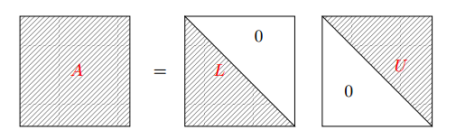

## Linear systems: Direct Methods

We call **linear system of order $n$** ($n$ positive integer), an expression of the form
$$
A \mathbf{x} = \mathbf{b},
\nonumber
$$
where $A = (a_{ij})$ is a *given matrix* of size $n × n$, $\mathbf{b} = (b_j)$ is a *given vector* and $\mathbf{x} = (x_j)$ is the *unknown vector* of the system. The previous relation is equivalent to the $n$ equations

$$
\sum^n_{j=1} a_{ij}x_j = b_i, \quad i = 1, \ldots, n.
\nonumber
$$
The matrix $A$ is called non-singular if $\det(A) \neq 0$; the solution $\mathbf{x}$ will be unique (for any given vector $\mathbf{b}$) if and only if the matrix associated to the linear system is non-singular.

In theory, if $A$ is non-singular, the solution is given by the Cramer’s rule:
$$
x_i = \frac{\det(B_i)}{\det(A)}, \quad i = 1, \ldots, n,
\nonumber
$$
where $B_i$ is the matrix by substituting the $i$-th column of $A$ by the vector $\mathbf{b}$:
$$
B_i = \begin{bmatrix} a_{11} & \ldots & {\color{blue}{b_1}} & \ldots & a_{1n} \\
a_{21} & \ldots & {\color{blue}{b_2}} & \ldots & a_{2n}\\
\vdots & & \vdots & & \vdots \\0
a_{n1} & \ldots & {\color{blue}{b_n}} & \ldots & a_{nn}
\end{bmatrix}\\
\quad \quad \; \uparrow\\
\quad \quad \; i
\nonumber
$$
Unfortunately, the application of this rule is unacceptable for the practical solution of systems because the computational cost is of the order of $(n + 1)!$ floating point operations per second (flops). In fact, every determinant requires $n!$ flops.

### Triangular systems

A matrix $U = (u_{ij})$ is **upper triangular** if
$$
u_{ij} = 0 \; \forall i,j: 1 \le j < i \le n
\nonumber
$$
and a matrix $L = (l_{ij})$ is **lower triangular** if
$$
l_{ij} = 0 \; \forall i,j: 1 \le i < j \le n.
\nonumber
$$
A diagonal matrix is a special triangular matrix. Respectively, the system to be solved is called **upper or lower triangular system**.

**Remark:** If a matrix $A$ in non-singular and triangular, knowing that
$$
\det(A) = \prod^n_{i=1} λ_i(A) = \prod^n_{i=1} a_{ii}
\nonumber
$$
($λ_i(A)$ being the $i$-th eigenvalue of $A$), we can deduce that $a_{ii} \neq 0$, for all $i = 1, \ldots, n$.

If $L$ is lower triangular and non-singular, the linear system $L\mathbf{y} = \mathbf{b}$ corresponds to
$$
\begin{align*}
\begin{cases}
l_{11} y_1 &= b_1 \\
l_{21} y_1 + l_{22} y_2 &= b_2 \\
\vdots \\
l_{n1} y_1 + l_{n2} y_2 + \ldots + l_{nn} y_n &= b_n
\end{cases}
\end{align*}
$$
Thus:
$$
{\color{red}{\boxed{y_1 = \frac{b_1}{l_{11}}}}, \quad \text{[1 operation]}}
\nonumber
$$
and for $i = 2, 3, . . . , n$
$$
{\color{red}{\boxed{y_i = \frac{1}{l_{ii}} \left( b_i − \sum^{i-1}_{j=1} l_{ij} y_j \right)}}. \quad \text{[$1 + 2(i - 1)$ operations]}}
\nonumber
$$
This algorithm is called **forward substitutions algorithm**.

The forward substitutions algorithm requires $n^2$ operations, where $n$ is the size of the system, since
$$
1 + \sum_{i=2}^n (1 + 2(i-1)) = 1 + \sum_{i=1}^n (2i-1) - 1= n^2.
\nonumber
$$
If $U$ is upper triangular and non-singular, the system $U \mathbf{x} = \mathbf{y}$ is:
$$
\begin{align*}
\begin{cases}
u_{11} x_1 + \ldots + u_{1,n-1} x_{n-1} + u_{1n} x_n &= y_1 \\
\vdots\\
u_{n-1,n-1} x_{n-1} + u_{n-1,n} x_n &= y_{n-1} \\
u_{nn} x_n &= y_n
\end{cases}
\end{align*}
$$
Thus:
$$
{\color{red}{\boxed{x_n = \frac{y_n}{u_{nn}}}}},
\nonumber
$$
and for $i = n-1, n-2, . . . , 2, 1$
$$
{\color{red}{\boxed{x_i = \frac{1}{u_{ii}} \left( y_i − \sum^n_{j=i+1} u_{ij} x_j \right) }}}.
\nonumber
$$
This algorithm is called **backward substitutions algorithm**. The cost is, once again, $n^2$ operations.

### The $LU$ factorization method

Let $A = (a_{ij})$ be a non-singular $n × n$ matrix. Assume that there exist a matrix $U = (u_{ij})$, **upper triangular** and a matrix $L = (l_{ij})$, **lower triangular** such that
$$
A = LU.
\label{eq:lu}
$$

We call $\eqref{eq:lu}$ a **factorization / decomposition $LU$ of $A$**.

If we know the factorization $LU$ of $A$, solving the system $A \mathbf{x} = \mathbf{b}$ is equivalent to solving two systems defined by triangular matrices. Indeed,
$$
A \mathbf{x} = \mathbf{b} \; \Longleftrightarrow \; LU \mathbf{x} = \mathbf{b} \; \Longleftrightarrow \; \begin{cases}L \mathbf{y} = \mathbf{b} \;, \\ U \mathbf{x} = \mathbf{y} \;. \end{cases}
\nonumber
$$
We can easily calculate the solutions of both systems:

+ first, we use the forward substitutions algorithm to solve $L \mathbf{y} = \mathbf{b}$ (order $n^2$ flops);
+ then, we use the backward substitutions algorithm to solve $U \mathbf{x} = \mathbf{y}$ (order $n^2$ flops).

It is required to find first (if possible) the matrices $L$ and $U$, which requires a number of operations of the order $\frac{2n^3}{3}$ flops, that is better than $(n+1)!$.

**Example.** Lets try to find a factorization $LU$ in the case case where the size of the matrix $A$ is $n = 2$. We can write the equation $\eqref{eq:lu}$ as
$$
\begin{bmatrix} a_{11} & a_{21}\\ a_{12} & a_{22} \end{bmatrix} = \begin{bmatrix} l_{11} & 0\\ l_{21} & l_{22} \end{bmatrix} \begin{bmatrix} u_{11} & u_{12}\\ 0 & u_{22} \end{bmatrix},
\nonumber
$$
Or equivalently:
$$
\begin{align*}
(a) \quad l_{11} u_{11} = a_{11}, \quad\quad &(b) \quad l_{11} u_{12} = a_{12},\\
(c) \quad l_{21} u_{11} = a_{21}, \quad\quad &(d) \quad l_{21} u_{12} + l_{22} u_{22} = a_{22}.
\end{align*}
$$
We have then a system (non-linear) with $4$ equations and $6$ unknowns; in order to have the same number of equations and unknowns, we fix the diagonal of $L$ by taking $l_{11} = l_{22} = 1$. Consequently, from $(a)$ and $(b)$ we have $u_{11} = a_{11}$ and $u_{12} = a_{12}$; finally, if we assume $a_{11} \neq 0$, we obtain $l_{21} = \frac{a_{21}}{a_{11}}$ and $u_{22} = a_{22} - l_{21} u_{12} = a_{22} - \frac{a_{21} a_{12}}{a_{11}}$ using the equations $(c)$ and $(d)$. 

To determine a factorization $LU$ of the matrix $A$ of any size $n$, we apply the following method.

1. The elements of $L$ and $U$ satisfy the non-linear system

$$
\sum^{\min(i,j)}_{r=1} l_{ir} u_{rj} = a_{ij}, \quad i,j = 1, \ldots, n;
\label{eq2}
$$

2. The system $\eqref{eq2}$ has $n^2$ equations and $n^2 + n$ unknowns, so it is undetermined. Consequently, the $LU$ factorization is not unique. We can wipe out $n$ unknowns if we set the $n$ diagonal elements of $L$ equal to 1:
   $$
   \begin{equation*}
   l_{ii} = 1, \quad i = 1, \ldots, n.
   \end{equation*}
   $$
   We will see that in this case there exists an algorithm (*Gauss factorization*) allowing us to efficiently compute the factors $L$ and $U$.

Any $n \times n$ matrix $\textstyle A$ admits a $LU$ factorization with partial pivoting (LUP)[[1]](https://en.wikipedia.org/wiki/LU_decomposition#cite_note-okunev-cor3-2) [we will see it later]. It turns out that all square matrices can be factorized in this form, and the factorization is numerically stable in practice. Instead, if ${\textstyle A}$ is invertible, then it admits an $LU$ factorization if and only if all its leading principal minors[[2]](https://en.wikipedia.org/wiki/Minor_(linear_algebra)#Other_applications) are nonzero (like for the GEM).

### The Gauss elimination method

The **Gauss elimination method** (GEM) transforms the system
$$
A \mathbf{x} = \mathbf{b}
\nonumber
$$
with $A \in \mathbb R^{n \times n}$, in an equivalent system (i.e. with the same solution) of the form:
$$
U \mathbf{x} = \mathbf{\hat{b}},
\nonumber
$$
where $U$ is an upper triangular matrix and $\mathbf{\hat{b}}$ is a properly modified second member. This system can be solved by a backward substitutions method.

In the transformation, we essentially use the property that says that we do not change the solution of the system if we add to a given equation a linear combination of other equations.

Let us consider an invertible matrix $A \in \mathbb{R}^{n×n}$ in which the diagonal element $a_{11}$ is assumed to be non-zero. we set $A^{(1)} = A$ and $\mathbf{b}^{(1)} = \mathbf{b}$. We introduce the **multiplier**
$$
l_{i1} = \frac{a^{(1)}_{i1}}{a^{(1)}_{11}}, \; i = 2, 3, \ldots, n, \quad\quad A^{(1)} = \begin{bmatrix}
a^{(1)}_{11} & \cdots & a^{(1)}_{1j} & \cdots & a^{(1)}_{1n}\\
\vdots & & \vdots & & \vdots\\
a^{(1)}_{i1} & \cdots & a^{(1)}_{ij} & \cdots & a^{(1)}_{in}\\
\vdots & & \vdots & & \vdots\\
a^{(1)}_{n1} & \cdots & a^{(1)}_{nj} & \cdots & a^{(1)}_{nn}
\end{bmatrix}
\nonumber
$$
where the $a^{(1)}_{ij}$ represent the elements of $A^{(1)}$. This multiplier will yield $0$ as coefficient for the unknown $x_1$ in the lines $i\ge 2$ when combined with the first line of the matrix. In this way the unknown $x_1$ can be removed from the rows $i = 2, . . . , n$ by subtracting $l_{i1}$ times the first row and doing the same at the right-hand side.

Let us define
$$
a^{(2)}_{ij} = a^{(1)}_{ij} - l_{i1} a^{(1)}_{1j}, \quad\; i,j = 2, \ldots, n,\\
b^{(2)}_i = b^{(1)}_i - l_{i1} b^{(1)}_1, \quad\quad\; i = 2, \ldots, n,
\nonumber
$$
where the $b^{(1)}_i$ are the components of $\mathbf b^{(1)}$. The coefficients $l_{i1}$ will set to $0$ all the elements $a_{ij}$ below the pivot, and $\mathbf b^{(2)}$ will be the adjusted $\mathbf b$ accordingly to the changes made to the matrix $A$. We get a new system of the form
$$
\begin{bmatrix}
a^{(1)}_{11} & a^{(1)}_{12} & \ldots & a^{(1)}_{1n}\\
0 & a^{(2)}_{22} & \ldots & a^{(2)}_{2n}\\
\vdots & \vdots & & \vdots\\
0 & a^{(2)}_{n2} & \ldots & a^{(2)}_{nn}
\end{bmatrix}
\begin{bmatrix}
x_1\\
x_2\\
\vdots\\
x_n
\end{bmatrix} = \begin{bmatrix}
b^{(1)}_1\\
b^{(2)}_2\\
\vdots\\
b^{(2)}_n
\end{bmatrix},
\nonumber
$$
which will be written as $A^{(2)} \mathbf{x} = \mathbf{b}^{(2)}$ and that is equivalent to the system we had at the beginning.

Once again we can transform this system by removing the unknown $x_2$ from the rows $3, . . . , n$. By repeating this step we obtain a finite series of systems
$$
A^{(k)} \mathbf{x} = \mathbf{b}^{(k)}, \; 1 \le k \le n,
\nonumber
$$
where, for $k \ge 2$, the matrix $A^{(k)}$ is of the form
$$
A^{(k)} =
\begin{bmatrix}
a^{(1)}_{11} & a^{(1)}_{12} & \cdots & \cdots  & \cdots & a^{(1)}_{1n} \\
0 & a^{(2)}_{22} & & & & a^{(2)}_{2n} \\
\vdots & & \ddots & & & \vdots \\
0 & \cdots & 0 & a^{(k)}_{kk} & \cdots & a^{(k)}_{kn} \\
\vdots & & \vdots & \vdots & & \vdots \\
0 & \cdots & 0 & a^{(k)}_{nk} & \cdots & a^{(k)}_{nn}
\end{bmatrix},
\nonumber
$$
where we assume $a^{(i)}_{ii} \neq 0$ for $i = 1, . . . , k - 1$.

|  |
| :----------------------------------------------------------: |
| GEM: diagram showing how the matrix $A^{(k+1)}$ is obtained from the matrix $A^{(k)}$. |

It is clear that for $k = n$ we obtain the following upper triangular system $A^{(n)} \mathbf{x} = \mathbf{b}^{(n)}$:
$$
\begin{bmatrix}
a^{(1)}_{11} & a^{(1)}_{12} & \ldots & \ldots & a^{(1)}_{1n} \\
0 & a^{(2)}_{22} & & & a^{(2)}_{2n} \\
\vdots & & \ddots & & \vdots \\
0 & & & \ddots & \vdots \\
0 & & & & a^{(n)}_{nn}
\end{bmatrix}
\begin{bmatrix}
x_1 \\
x_2 \\
\vdots \\
\vdots \\
x_n
\end{bmatrix} = \begin{bmatrix}
b^{(1)}_1 \\
b^{(2)}_2 \\
\vdots \\
\vdots \\
b^{(n)}_n
\end{bmatrix}.
\nonumber
$$
To be consistent with the previous notation, we write as $U$ the upper triangular matrix $A^{(n)}$. The elements on the main diagonals, the $a^{(k)}_{kk}$, are called **pivots** and have to be non-zero for $k = 1, \ldots, n - 1$.

In order to make explicit the formula to get from the $k$-th system to the $(k + 1)$-th, for $k = 1, . . . , n-1$, we assume that $a^{(k)}_{kk} \neq 0$ and we define the **multiplier**
$$
{\color{red}{\boxed{l_{ik} = \frac{a^{(k)}_{ik}}{a^{(k)}_{kk}}}}}, \quad i = k+1, \ldots, n, \quad\quad {\color{blue}\text{[$(n-k)$ operations]}}
\label{eq4}
$$
we set then
$$
\begin{align*}
{\color{red}{\boxed{a^{(k+1)}_{ij} = a^{(k)}_{ij} − l_{ik} a^{(k)}_{kj}}}}, \quad &i,j = k + 1, \ldots, n, \quad {\color{blue}\text{[$2(n-k)^2$ operations]}}
\\
{\color{red}{\boxed{b^{(k+1)}_i = b^{(k)}_i − l_{ik} b^{(k)}_k}}}, \quad &i = k+1, \ldots, n. \quad\quad {\color{blue}\text{[$2(n-k)$ operations]}}
\end{align*}
\tag{38}
$$

**Remark.** *To perform the Gauss elimination we require $2(n-k)^2$ operations to update $A$, $2(n-k)$ operations to update $b$ and $(n-k)$ operations to update $l$, so in total*
$$
\begin{align*}
2 \sum^{n-1}_{k=1} (n - k)^2 + 3 \sum^{n-1}_{k=1}(n - k) &=
2 \sum^{n-1}_{p=1}p^2 + 3 \sum^{n-1}_{p=1}p \\
&= 2 \frac{(n - 1)n(2n - 1)}{6} + 3\frac{n(n - 1)}{2} = \frac{n(n-1)(2n+3)}3
\end{align*}
$$
*operations are required, plus $n^2$ operations for the resolution with the backward substitutions method of the triangular system $U \mathbf{x} = \mathbf{b}^{(n)}$. By keeping only the dominant elements (of order $n^3$), we can say that the Gauss elimination method has a cost of around*
$$
\frac{2}{3} n^3 \; operations.
\nonumber
$$
The Gauss method is only properly defined if the pivots $a^{(k)}_{kk}$ are non-zero for $k = 1, . . . , n-1$. Unfortunately, knowing that the diagonal elements of $A$ are not zero is not enough to avoid null pivots during the elimination phase. For example, the following matrix $A$ in $\eqref{es:matrix}$ is invertible and its diagonal elements are non-zero
$$
A = \begin{bmatrix}
1 & 2 & 3 \\
2 & 4 & 5 \\
7 & 8 & 9
\end{bmatrix}, \quad \text{but we find} \quad A^{(2)} = \begin{bmatrix}
1 & 2 & 3 \\
0 & \boxed{0} & −1 \\
0 & −6 & −12
\end{bmatrix}.
\label{es:matrix}
$$
Nevertheless, we have to stop the Gauss method at the second step, because $a^{(2)}_{22} = 0$.

Let $A_i$ be the $i$-th main submatrix of $A$ ($i = 1, . . . , n-1$), i.e. the submatrix made of the $i$ first rows and columns of $A$:

and let $d_i$ be the principal minor of $A$ defined as $d_i = \det(A_i)$. We have the following result.

**Proposition 1.** *For a given matrix $A \in \mathbb{R}^{n×n}$, its Gauss factorization exists and is unique iff the principal submatrices $A_i$ ($i = 1, . . . , n-1$) are non-singular (i.e. the principal minors $d_i$ are non-zero: $d_i \neq 0$).*

<u>Remark:</u> If $d_i \neq 0$ ($i = 1, . . . , n-1$), then the pivots $a^{(i)}_{ii}$ are also non-zero.
The matrix of the previous example does not satisfy this condition because $d_1 = \det[1] = 1$ but $d_2 = \det\begin{bmatrix}1 &2 \\2 & 4\end{bmatrix} = 0$.

There are some categories of matrices for which the hypothesis of the [Proposition 1](#prop1) are fulfilled. In particular, we mention:

1. **(Strictly $>$) diagonal dominant by row matrices.** A matrix $A$ is said diagonal dominant by row if

$$
|a_{ii}| \ge \sum_{j=1,\ldots,n;j \neq i} |a_{ij}|, \quad i = 1, \ldots, n.
  \nonumber
$$

2. **(Strictly $>$) diagonal dominant by column matrices.** A matrix $A$ is said diagonal dominant by column if

$$
|a_{jj}| \ge \sum_{i=1,\ldots,n; i \neq j} |a_{ij}|, \quad j = 1, \ldots, n.
  \nonumber
$$

3. **Symmetric positive definite matrices.** A matrix $A$ is symmetric if $A = A^T$; it is positive definite if all its eigenvalues are positive, i.e.:
   $$
   \lambda_i(A) > 0, \quad i = 1, . . . , n.
   \nonumber
   $$

**Example 3:** The matrix $\begin{bmatrix}
−4 & 1 & 2 \\
2 & 5 & 0 \\
−2 & 1 & 7 \\
\end{bmatrix}$ is diagonal dominant by row and by column, whereas $\begin{bmatrix}
−3 & 1 & 2 \\
2 & 5 & 0 \\
−2 & 1 & 7 \\
\end{bmatrix}$ is only diagonal dominant by row (in the first column we have $|-3| < |2| + |-2|$).

### Gauss ∼ LU

We can show that the Gauss method is equivalent to the factorization $A = LU$ of the matrix $A$, with $L$ = multiplier matrix and $U = A^{(n)}$.

More exactly:

The matrices $L$ and $U$ only depend on $A$ (and not on $\mathbf{b}$), so the same factorization can be reused for solving several linear systems that share the same matrix $A$ but **different vectors** $\mathbf{b}$.

The number of operations is then considerably reduced, since most of the computational weight, around $\frac{2}{3} n^3$ flops, is due to the Gaussian elimination process. Indeed, let us consider the $M$ linear systems:
$$
A \mathbf{x}_m = \mathbf{b}_m \quad m = 1, \ldots, M.
\nonumber
$$
Therefore:

- the cost of the factorization $A = LU$ is $\frac{2}{3} n^3$ flops;
- the cost of the resolution of both triangular systems, $L \mathbf{y}_m = \mathbf{b}_m$ and $ U \mathbf{x}_m = \mathbf{y}_m$ ($m = 1, \ldots, M$) is $2Mn^2$ flops,

for a total of $\frac{2}{3} n^3 + 2Mn^2$ flops which is much smaller than $\frac{2}{3}Mn^3$ flops required to solve all the systems with the Gauss elimination method.

### The pivoting technique

It has been already noted that the Gauss method fails if a pivot becomes zero. In that case, we can use a technique called **pivoting** that consists in exchanging the rows (or the columns) of the system in such a way that no pivot is zero.

**Example.** Let us go back to the matrix $\eqref{es:matrix}$ for which the Gauss method gives a null pivot at the second step. By just exchanging the second and the third rows, we get a non-zero pivot and can execute one step further. Indeed,
$$
A^{(2)} = \begin{bmatrix}
1 & 2 & 3 \\
0 & 0 & −1 \\
0 & −6 & −12
\end{bmatrix} \quad \Longrightarrow \quad P_2 A^{(2)} = \begin{bmatrix}
1 & 2 & 3 \\
0 & −6 & −12 \\
0 & 0 & −1 \\
\end{bmatrix},
\nonumber
$$
where $P_2 = \begin{bmatrix}
1 & 0 & 0 \\
0 & 0 & 1 \\
0 & 1 & 0
\end{bmatrix}$ is called **permutation matrix**.

The pivoting strategy used for the previous example can be generalized by finding, at every step $k$ of the elimination, a non-zero pivot among the elements of the subcolumn $A^{(k)}(k : n, k)$. This is called a **partial pivot change** (by row).

From $\eqref{eq4}$ we know that a big value of $l_{ik}$ (coming for instance from a small $a^{(k)}_{kk}$) can amplify the rounding errors affecting the elements $a^{(k)}_{jk}$. Consequently, in order to ensure a better stability, we choose as pivot the biggest element in module of the column $A^{(k)}(k : n, k)$, and the partial pivoting is performed at every step, even if it is not strictly necessary (i.e. even if the pivot is non-zero). In this way $a_{ij}$ and $b_j$ are under control.

An alternative method consists looking for the pivot in the whole submatrix $A^{(k)}(k : n, k : n)$, performing what is called **complete pivoting**.

Remark that, whereas partial pivoting requires just an additional cost of $n^2$ tests, complete pivoting needs some $2n^3/3$, what considerably increases the cost of the Gauss method.

In general, if at the step $k$ we have to exchange the rows $k$ and $r$, we will have to multiply $A^{(k)}$ by the following **permutation matrix** $P_k$ before continuing:

This means we will consider $P_k A^{(k)}$ instead of $A^{(k)}$.

Setting $\mathbf l_k = [0, \ldots, 0, l_{k+1,k}, \ldots, l_{n,k}]^T \in \mathbb R^n$, and defining
$$
M_k =
\begin{bmatrix}
1 & \cdots & 0 & 0  & \cdots & 0 \\
\vdots & \ddots & \vdots &  \vdots & & \vdots \\
0 & \cdots & 1 & a^{(k)}_{kk} & \cdots & a^{(k)}_{kn} \\
0 & \cdots & -l_{k+1,k} & 1 & \cdots & 0 \\
\vdots & & \vdots & \vdots & \ddots & \vdots \\
0 & \cdots & -l_{n,k} & 0 & \cdots & 1
\end{bmatrix} = I_n - \mathbf l_k \mathbf e_k^T
\nonumber
$$
as the **$k$-th Gaussian transformation matrix**, one finds out that
$$
(M_k)_{ip} = \delta_{ip} - (\mathbf l_k \mathbf e^T_k)_{ip} = \delta_{ip} - l_{ik} \delta_{kp}, \quad\quad i, p = 1, \ldots, n.
\nonumber
$$
Let us analyze how partial pivoting affects the $LU$ factorization induced by GEM. At the first step of GEM with partial pivoting, after finding out the entry $a_{r1}$ of maximum module in the first column, the elementary permutation matrix $P_1$ which exchanges the first row with the $r$-th row is constructed (if $r = 1$, $P_1$ is the identity matrix). Next, the first Gaussian transformation matrix $M_1$ is generated and we set $A^{(2)} = M_1 P_1 A^{(1)}$. A similar approach is now taken on $A^{(2)}$ , searching for a new permutation matrix $P_2$ and a new matrix $M_2$ such that
$$
A^{(3)} = M_2 P_ 2 A^{(2)} = M_2 P_2 M_1 P_1 A^{(1)}.
\nonumber
$$
Executing all the elimination steps, the resulting upper triangular matrix $U$ is now given by
$$
U = A^{(n)} = M_{n-1} P_{n-1} \ldots M_1 P_1 A^{(1)}.
\label{eq:U}
$$
Letting $M = M_{n-1} P_{n-1} \ldots M_1 P_1$ and $P = P_{n-1} \ldots P_1$, we obtain that $U=MA$ and, thus, $U = (MP^{-1})PA$. It can be checked that the matrix $L = PM^{-1}$ is unit lower triangular, so that the $LU$ factorization reads
$$
{\color{blue}{\boxed{PA = LU}}},
$$
being $P = P_{n-1} P_{n-2} \ldots P_2 P_1$ the **global permutation matrix**, $L$ the **multiplier matrix** (the new ones!) and $U = A^{(n)}$.

Once the matrices $L$, $U$ and $P$ have been calculated, the resolution of the initial system is transformed into the resolution of the triangular systems
$$
A \mathbf{x} = b
\quad \Longrightarrow \quad 
PA \mathbf{x} = P \mathbf{b}
\quad \Longrightarrow \quad
LU \mathbf{x} = P \mathbf{b}
\quad \Longrightarrow \quad
\begin{cases}
L \mathbf{y} = P\mathbf{b} \;, \\
U \mathbf{x} = \mathbf{y} \;.
\end{cases}
\nonumber
$$
Remark that the coefficients of the matrix $L$ have the same values as the multipliers calculated by a factorization $LU$ of the matrix $PA$ without pivoting.

If complete pivoting is performed, at the first step of the process, once the element $a_{qr}$ of largest module in submatrix $A(1:n, 1:n)$ has been found, we must exchange the first row and column with the $q$-th row and the $r$-th column. This generates the matrix $P_1 A^{(1)} Q_1$, where $P_1$ and $Q_1$ are permutation matrices by rows and by columns, respectively. As a consequence, the action of matrix $M_1$ is now such that $A^{(2)} = M_1 P_1 A_{(1)} Q_1$. Repeating the process, at the last step, instead of $\eqref{eq:U}$ we obtain
$$
U = A^{(n)} = M_{n-1} P_{n-1} \ldots M_1 P_1 A^{(1)} Q_1 \ldots Q_{n-1}.
\nonumber
$$
In the case of complete pivoting the $LU$ factorization becomes
$$
{\color{blue}{\boxed{PAQ = LU}}}
$$
where $P = P_{n-1} \ldots P_1$ is a permutation matrix that takes into account all permutations by row, and $Q = Q_1 \ldots Q_{n-1}$ is a permutation matrix that takes into account all permutations by column. By construction, the matrix $L$ is still lower triangular, and its elements have a module lower or equal to $1$. As for the partial pivoting, the elements of $L$ are the multipliers generated by the factorization $LU$ of the matrix $PAQ$ with no pivoting.

Once the matrices $L$, $U$, $P$ and $Q$ have been calculated, for solving the linear system we notice that we can write
$$
A \mathbf{x} = \mathbf{b} \quad \Longleftrightarrow \quad \underbrace{PAQ}_{LU} \underbrace{Q^{-1} \mathbf{x}}_{\mathbf{x}^∗} = P \mathbf{b} \quad \Longleftrightarrow \quad LU \mathbf{x}^∗ = P \mathbf{b}.
\nonumber
$$
Which brings us to the resolution of two triangular systems and an equation
$$
\begin{cases}
L \mathbf{y} = P \mathbf{b} \;, \\
U \mathbf{x}^∗ = \mathbf{y} \;, \\
\mathbf{x} = Q \mathbf{x}^∗.
\end{cases}
\nonumber
$$
**Remark 1.** *The matrix $P$ is a permutation matrix. In the case where the matrix $P$ is the identity, the matrices $L$ and $U$ are the matrices we are looking for (such that $LU = A$). Otherwise, we have $LU = PA$.*

**Remark 2.** *Using the $LU$ factorization, obtained by fixing the value $1$ for the $n$ diagonal elements of $L$, we can calculate the determinant of a square matrix with $O(n^3)$ operations, thanks to the Binet theorem:*
$$
\det(A) = \det(L) \det(U) = \det(U) = \prod^n_{k=1} u_{kk};
$$
*indeed, the determinant of a triangular matrix is is the product of the diagonal elements.*

### The inverse matrix

If $A$ is a $n × n$ *non-singular* matrix, let us call $x^{(1)}, \ldots, x^{(n)}$ the columns of its inverse matrix $A^{-1}$, i.e. $A^{-1} = (x^{(1)}, \ldots, x^{(n)})$. The relation $AA^{-1} = I$ can be expressed by the following $n$ systems : for $1 \le k \le n$,
$$
A \mathbf{x}^{(k)} = \mathbf{e}^{(k)},
\label{eq5}
$$
where $\mathbf{e}^{(k)} = (0,0, \ldots, 0, 1, 0, \ldots, 0)$ is the column vector with all the elements equal to $0$ except the one corresponding to the $k$-th row, which equals $1$ (it corresponds to the $k$-th column of $I$).
Once we know the matrices $L$ and $U$ that factorizes $A$, solving the $n$ systems $\eqref{eq5}$ defined by the same matrix $A$ requires $2n \cdot n^2 = 2n^3$ operations.

### The Cholesky factorization

In the case where the $n × n$ matrix $A$ is symmetric and positive definite, there exists a unique upper triangular matrix $R$ with positive diagonal elements such that
$$
{\color{blue}{\boxed{A = R^T R}}}.
\nonumber
$$
This factorization is called **Cholesky factorization**.

The elements $r_{ij}$ of $R$ can be calculated using the expressions
$$
r_{11} = \sqrt{a_{11}}
$$
and for $i = 2, . . . , n$:
$$
\begin{align}
r_{ji} &= \frac{1}{r_{jj}} \left( a_{ij} − \sum^{j-1}_{k=1} r_{ki} r_{kj} \right), \quad j = 1, \ldots, i-1,
\\
r_{ii} &= \sqrt{a_{ii} − \sum^{i-1}_{k=1} r^2_{ki}}
\end{align}
$$

The Cholesky factorization needs around $\frac{n^3}{3}$ operations (half the operations for a $LU$ factorization, so it uses half of the computational time!).

### Memory space limitations

A square matrix of order $n$ is called **sparse** if the number of nonzero entries is of order $n$ (on $n^2$ total entries).

The **pattern** is the 2D representation of nonzero entries positions:

- lower band $p_1$: $a_{ij} = 0$ when $i > j + p_1$
- upper band $p_2$: $a_{ij} = 0$ when $j > i + p_2$

The maximum between $p_1$ and $p_2$ is called **matrix bandwidth**.

The **fill-in phenomenon** occurs when, after a $LU$ decomposition, $L$ and $U$ present less sparsity then the original matrix $A$, leading to a bigger memory usage. To reduce the phenomenon we can apply row and column permutations to **reorder** $A$ before performing the factorization (**pivoting**).

**Example 1.** Let $A$ be a matrix of size $127 × 127$, symmetric and positive definite. The number of non-null entries of $A$ is $379$ and thus much smaller than $(127)^2 = 16129$. It is a sparse matrix. The figure on the left shows the disposition of the non-null entries of $A$, whereas the one on the right shows the non-null entries of the matrix $R$. Even if also $R$ is a sparse matrix, we need one order of magnitude more to allocate this matrix!

**Example 2.** Let us consider the problem of calculating the deformations in a structure subject to a given set of forces. The discretization using the finite elements method generates a matrix $A$ of size $150 × 150$. (The same matrix would have been produced by the approximation of an electric potential field.) This matrix is symmetric positive definite. The number of non-null entries of $A$ is 964, and thus much smaller than $(150)^2 = 22500$. It is a *sparse* matrix.

The figure on the left shows the disposition of the non-null entries of $A$, whereas the one on the right shows the non-null entries of the matrix $R$.

We notice that the number of non-null entries of $R$ is much bigger than those of $A$ (**fill-in phenomenon**, due to the change of the structure of the matrix during the factorization). This leads to a bigger memory usage, and it's not suggested to use the sparse structure anymore. To reduce the fill-in phenomenon, we can re-order rows and columns of $A$ in a particular fashion; this is called **re-ordering** of the matrix. There are several algorithms that allow us to do this.

For example, the following figure shows, on the left, one possibility of reordering $A$, while the one on the right shows the disposition of the non-null entries of the Cholesky factorization of the reordered matrix $A$. With the new techniques this will be much more easy and less costly.

### Precision limitations

**Example 3.** Rounding errors can induce important differences between the calculated solution using the Gauss elimination method (GEM) and the exact solution. This happens when the *conditioning (number)* of the matrix of the system (representing how numerically stable this matrix can be) is very big.

The Hilbert matrix of size $n × n$ is a symmetric matrix defined by:
$$
A_{ij} = \frac{1}{i + j − 1}, \quad i, j = 1, \ldots, n
\nonumber
$$
For example, for $n = 4$, we get:
$$
A =
\begin{bmatrix}
1 & \frac{1}{2} & \frac{1}{3} & \frac{1}{4} \\
\frac{1}{2} & \frac{1}{3} & \frac{1}{4} & \frac{1}{5} \\
\frac{1}{3} & \frac{1}{4} & \frac{1}{5} & \frac{1}{6} \\
\frac{1}{4} & \frac{1}{5} & \frac{1}{6} & \frac{1}{7}
\end{bmatrix}
\nonumber
$$
This matrices are often used as benchmark to estimate the performance of the numerical method.

We consider the linear systems $A_n \mathbf{x}_n = \mathbf{b}_n$ where $A_n$ is the Hilbert matrix of size $n$ with $n = 4, 6, 8, 10, 12, \ldots$, whereas $\mathbf{b}_n$ is chosen such that the exact solution is $\mathbf{x}_n = (1, 1, \ldots, 1)^T$.

The residual are always computable so they can be used as estimation of the error when you cannot compute it.

For every $n$, we calculate the conditioning of the matrix, we solve the linear system by $LU$ factorization and we get $\mathbf{x}^{LU}_n$ as the found solution. The obtained conditioning as well as the (relative) error $||\mathbf{x}_n - \mathbf{x}^{LU}_n || / ||\mathbf{x}_n ||$ (where $|| \cdot ||$ is the Euclidean norm of a vector, $||\mathbf{x}|| = \sqrt{\mathbf{x}^T \cdot \mathbf{x}}$) are shown in the figure below.

We have that the relative error is greater than 1 → 120% of error! IT'S IMPOSSIBLE!!!

### Considerations on the precision

The methods we have seen until now allow us to find the solution of a linear system in a finite number of operations. That is why they are called **direct methods**. However, there are cases where these methods are not satisfactory.

Total pivoting is more stable than partial pivoting.

**Definition.** *We call **conditioning** of a matrix $M$, symmetric positive definite, the ratio between the maximum and minimum of its eigenvalues, i.e.*
$$
K(M) = \frac{\lambda_\max(M)}{\lambda_\min(M)}
\nonumber
$$
*It is also called the **spectral condition number** of $M$.*

It can be shown that, the bigger the conditioning of a matrix, the worse the solution obtained by a direct method.

For example, let us consider a linear system $A \mathbf{x} = \mathbf{b}$. If we solve this system with a computer, due to rounding errors, we will not find the exact solution $\mathbf{x}$ but an approximate solution $\hat{\mathbf{x}}$. The following relationship can be shown:
$$
\frac{||\mathbf{x} - \hat{\mathbf{x}}||}{||\mathbf{x}||} \le K(A) \frac{||r||}{||b||}
\label{eq6}
$$
where $\mathbf{r}$ is the residual $\mathbf{r} = \mathbf{b} - A \hat{\mathbf{x}}$; we write as $||\mathbf{v}|| = \left( \sum^n_{k=1} v_k^2 \right) ^{1/2}$ the Euclidean norm of a vector $\mathbf{v}$.

Remark that, if the conditioning of $A$ is big, the distance $||\mathbf{x} - \hat{\mathbf{x}}||$ between the exact solution and the numerically computed solution can be very big even if the residual is very small. So the bigger $K(A)$, the worse the solution provided by a direct method. If $K \approx 1$, the matrix is **well conditioned**. We have that $\mathbf r$ is an estimation of the error $|| x - \hat x||$: if $K(A)$ is small, then the error is small when $||\mathbf r||$ is small; vice versa, if $K(A)$ is large we can't use $||\mathbf r||$ as measure for the error.

**Proof for $\eqref{eq6}$:** Let $A$ be a symmetric positive definite matrix, we can consider the $n$ eigenvalues $\lambda_i > 0$ and the associated unitary eigenvectors $\{\mathbf{v}_i\}$, $i = 1, \ldots, n$: $A \mathbf{v}_i = \lambda_i \mathbf{v}_i$, $i = 1, . . . , n$. These vectors form an orthonormal base of $\mathbb{R}^n$, which means $\mathbf{v}_i^T \mathbf{v}_j = \delta_{ij}$ for $i, j = 1, . . . , n$. For any $\mathbf{w} \in \mathbb{R}^n$, if we write it as
$$
\mathbf{w} = \sum^n_{i=1} w_i \mathbf{v}_i,
\nonumber
$$
we have
$$
\begin{align*}
|| A \mathbf{w} ||^2 &= (A \mathbf{w})^T (A \mathbf{w}) \\
&= (\lambda_1 w_1 \mathbf{v}_1^T + \ldots + \lambda_n w_n \mathbf{v}_n^T)(\lambda_1 w_1 \mathbf{v}_1 + \ldots + \lambda_n w_n \mathbf{v}_n) \\
&= \sum^n_{i,j=1} \lambda_i \lambda_j w_i w_j \mathbf{v}_i^T \mathbf{v}_j = \sum^n_{i,j=1} \lambda_i \lambda_j w_i w_j \delta_{ij} = \sum^n_{i=1} \lambda^2_i w_i^2
\end{align*}
\nonumber
$$
And yet, as $||\mathbf{w}||^2 = \sum^n_{i=1} w_i^2$, we get $||A \mathbf{w}||^2 \le \lambda^2_\max ||\mathbf{w}||^2$, i.e. $||A \mathbf{w}|| \le \lambda_\max ||\mathbf{w}||$ where $\lambda_\max$ is the biggest eigenvalue of $A$.

As the eigenvalues of $A^{-1}$ are $1/\lambda_i$, we also get $||A^{-1} \mathbf{w}|| \le \frac{1}{\lambda_\min} ||\mathbf{w}|| \; \forall \mathbf{w} \in \mathbb{R}^n$, where $\lambda_\min$ is the smallest eigenvalue of $A$.

Thus, we have
$$
\begin{align*}
||\mathbf{x} - \hat{\mathbf{x}}|| &= ||A^{-1} \mathbf{r}|| \le \frac{1}{\lambda_\min} ||\mathbf{r}||, \\
||\mathbf{b}|| &= ||A \mathbf{x}|| \le \lambda_\max ||\mathbf{x}||,
\end{align*}
\nonumber
$$
from where we directly find the inequality $\eqref{eq6}$:
$$
\frac{||\mathbf{x} - \hat{\mathbf{x}}||}{\lambda_\max ||\mathbf{x}||} \le \frac{\lambda_\min^{-1}||\mathbf{r}||}{||\mathbf{b}||} \Longleftrightarrow \frac{||\mathbf{x} - \hat{\mathbf{x}}||}{||\mathbf{x}||} \le \frac{\lambda_\max}{\lambda_\min}\frac{||\mathbf{r}||}{||\mathbf{b}||} \Longleftrightarrow \frac{||\mathbf{x} - \hat{\mathbf{x}}||}{||\mathbf{x}||} \le K(A) \frac{||\mathbf{r}||}{||\mathbf{b}||} 
\nonumber
$$

#### Other direct methods

- The **Thomas algorithm** is used to perform an optimized $LU$ factorization of a tridiagonal matrix in $n$ operations.
- The solution of an overdetermined system $A\mathbf x = \mathbf b$ with $A \in \mathbb R^{m \times n}$,  with $m > n$, can be computed using the $QR$ factorization or the singular value decomposition.