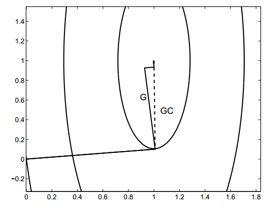
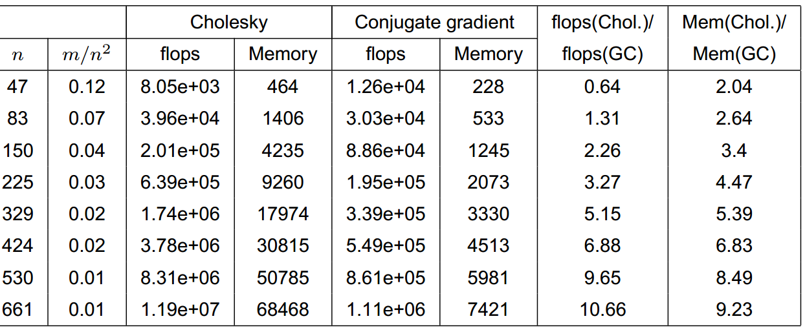
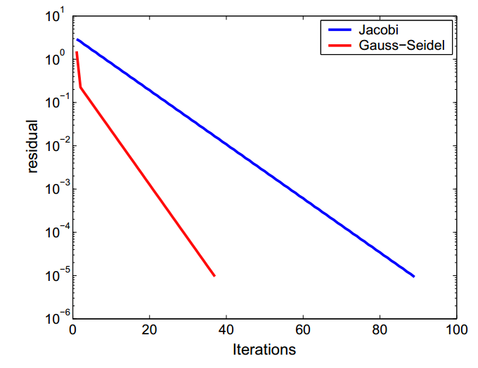
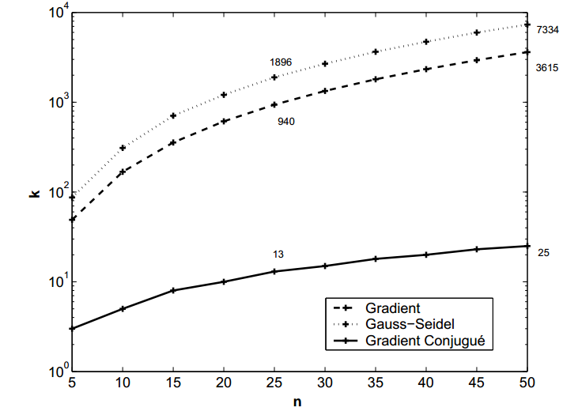
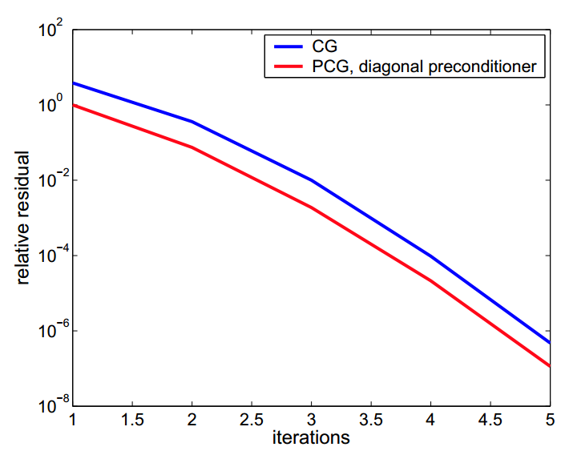
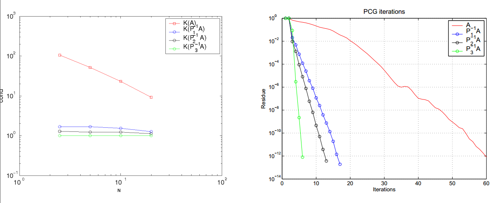
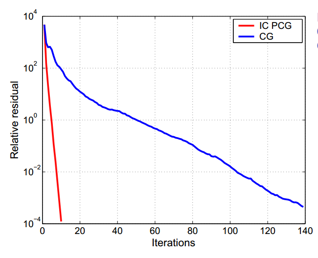
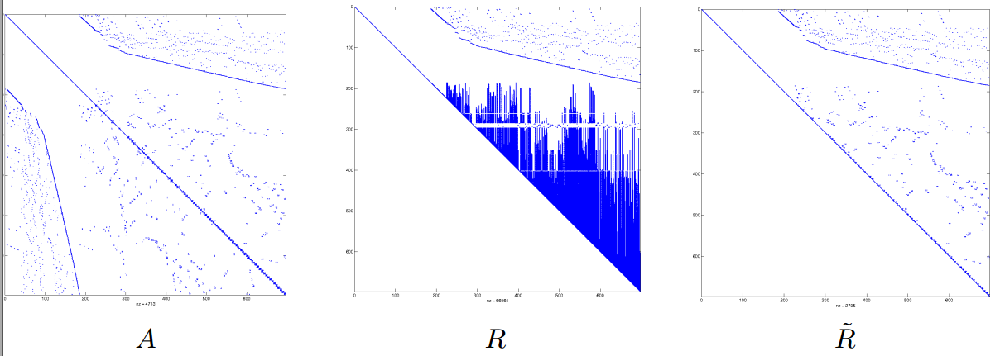

## Linear Systems: Iterative Methods

Solve the linear system $A \mathbf{x} = \mathbf{b}$ using an **iterative method** consists in building a series of vectors $\mathbf{x}^{(k)}$, $k \ge 0$, in $\mathbb{R}^n$ that converge at the exact solution $\mathbf{x}$, i.e.:
$$
\lim_{k \to \infty} \mathbf{x}^{(k)} = \mathbf{x}
\nonumber
$$
for any initial vector $\mathbf{x}^{(0)} \in \mathbb{R}^n$.
We can consider the following recurrence relation:
$$
\mathbf{x}^{(k+1)} = B \mathbf{x}^{(k)} + \mathbf{g}, \quad k \ge 0
\label{eq:iterative}
$$
where $B$ is a well chosen matrix (depending on $A$) and $\mathbf{g}$ is a vector (that depends on $A$ and $\mathbf{b}$, satisfying the relation (of consistence)
$$
\mathbf{x} = B \mathbf{x} + \mathbf{g}.
\label{eq:consistence}
$$
Given $\mathbf{x} = A^{-1} \mathbf{b}$, we get $\mathbf{g} = (I - B)A^{-1} \mathbf{b}$; the iterative method is therefore completely defined by the matrix $B$, known as **iteration matrix**.
By defining the error at step $k$ as
$$
\boxed{\mathbf{e}^{(k)} = \mathbf{x} - \mathbf{x}^{(k)}},
\nonumber
$$
we obtain the following recurrence relation:
$$
\begin{align*}
e^{(k+1)} &= \mathbf x - \mathbf x^{(k+)} = A^{-1}\mathbf b - B\mathbf x^{(k)} - \mathbf g = A^{-1}\mathbf b - B\mathbf x^{(k)} - (I - B)A^{-1} \mathbf b \\
&= A^{-1}\mathbf b - B\mathbf x^{(k)} - A^{-1} \mathbf b + BA^{-1} \mathbf b = - B\mathbf x^{(k)} + B \mathbf x = B(\mathbf x - \mathbf x^{(k)})
\end{align*}
$$
so
$$
\mathbf{e}^{(k+1)} = B \mathbf{e}^{(k)} \quad \text{and thus} \quad \mathbf{e}^{(k+1)} = B^{k+1} \mathbf{e}^{(0)}, \quad k = 0, 1, \ldots
\nonumber
$$
**Theorem.** *We have that $\lim_{k \to \infty} \mathbf{e}^{(k)} = 0$ for all $\mathbf{e}^{(0)}$ (and thus for all $\mathbf{x}^{(0)}$) if and only if*
$$
\boxed{ρ(B) = \max |λ_i(B)| < 1},
\nonumber
$$
*where $ρ(B)$ is the spectral radius of the matrix $B$, and $λ_i(B)$ are the eigenvalues of the matrix $B$.*

The smaller the value of $ρ(B)$, the less iterations are needed to reduce the initial error $e^{(0)}$ of a given factor or under a threshold $\varepsilon$; we would require at least $k_\min$ iterations, where
$$
\min (k_\min) \quad \text{s.t.} \quad \rho(B)^{k_\min} \le \varepsilon.
$$

### Construction of an iterative method

A general way of setting up an iterative method is based on the decomposition of the matrix $A$:
$$
A = P - (P - A)
\nonumber
$$
where $P$ in an invertible matrix called **preconditioner** of $A$.
Hence,
$$
A \mathbf{x} = \mathbf{b} \quad \Longleftrightarrow \quad  P \mathbf{x} = (P - A) \mathbf{x} + \mathbf{b}
\nonumber
$$
which is of the form $\eqref{eq:consistence}$ leaving
$$
B = P^{-1}(P - A) = I - P^{-1} A \quad \text{and} \quad \mathbf{g} = P^{-1} \mathbf{b}.
\nonumber
$$
We can define the corresponding iterative method
$$
P (\mathbf{x}^{(k+1)} - \mathbf{x}^{(k)}) = \mathbf{r}^{(k)} \quad k \ge 0
\nonumber
$$
where $\mathbf{r}^{(k)}$ represents the **residual** at the iteration $k$: $\boxed{\mathbf{r}^{(k)} = \mathbf{b} − A \mathbf{x}^{(k)}}$.

We can generalize this method as follows:
$$
{\color{red}{\boxed{P (\mathbf{x}^{(k+1)} - \mathbf{x}^{(k)}) = \alpha_k \mathbf{r}^{(k)}}}} \quad k \ge 0
\label{eq:Richardson}
$$
where $\alpha_k \neq 0$ is a parameter that improves the convergence of the series $\mathbf{x}^{(k)}$, called **acceleration parameter**. The method $\eqref{eq:Richardson}$ is called **Richardson’s method**.

This is equal to solve the linear system
$$
P \mathbf z^{(k)} = \mathbf r^{(k)}, \quad \text{with } \mathbf x^{(k+1)} = \mathbf x^{(k)} + \alpha_k \mathbf z^{(k)} \Longleftrightarrow P \left(\frac{\mathbf x^{(k+1)} - \mathbf x^{(k)}}{\alpha_k}\right) = \mathbf r^{(k)}
\nonumber
$$
where $\mathbf z^{(k)} = \frac{\mathbf x^{(k+1)} - \mathbf x^{(k)}}{\alpha_k}$ is called the **preconditioned residual** at step $k$.

The matrix $P$ has to be chosen in such a way that renders the cost of solving $\eqref{eq:Richardson}$ small enough. For example a diagonal or triangular $P$ matrix would comply with this criterion.

### Jacobi method

If the elements of the diagonal of $A = (a_{ij}) \in \mathbb R^{n \times n}$ are non-zero, so $a_{ii} \neq 0, \forall i=0,\ldots, n$, we can write
$$
P = D = \text{diag}(a_{11}, a_{22}, \ldots, a_{nn})
\nonumber
$$
$D$ with the diagonal part of $A$ being:
$$
D_{ij} = \begin{cases} 0 & \text{if } i \neq j \\
a_{ij} & \text{if } i=j.
\end{cases}
\nonumber
$$
The Jacobi method corresponds to this choice with $\alpha_k = 1$ for all $k$. We deduce:
$$
D \mathbf{x}^{(k+1)} = \mathbf{b} - (A - D) \mathbf{x}^{(k)} \quad k \ge 0.
\nonumber
$$
By components:
$$
{\color{red}{\boxed{x^{(k+1)}_i = \frac{1}{a_{ii}} \left( b_i - \sum^n_{j=1,j \neq i} a_{ij} x^{(k)}_j \right)}}}, \quad i = 1, . . . , n.
$$
The Jacobi method can be written under the general form
$$
{\color{red}{\boxed{\mathbf{x}^{(k+1)} = B \mathbf{x}^{(k)} + \mathbf{g}}}},
\nonumber
$$
with
$$
\boxed{B = B_J = D^{-1}(D - A) = I - D^{-1}A}, \quad \mathbf{g} = \mathbf{g}_J = D^{-1} \mathbf{b}.
\nonumber
$$

### Gauss-Seidel method

In order to obtain a faster convergence, we can include the newly computed components of vector $x_j^{(k+1)}$, $j=1,\ldots, i-1$ to the previous $x_j^{(k)}$, $j \ge i$, to compute $x_i^{(k+1)}$. This method is defined as follows:
$$
{\color{red}{\boxed{ \mathbf{x}^{(k+1)}_i = \frac{1}{a_{ii}} \left( b_i - \sum^{i-1}_{j=1} a_{ij} x^{(k+1)}_j - \sum^n_{j=i+1} a_{ij} x^{(k)}_j \right) }}}, \quad i = 1, \ldots, n.
\nonumber
$$
In this case the update is **sequential** rather than **simultaneous**, but leads to faster convergence. This method corresponds to $\eqref{eq:iterative}$ with $P = D - E$ and $\alpha_k = 1$ ($\forall k \ge 0$), where $E$ is the lower triangular matrix
$$
\begin{cases}
E_{ij} = -a_{ij} & \text{if } i > j \\
E_{ij} = 0 & \text{if } i \le j
\end{cases}
\nonumber
$$
(lower triangular part of $A$ without the diagonal and with its elements’ sign inverted).

We can write this method under the form $\eqref{eq:Richardson}$, with the iteration matrix $B = B_{GS}$ given by
$$
{\color{red}{\boxed{ B_{GS} = (D - E)^{-1} (D - E - A)}}}
\nonumber
$$
and
$$
{\color{red}{\boxed{ \mathbf{g}_{GS} = (D - E)^{-1} \mathbf{b}}}}.
\nonumber
$$

### Convergence

We have the following convergence results:

- **Proposition 1.**  If the matrix $A$ is *strictly diagonally dominant by row*, i.e.,
  $$
  |a_{ii}| > \sum_{j=1,...,n;j \neq i} |a_{ij}|, \quad i = 1, \ldots, n,
  \nonumber
  $$
  then the Jacobi and the Gauss-Seidel methods converge.

- If A is *symmetric positive definite*, then the Gauss-Seidel method converges (Jacobi maybe not).

- **Proposition 2.** Let $A$ be a *tridiagonal non-singular matrix* whose diagonal elements are all non-null. Then the Jacobi and the Gauss-Seidel methods are either *both divergent or both convergent*. In the latter case, $ρ(B_{GS}) = ρ(B_J)^2$.

### Richardson method

Let consider the iterative method $\eqref{eq:Richardson}$:
$$
P( \mathbf{x}^{(k+1)} - \mathbf{x}^{(k)}) = α_k \mathbf{r}^{(k)}, \quad k \ge 0.
\nonumber
$$
If the acceleration parameter is $α_k = α$ (a constant) this method is called **stationary preconditioned Richardson method**; otherwise is called **dynamic preconditioned Richardson method** when $α_k$ varies during the iterations.

Recall that the matrix $P$ is called **preconditioner** of $A$.

If $A$ and $P$ are symmetric positive definite, then there are two optimal criteria to choose $α_k$:

1. **Stationary case:**
   $$
   \alpha_k = \alpha_{opt} = \frac{2}{λ_\min + λ_\max}, \quad k \ge 0,
   \nonumber
   $$
   where $λ_\min$ and $λ_\max$ represent the smaller and the larger eigenvalue of the matrix $P^{-1}A$.

2. **Dynamic case:**
   $$
   \alpha_k = \frac{(\mathbf{z}^{(k)})^T \mathbf{r}^{(k)}}{(\mathbf{z}^{(k)})^T A \mathbf{z}^{(k)}}, \quad k \ge 0,
   \nonumber
   $$
   where $\mathbf{z}^{(k)} = P^{-1} \mathbf{r}^{(k)}$ is the *preconditioned residual*. This method is also called **preconditioned gradient method**.

If $P = I$ and $A$ is symmetric definite positive, we get the following methods:

- the **Stationary Richardson** if $B = I - \alpha_k A$, $\mathbf g = \mathbf b$ and we choose:
  $$
  α_k = α_{opt} = \frac{2}{λ_\min(A) + λ_\max(A)}.
  $$

- the **Gradient method** if $B = I - \alpha_k A$, $\mathbf g = \mathbf b$ and:
  $$
  α_k = \frac{(\mathbf{r}^{(k)})^T \mathbf{r}^{(k)}}{(\mathbf{r}^{(k)})^T A \mathbf{r}^{(k)}}, \quad k \ge 0,
  $$
  (we have that $\mathbf{z}^{(k)} = P^{-1} \mathbf{r}^{(k)} = I^{-1}\mathbf{r}^{(k)}=\mathbf{r}^{(k)}$).

**Methodology.** The gradient method can be written as:

Let $\mathbf{x}^{(0)}$ be given, set $\mathbf{r}^{(0)} = \mathbf{b} - A \mathbf{x}^{(0)}$, then for $k \ge 0$,
$$
\begin{align*}
&\text{solve the linear system} & P\mathbf{z}^{(k)} &= \mathbf{r}^{(k)} \\
&\text{compute the acceleration parameter} & α_k &= \frac{(\mathbf{z}^{(k)})^T \mathbf{r}^{(k)}}{(\mathbf{z}^{(k)})^T A \mathbf{z}^{(k)}} \\
&\text{update the solution} & \mathbf{x}^{(k+1)} &= \mathbf{x}^{(k)} + α_k \mathbf{z}^{(k)} \\
&\text{update the residual} & \mathbf{r}^{(k+1)} &= \mathbf{r}^{(k)} - α_k A \mathbf{z}^{(k)}.
\end{align*}
\nonumber
$$
We can compute the preconditioned residual $\mathbf z^{(k)}$ in any way we want: with the $LU$ decomposition, the Gauss method, etc. We have to apply once $A$ and inverse $P$ at each iteration. $P$ should then be such that the resolution of the associated system results easy (i.e. it requires a reasonable amount of computing cost). For example, we can choose a diagonal $P$ (like in the gradient or the stationary Richardson cases) or triangular.

### Convergence of Richardson method

When $A$ and $P$ are symmetric positive definite (s.p.d.) and with the two optimal choices for $α$, we can show that the series $\{x^{(k)}\}$ given by the preconditioned Richardson method  (stationary and dynamic) converges to $\mathbf x$ when $k \to \infty$, and that
$$
|| \mathbf{x}^{(k)} - \mathbf{x} ||_A \le \left( \frac{K(P^{-1}A) - 1}{K(P^{-1} A) + 1} \right)^k || \mathbf{x}^{(0)} - \mathbf{x}||_A, \quad k \ge 0,
\label{eq:convergRich}
$$
where $||\mathbf{v}||_A = \sqrt{\mathbf{v}^T A\mathbf{v}}$ is the energy norm of $A$ and $K(P^{-1}A)$ is the condition number of $P^{-1}A$.

**Remark 1.** In the case of the gradient method or the Richardson stationary method the error estimation becomes
$$
|| \mathbf{x}^{(k)} - \mathbf{x} ||_A \le \left( \frac{K(A) - 1}{K(A) + 1} \right)^k || \mathbf{x}^{(0)} - \mathbf{x}||_A, \quad k \ge 0.
\nonumber
$$
The gradient method converges faster, followed by the Gauss-Seidel method and the Jacobi method. If $A$ is a generic matrix, keeping low both $K$ and the number of operations is hard.

**Remark 2.** If $A$ and $P$ are s.p.d., we have that
$$
K(P^{-1} A) = \frac{λ_\max(P^{-1} A)}{λ_\min(P^{-1} A)}.
\nonumber
$$
**Theorem.** Assume that $P$ is a nonsingular matrix and that $P^{-1} A$ has positive real eigenvalues, ordered in such a way that $\lambda_1 = \lambda_\max \ge \lambda_2 \ge \ldots \ge \lambda_n=\lambda_\min > 0$. Then, the stationary Richardson method $\eqref{eq:Richardson}$ with $\alpha_k = \alpha$ is convergent iff $0 < \alpha < 2/\lambda_\max$. Moreover, letting
$$
\alpha_\text{opt} = \frac2{\lambda_\max + \lambda_\min},
\nonumber
$$
the spectral radius of the iteration matrix $R_\alpha$ is minimum if $\alpha = \alpha_\text{opt}$, with
$$
\rho_\text{opt} = \min_\alpha[\rho(R_\alpha)] = \frac{\lambda_\max - \lambda_\min}{\lambda_\max + \lambda_\min}.
\nonumber
$$
**Proof.** The iteration matrix of the method is given by $R_α = I - αP^{-1}A$, where the eigenvalues of $R_α$ are of the form $\lambda_i(R_\alpha)=1 - \alpha \lambda_i$ (where $\lambda_i$ is the eigenvalue of the matrix $P^{-1}A$). The method is convergent if and only if $|\lambda_i(R_\alpha)| = |1 − αλ_i| < 1$ for $i = 1, \ldots, n$, therefore $-1 < 1 - αλ_i < 1$ for $i = 1, \ldots, n$. As $α > 0$, this is the equivalent to $-1 < 1 - αλ_\max$, from where the necessary and sufficient condition for convergence remains $α < 2/λ_\max$. Consequently, $ρ(R_α)$ is minimum if $1 - αλ_\min = αλ_\max - 1$, i.e., for $α_{opt} = 2/(λ_\min + λ_\max)$. By substitution, we obtain
$$
ρ_{opt} = ρ(R_{opt}) = 1 - α_{opt}λ_\min = 1 - \frac{2λ_\min}{λ_\min + λ_\max} = \frac{λ_\max - λ_\min}{λ_\min + λ_\max}
\nonumber
$$
which allows us to complete the proof.

In the dynamic case, we get a result that allows us to optimally choose the iteration parameters at each step, if the matrix $A$ is symmetric definite positive:

**Theorem 1** (Dynamic case)**.** *If $A$ is symmetric definite positive, the optimal choice for $α_k$ is given by*
$$
α_k = \frac{(\mathbf{r}^{(k)}, \mathbf{z}^{(k)})}{(A \mathbf{z}^{(k)}, \mathbf{z}^{(k)})}, \quad k \ge 0
$$
where
$$
\mathbf{z}^{(k)} = P^{-1} \mathbf{r}^{(k)}.
\label{eq9}
$$
**Proof.** On the one hand we have
$$
\mathbf{r}^{(k)} = \mathbf{b} - A \mathbf{x}^{(k)} = A( \mathbf{x} - \mathbf{x}^{(k)}) = -A \mathbf{e}^{(k)},
\nonumber
$$
and thus, using $\eqref{eq9}$,
$$
P^{-1} A \mathbf{e}^{(k)} = - \mathbf{z}^{(k)},
\nonumber
$$
where $\mathbf{e}^{(k)}$ represents the error at the step $k$. On the other hand
$$
\mathbf{e}^{(k+1)} = \mathbf{e}^{(k+1)}(α) = \underbrace{(I - α P^{-1} A)}_{R_α} \mathbf{e}^{(k)}.
\nonumber
$$
We notice that, in order to update the residual, we have the relation
$$
\mathbf{r}^{(k+1)} = \mathbf{r}^{(k)} - α A \mathbf{z}^{(k)} = \mathbf{r}^{(k)} - α A P^{-1} \mathbf{r}^{(k)}.
\nonumber
$$
Thus, expressing as $|| \cdot ||_A$ the vector norm associated to the scalar product $(\mathbf{x}, \mathbf{y})_A = (A \mathbf{x}, \mathbf{y})$, which means, $||\mathbf{x}||_A = (A\mathbf{x}, \mathbf{x})^{1/2}$ we can write
$$
\begin{align*}
||\mathbf{e}^{(k+1)}||^2_A &= (A \mathbf{e}^{(k+1)}, \mathbf{e}^{(k+1)}) \\
&= -(\mathbf{r}^{(k+1)}, \mathbf{e}^{(k+1)}) \\
&= -(\mathbf{r}^{(k)} - αAP^{-1} \mathbf{r}^{(k)}, \mathbf{e}^{(k)} - αP^{-1} A \mathbf{e}^{(k)}) \\
&= -(\mathbf{r}^{(k)}, \mathbf{e}^{(k)}) + α[(\mathbf{r}^{(k)}, P^{-1} A \mathbf{e}^{(k)}) + (A \mathbf{z}^{(k)}, \mathbf{e}^{(k)})] \\
& \quad\, −α^2(A \mathbf{z}^{(k)}, P^{-1} A \mathbf{e}^{(k)})
\end{align*}
\nonumber
$$
Now we choose $α$ as the $α_k$ that minimizes $||\mathbf{e}^{(k+1)}(α)||_A$:
$$
\frac{d}{dα} \left\| \mathbf{e}^{(k+1)}(α) \right\|_A \bigg\rvert_{α=α_k} 
= 0
\nonumber
$$
We then obtain
$$
α_k = \frac{1}{2} \frac{(\mathbf{r}^{(k)}, P^{-1} A \mathbf{e}^{(k)}) + (A \mathbf{z}^{(k)}, \mathbf{e}^{(k)})}{(A \mathbf{z}^{(k)}, P^{-1} A \mathbf{e}^{(k)})} = \frac{1}{2} \frac{-( \mathbf{r}^{(k)}, \mathbf{z}^{(k)}) + (A \mathbf{z}^{(k)}, \mathbf{e}^{(k)})}{-(A \mathbf{z}^{(k)}, \mathbf{z}^{(k)})}
\nonumber
$$
and using the equality $(A \mathbf{z}^{(k)}, \mathbf{e}^{(k)}) = (\mathbf{z}^{(k)}, A \mathbf{e}^{(k)})$ knowing that $A$ is symmetric definite positive, and noting that $A \mathbf{e}^{(k)} = -\mathbf{r}^{(k)}$, we find
$$
α_k = \frac{(\mathbf{r}^{(k)}, \mathbf{z}^{(k)})}{(A \mathbf{z}^{(k)}, \mathbf{z}^{(k)})}
\nonumber
$$

### The conjugate gradient method

When $A$ and $P$ are s.p.d., there exists a very efficient and effective method to iteratively solve the system, which converges even faster then the gradient method (at most $n$ steps): the **conjugate gradient method**.

Let $\mathbf{x}^{(0)}$ be given; we compute $\mathbf{r}^{(0)} = \mathbf{b} - A \mathbf{x}^{(0)}, \mathbf{z}^{(0)} = P^{-1} \mathbf{r}^{(0)}, \mathbf{p}^{(0)} = \mathbf{z}^{(0)}$, then for $k \ge 0$,
$$
\color{red}{\boxed{ \begin{align*}
α_k &= \frac{(\mathbf{p}^{(k)})^T \mathbf{r}^{(k)}}{(\mathbf{p}^{(k)})^T A \mathbf{p}^{(k)}} \\
\mathbf{x}^{(k+1)} &= \mathbf{x}^{(k)} + α_k \mathbf{p}^{(k)} \\
\mathbf{r}^{(k+1)} &= \mathbf{r}^{(k)} - α_k A \mathbf{p}^{(k)} \\
P \mathbf{z}^{(k+1)} &= \mathbf{r}^{(k+1)} \\
β_k &= \frac{(A \mathbf{p}^{(k)})^T \mathbf{z}^{(k+1)}}{(A \mathbf{p}^{(k)})^T \mathbf{p}^{(k)}} \\
\mathbf{p}^{(k+1)} &= \mathbf{z}^{(k+1)} - β_k \mathbf{p}^{(k)}.
\end{align*}}}
\nonumber
$$
The error estimate is given by
$$
||\mathbf{e}^{(k)}||_A = ||\mathbf{x}^{(k)} - \mathbf{x}||_A \le \frac{2c^k}{1 + c^{2k}} ||\mathbf{x}^{(0)} - \mathbf{x}||_A, \; k \ge 0 \; \text{ where } \; c = \frac{\sqrt{K_2(P^{-1}A) - 1}}{\sqrt{K_2(P^{-1}A) + 1}}.
\nonumber
$$

**Fig. 4.7.** Directions for the conjugate gradient method (denoted by CG, dashed line) and the gradient method (denoted by G, solid line). Notice that the CG method reaches the solution after two iterations.

### Convergence criteria

As for direct methods, we have the following error bound:

*If $A$ is s.p.d, then*
$$
\boxed{\frac{||\mathbf{x}^{(k)} - \mathbf{x}||}{||\mathbf{x}||} \le K(A) \frac{||\mathbf{r}^{(k)}||}{||\mathbf{b}||}}
\label{eq17}
$$
*The relative error at the iteration $k$ is bounded by the condition number of $A$ times the residual scaled with the right hand side.*
*We can also use another relation in case of a preconditioned system:*
$$
\boxed{\frac{||\mathbf{x}^{(k)} - \mathbf{x}||}{||\mathbf{x}||} \le K(P^{-1}A) \frac{||P^{-1}\mathbf{r}^{(k)}||}{||P^{-1}\mathbf{b}||}}
\nonumber
$$

### Some observations

#### Stopping conditions

As for nonlinear systems, we can choose to control the residual $\mathbf r$ or the increment:

- $||\mathbf r^{(k_\min)}|| \le \varepsilon ||\mathbf b|| \Longrightarrow ||\mathbf e^{(k_\min)}||/||\mathbf x|| \le \varepsilon K(A)$, meaningful only if $K(A)$ is reasonably small
- $\delta^{(k)} = \mathbf x^{(k+1)} - \mathbf x^{(k)} \Longrightarrow ||\delta^{(k_\min)}|| \le \varepsilon$ → latter if $\rho(B) \gg 1$

#### Choosing the method

The choice of the method is particularly important for large $A$, and depends largely on context ($A$ properties, resources, etc). Direct methods are usually more effective in absence of a good $P$, but more sensitive to ill-conditioning and require large storage.

#### Memory and computational costs

Computational cost (*flops*) and used memory (*bytes*): we consider the Cholesky an the conjugate gradient methods for sparse matrices of size $n$ (originated in the approximation of solutions to the Poisson equation in the finite elements method) with $m$ non zero elements.

#### Iterative methods: Jacobi, Gauss-Seidel

Behavior of the error for a well conditioned matrix ($K = 20$). Gauss-Seidel is performing better than Jacobi, as we expect.

#### Iterative methods: G-S, Gradient, Gradient Conjugate

Number of iterations needed to reach a solution as function of the size $n$ of a stiffness matrix, tolerance $10^{-6}$. We can notice that the Gradient Conjugate is better!

#### Preconditioning

The convergence conjugate gradient and the preconditioned conjugate gradient methods with a diagonal preconditioner ($K = 4 \cdot 10^8$).

Role of the preconditioning over the condition number of a matrix (approximation by the finite element method of the Laplacian operator)

Sometimes the condition number doesn't depend on the dimension of the matrix (green line), and that's the ideal condition!

The convergence of the conjugate gradient method and the preconditioned conjugate gradient method with a preconditioner based on an Cholesky incomplete decomposition for a sparse matrix originated from the finite element method ($K = 1.5 \cdot 10^3$).

Incomplete Cholesky Preconditioned Conjugate Gradient vs. Conjugate Gradient

Comparison between the non zero elements of the sparse matrix $A$ from the previous example, its Cholesky factor $R$ and the matrix $\tilde{R}$ obtained by the Cholesky incomplete decomposition:

### Non-linear systems

We want to generalize the *Newton method* for the case of non-linear systems. To do this, we define the *Jacobian* matrix of the vector $\mathbf{f}$:
$$
J_f(\mathbf{x} = (x_1, x_2)) = \begin{bmatrix}
\frac{∂f_1}{∂x_1} & \frac{∂f_1}{∂x_2} \\
\frac{∂f_2}{∂x_1} & \frac{∂f_2}{∂x_2}
\end{bmatrix}.
\nonumber
$$
If $J_\mathbf{f}(\mathbf{x}^{(k)})$ is invertible, the Newton method for non linear systems is written: *Let $\mathbf{x}^{(0)} = (x^{(0)}_1, x^{(0)}_2)$, we compute for $k = 0, 1, 2, \ldots$*
$$
\boxed{\mathbf{x}^{(k+1)} = \mathbf{x}^{(k)}  - [J_\mathbf{f}(\mathbf{x}^{(k)})]^{-1} \mathbf{f}(\mathbf{x}^{(k)})}, \quad k = 0, 1, 2 \ldots
\label{eq20}
$$
We can write $\eqref{eq20}$ as
$$
\boxed{[J_\mathbf{f}(\mathbf{x}^{(k)})](\mathbf{x}^{(k+1)} - \mathbf{x}^{(k)}) = -\mathbf{f}(\mathbf{x}^{(k)})}, \quad k = 0, 1, 2 \ldots
\label{eq21}
$$
