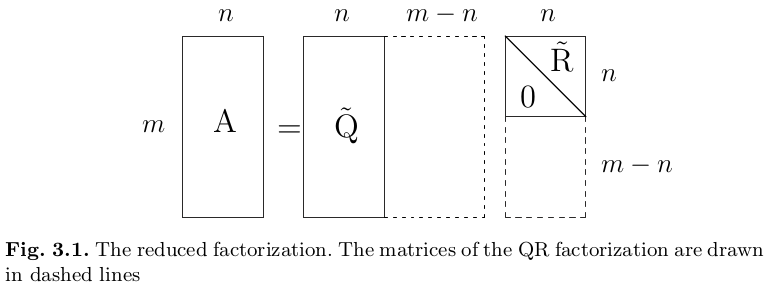

## Eigenvalues and Eigenvectors

Let $A \in \mathbb{C}^{n×n}$, the **eigenvalue problem** consists in finding a scalar $\lambda$ (real or complex) and a nonnull vector $\mathbf{x}$ such that
$$
A \mathbf{x} = λ\mathbf{x}
$$
Any such $λ$ is called an **eigenvalue** of $A$, while $\mathbf{x}$ is the associated **eigenvector**. The latter is not unique; indeed all multiples of $\mathbf x$, $α\mathbf{x}$ with $α \neq 0$, are also eigenvectors associated with $λ$.

Should $\mathbf{x}$ be known, $λ$ can be recovered by using the **Rayleigh quotient**
$$
\mathbf{x}^H A \mathbf{x}/||\mathbf x||^2 = \bar{\mathbf x}^T A \mathbf{x}/||\mathbf x||^2.
\nonumber
$$
The eigenvalues of $A$ are the roots of the **characteristic polynomial** of $A$:
$$
p_A(\lambda) = \det(A - \lambda I).
\nonumber
$$
A $n × n$ matrix has exactly $n$ eigenvalues (real or complex), not necessarily distinct. A matrix $A \in \mathbb{C}^{n×n}$ is said to be **diagonalizable** if there exists a nonsingular matrix $U \in \mathbb{C}^{n×n}$ such that
$$
U^{-1}AU = \Lambda = \text{diag}(\lambda_1, \ldots, \lambda_n).
$$
The columns of $U$ are the eigenvectors of $A$. If $A$ is diagonal or triangular, the $\lambda$'s are its diagonal entries; otherwise, if $A$ is a general large matrix, seeking the zeros of $p_A$ is hard.

### The power method

Let $A \in \mathbb R^{n \times n}$, so with real entries, and assume that its eigenvalues are ordered
$$
|\lambda_1| = |\lambda_\max| {\color{red}>} |\lambda_2| \ge |\lambda_3| \ge \ldots \ge |\lambda_n| = |\lambda_\min|.
\nonumber
$$
The **power method** can find the greater eigenvalue $\lambda_\max = \lambda_1$ of a non-singular matrix $A$.

Let $\mathbf{x}^{(0)} \in \mathbb{C}^n$ be given and set $\mathbf{y}^{(0)} = \mathbf{x}^{(0)} / ||\mathbf{x}^{(0)}||$, for $k = 1, 2, \ldots$ compute
$$
\color{red}\boxed{
\begin{align*}
\mathbf{x}^{(k)} &= A \mathbf{y}^{(k-1)} \\
\mathbf{y}^{(k)} &= \frac{\mathbf{x}^{(k)}}{||\mathbf{x}^{(k)}||}\\
λ^{(k)} &= (\mathbf{y}^{(k)})^H A \mathbf{y}^{(k)}
\end{align*}}
\nonumber
$$
until $|λ^{(k)} - λ^{(k-1)}| < \varepsilon |λ^{(k)}|$ (stopping condition), where $\varepsilon$ is the desired tolerance.

By induction on $k$ one can check that
$$
\mathbf y^{(k)} = \frac{\mathbf x^{(k)}}{||\mathbf x^{(k)}||} = \frac{A\mathbf y^{(k-1)}}{||A\mathbf y^{(k-1)}||} = \ldots = \frac{A^k\mathbf y^{(0)}}{||A^k \mathbf y^{(0)}||}, \quad k \ge 1.
\nonumber
$$
This relation explains the role played by the powers of $A$ in the method: the term $\mathbf y^{(k)}$ can also be expressed as a power, thus the name of the method.

This method generates a sequence of unitary vectors $\{\mathbf y^{(k)}\}$ such that for $k \to \infty$ they align in the direction of the eigenvector $\mathbf x_1$. In all cases, we have that $\lambda^{(k)} \to \lambda_\max=\lambda_1$ for $k \to \infty$.

### Convergence

Since the eigenvectors $\mathbf{x}_1, \ldots, \mathbf{x}_n$ of $A$ are linearly independent, these eigenvectors form a basis for $\mathbb{C}^n$. Thus the vectors $\mathbf{x}^{(0)}$ and $\mathbf{y}^{(0)}$ can be written as
$$
\mathbf{x}^{(0)} = \sum^n_{i=1} \alpha_i \mathbf{x}_i, \quad\quad
\mathbf{y}^{(0)} = \beta^{(0)} \sum^n_{i=1} \alpha_i \mathbf{x}_i, \quad\quad
\text{with } \beta^{(0)} = 1/||\mathbf{x}^{(0)}|| \text{ and } \alpha_i \in \mathbb{C}.
\nonumber
$$
At the first step the power method gives
$$
\mathbf{x}^{(1)} = A \mathbf{y}^{(0)} = β^{(0)} A \sum^n_{i=1} α_i \mathbf{x}_i = β^{(0)} \sum^n_{i=1} α_i λ_i \mathbf{x}_i \quad \text{and, similarly,} \\
\mathbf{y}^{(1)} = β^{(1)} \sum^n_{i=1} α_i λ_i \mathbf{x}_i, \quad β^{(1)} = \frac 1{||\mathbf{x}^{(0)}|| \cdot ||\mathbf{x}^{(1)}||}.
\nonumber
$$
At a given step $k$ we will have
$$
\mathbf{y}^{(k)} = β^{(k)} \sum^n_{i=1} α_i λ^k_i \mathbf{x}_i, \quad\quad β^{(k)} = \frac1{||\mathbf{x}^{(0)}|| \cdots ||\mathbf{x}^{(k)}||} = \frac1{\prod_{i=0}^k ||\mathbf{x}^{(i)}||}
\nonumber
$$
And therefore
$$
\mathbf{y}^{(k)} = λ^k_1 β^{(k)} \left( α_1 \mathbf{x}_1 + \sum^n_{i=2}
α_i \frac{λ^k_i}{λ^k_1} \mathbf{x}_i \right).
\nonumber
$$
Since $|λ_i/λ_1| < 1$ for $i = 2, \ldots, n$, the vector $\mathbf{y}^{(k)}$ tends to align along the same direction as the eigenvector $\mathbf{x}_1$ when $k$ tends to $+\infty$, provided $α_1 \neq 0$.

### The inverse power method

The **inverse power method** can find the smaller eigenvalue of a non-singular matrix $A$. It is like the previous method, but if $A$ is non-singular we can use $A^{-1}$, which eigenvalues are the reciprocal of those of $A$, to obtain the eigenvalue of $A$ with minimum modulus.

Let $\mathbf{x}^{(0)} \in \mathbb{C}^n$ be given and set $\mathbf{y}^{(0)} = \mathbf{x}^{(0)}/||\mathbf{x}^{(0)}||$, for $k = 1, 2, \ldots$ compute
$$
\color{red}\boxed{
\begin{align*}
\mathbf{x}^{(k)} &= A^{-1} \mathbf{y}^{(k-1)} \\
\mathbf{y}^{(k)} &= \frac{\mathbf{x}^{(k)}}{||\mathbf{x}^{(k)}||} \\
\mu^{(k)} &= (\mathbf{y}^{(k)})^H A^{-1} \mathbf{y}^{(k)}
\end{align*}}
\nonumber
$$
until $|\mu^{(k)} - \mu^{(k-1)}| < \varepsilon|\mu^{(k)}|$, where $\varepsilon$ is the desired tolerance.

If $A$ admits $n$ linearly independent eigenvectors, and if also the eigenvalue $\lambda_\min = \lambda_n$ of minimum modulus is distinct from the others, then
$$
\lim_{k \to \infty} \mu^{(k)} = 1/\lambda_\min,
\nonumber
$$
At each step $k$ we have to solve a linear system of the form $A\mathbf{x}^{(k)} = \mathbf{y}^{(k-1)}$, and we can use for example the $LU$ factorization or the Cholesky factorization.

### The power method with shift

The power method with shift can find the eigenvalue of $A$ near to a given number $\mu$.

Define $A_\mu = A - \mu I$, whose eigenvalues are $λ(A_\mu) = λ(A) - \mu$. In order to approximate $λ_\mu$, we can at first approximate the eigenvalue of minimum length of $A_\mu$ with the inverse power method.
Let $\mathbf{x}^{(0)} \in \mathbb{C}^n$ be given and set $\mathbf{y}^{(0)} = \mathbf{x}^{(0)} / ||\mathbf{x}^{(0)}||$, for $k = 1, 2, \ldots$ compute
$$
\color{red}\boxed{
\begin{align*}
\mathbf{x}^{(k)} &= A^{-1}_\mu \mathbf{y}^{(k-1)} \\ \mathbf{y}^{(k)} &= \frac{\mathbf{x}^{(k)}}{||\mathbf{x}^{(k)}||} \\
λ^{(k)}_\mu &= \frac1{(\mathbf{y}^{(k)})^H A^{-1}_\mu \mathbf{y}^{(k)}}
\end{align*}}
\nonumber
$$
until $|λ^{(k)}_\mu - λ^{(k-1)}_\mu| < \varepsilon|λ^{(k)}_\mu|$, where $\varepsilon$ is the desired tolerance. The searched eigenvalue of $A$ is approximated by $λ = λ_\mu + \mu$.

The value of the shift can be modified during the iterations, by setting $\mu = λ^{(k)}$. This yields a faster convergence; however the computational cost grows substantially since now at each iteration the matrix $A_\mu$ does change and the $LU$ factorization has to be performed at each iteration.

### How to compute the shift

We need to locate (more or less accurately) the eigenvalues of $A$ in the complex plane.

Let $A \in \mathbb C^{n \times n}$ be a square matrix of dimension $n$. The **Gershgorin circles** $C_i^{(r)}$ and $C_i^{(c)}$ associated with its $i$-th row and $i$-th column are respectively defined as
$$
\mathcal R_i = C_i^{(r)} = \left\{ z \in \mathbb{C}: |z - a_{ii}| \le \sum^n_{j=1,j \neq i} |a_{ij}| \right\}, \\
\mathcal C_i = C_i^{(c)} = \left\{ z \in \mathbb{C}: |z - a_{ii}| \le \sum^n_{j=1,j \neq i} |a_{ji}| \right\}.
\nonumber
$$
$\mathcal R_i$ is called the $i$-th **row circle** and $\mathcal C_i$ the $i$-th **column circle**.

**First Gershgorin theorem.** All the eigenvalues of a given matrix $A \in \mathbb{C}^{n×n}$ belong to the region of the complex plane which is the intersection of the two regions formed respectively by the union of the row circles $\mathcal S_\mathcal R = \bigcup_{i=1}^n \mathcal R_i$ and the union of the column circles $\mathcal{S_C} = \bigcup_{i=1}^n \mathcal C_i$:
$$
\forall \lambda \in \sigma(A), \quad \lambda \in \mathcal{S_R} \bigcap \mathcal{S_C}.
\nonumber
$$
Moreover, should $m$ row circles (or column circles), with $1 \le m \le n$, be disconnected from the union of the remaining $n - m$ circles, then their union contains exactly $m$ eigenvalues.

There is no guarantee that a circle should contain eigenvalues, unless it is isolated from the others. The information provided by Gershgorin circles are in general quite coarse, thus the previous result can provide only a preliminary guess of the shift.

**Remark.** Note that all the eigenvalues of a strictly diagonally dominant matrix are non-null.

### The $QR$ method

We will see some iterative techniques for simultaneously approximating all the eigenvalues of a given matrix $A$. The basic idea consists of reducing $A$, by means of suitable similarity transformations, into a form for which the calculation of the eigenvalues is easier than on the starting matrix.

If $A$ and $B$ are similar $P^{-1}AP = B$ then $\lambda_A = \lambda_B$
$$
BP^{-1}\mathbf x = P^{-1}A \mathbf x = \lambda P^{-1} \mathbf x
\nonumber
$$
A method to compute all the eigenvalues of $A$ is transforming it in a similar diagonal / triangular matrix.

The $QR$ method uses repeatedly the $QR$ factorization to compute $\lambda$.

$$
\Longrightarrow Q^{(k+1)}R^{(k+1)}=A^{(k)} \Longrightarrow A^{(k+1)} = R^{(k+1)}Q^{(k+1)}
\nonumber
$$
$A^{(k)}$ and $A^{(k+1)}$ are similar and the rate of decay to zero of lower triangular coefficients in $A^{(k)}$ depends on $\max_{i} |\lambda_{i+1}/\lambda_i|, \; \forall i$. If $A$ is symmetric, $A^{(k)}$ for $k \to \infty$ is diagonal.
