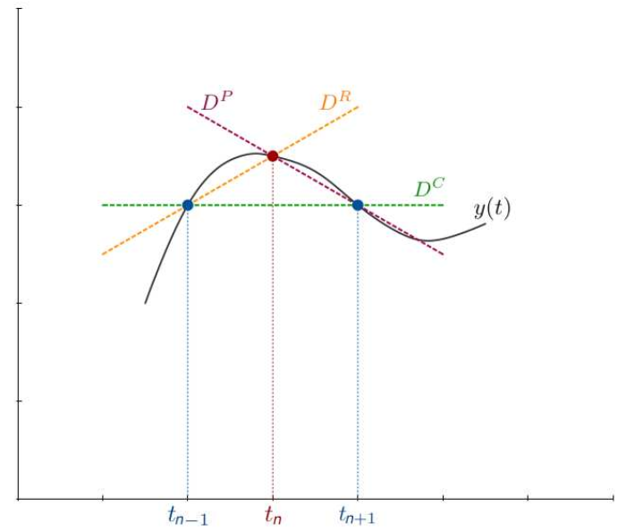
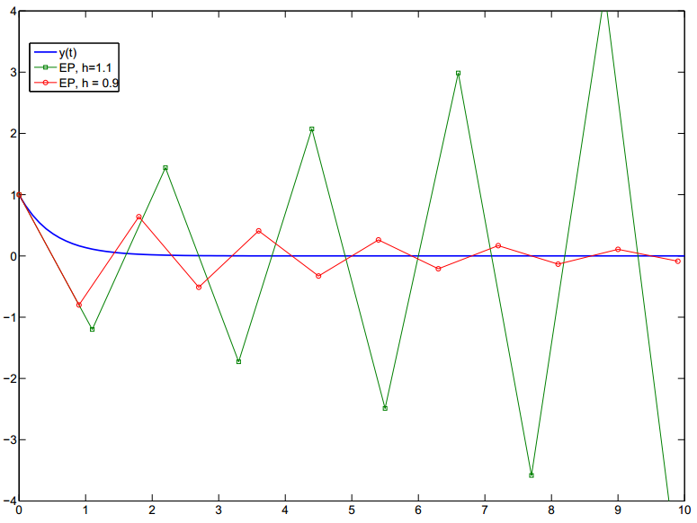
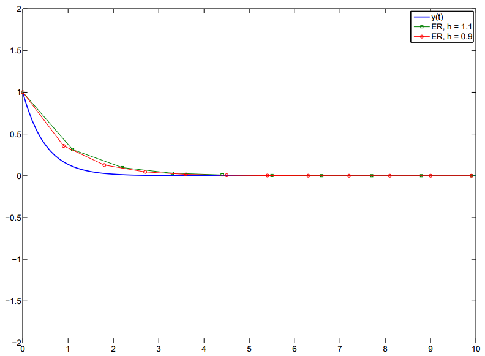
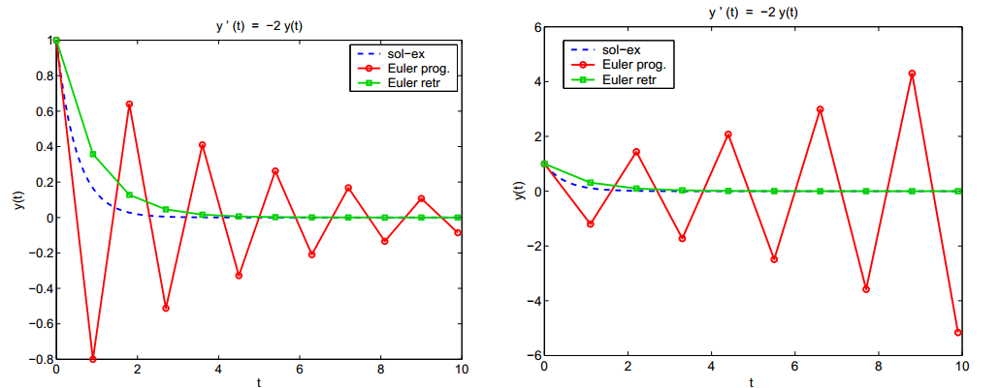
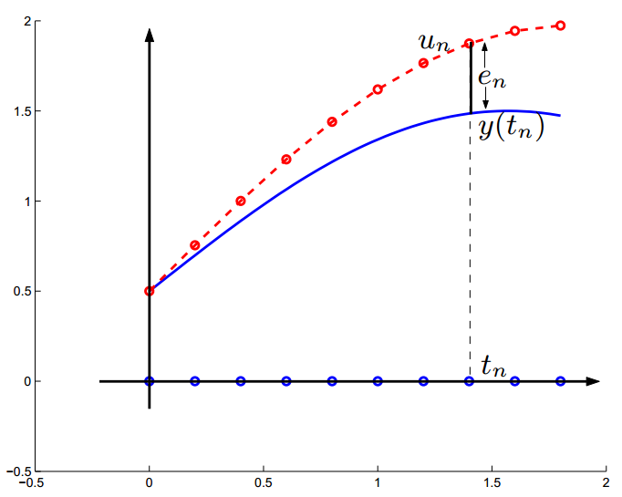
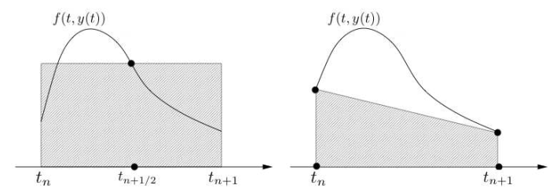
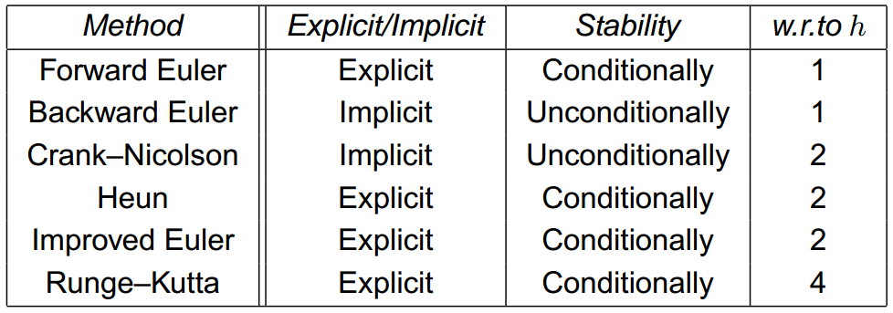
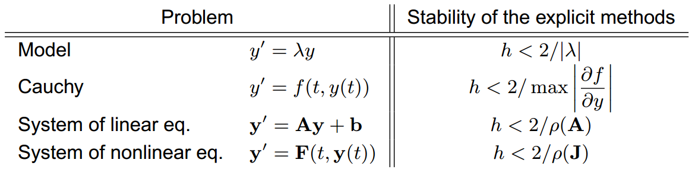

## Ordinary differential equations (ODE)

A **differential equation** involves one or more derivatives of an unknown function. If those derivatives are taken w.r.t. a single variable, it is called **ordinary differential equation**, whereas it is a **partial differential equation** if partial derivatives are present. The ODE or PDE has order $p$, where $p$ is the maximum order of differentiation.

Any equation of order $p > 1$ can always be reduced to a system of $p$ equations of order $1$.

An ODE has infinite solutions. We formulate a *Cauchy problem* by adding a **boundary condition** on initial data to the ODE, ensuring the uniqueness of the solution.

Consider a continuous function $f: \mathbb{R}_+ × \mathbb{R} \rightarrow \mathbb{R}$. For given $y_0 \in \mathbb{R}$, we search $y: t \in I \subset \mathbb{R}_+ \rightarrow y(t) \in R$ that satisfies the following problem, called the **Cauchy problem**:
$$
\begin{cases}
y′(t) = f(t, y(t)) \quad \forall t \in I \\
y(t_0) = y_0
\end{cases}
\label{eq:Cauchy}
$$
where $y′(t) = \frac{dy(t)}{dt}$.

**Theorem 1** (Cauchy-Lipschitz)**.** *If a function $f(t, y)$ is*

1. ***continuous*** *with respect to both its arguments $t$ and $y$;*

2. ***Uniformly Lipschitz-continuous*** *with respect to its second argument, that is, there exists a positive constant $L$ (named Lipschitz constant) such that*

$$
|f(t, y_1) - f(t, y_2)| \le L|y_1 - y2| \quad \forall y_1, y_2 \in \mathbb{R}, \forall t \in I,
\nonumber
$$

*Then the solution $y = y(t)$ of the Cauchy problem $\eqref{eq:Cauchy}$ **exists**, is **unique** and belongs to $C^1(I)$.*

The Lipschitz continuity gives more regularity than normal continuity because incremental quotients are bounded (a.k.a. $f$ cannot peak anywhere).

Solutions of the Cauchy problem are seldom explicit and often cannot be represented even in an implicit form. Numerical methods allows for the approximation of every ODE family for which solutions exists.

The common approach is to divide $I = [t_0, T]$ into $N_h$ intervals of length $h = (T- t_0)/N_h$, where $h$ is called the **time step** or **discretization step**. Each $t_n = t_0 + n h$ is a **node** on which we compute $u_n \approx y_n = y(t_n)$, and $\{u_0=y_0, u_1, \ldots, u_{N_h}\}$ is the **numerical solution** of the Cauchy problem.

### Numerical differentiation

We aim to approximate, given a function $y:[a,b] \rightarrow \mathbb R$ continuously differentiable on $[a,b]$, its derivative at a generic $t_n \in [a,b]$.

Let $y: [a, b] \rightarrow \mathbb{R}$ be $C^1([a,b])$ and $t_n \in [a, b]$. The derivative $y′(t_n)$ is given by
$$
\begin{align*}
y′(t_n) &= \lim_{h \to 0^+} \frac{y(t_n + h) - y(t_n)}{h}, \\
&= \lim_{h \to 0^+} \frac{y(t_n) - y(t_n - h)}{h}, \\
&= \lim_{h \to 0} \frac{y(t_n + h) - y(t_n - h)}{2h}.
\end{align*}
$$
Let $t_0, t_1, \ldots, t_{N_h}$, be $N_h + 1$ equidistributed nodes at $[t_0, t_{N_h}]$. Let $h = (t_{N_h} - t_0)/N_h$ be the distance between two consecutive nodes. Let $(Dy)_n$ be an approximation of $y′(t_n)$. We say

- **Forward finite difference** if
  $$
  (Dy)^{FD}_n = \frac{y(t_{n+1}) - y(t_n)}{h}, \quad n = 0, \ldots, N_h - 1
  $$

- **Backward finite difference** if
  $$
  (Dy)^{BD}_n = \frac{y(t_n) - y(t_{n-1})}{h}, \quad n = 1, \ldots, N_h
  $$

- **Centered finite difference** if
  $$
  (Dy)^{CD}_n = \frac{y(t_{n+1}) - y(t_{n-1})}{2h}, n = 1, \ldots, N_h - 1
  $$

### The error in the finite difference

If $y \in C^2(\mathbb{R})$ for all $t \in \mathbb{R}$, then there exists $\xi_n$ between $t_n$ and $t$ such that (using the Taylor expansion)
$$
y(t) = y(t_n) + y′(t_n)(t - t_n) + \frac{y′′(\xi_n)}{2} (t - t_n)^2.
\label{eq11}
$$

- For $t = t_{n+1}$ in $\eqref{eq11}$, we obtain
  $$
  y(t_{n+1}) - y(t_n) = y′(t_n)h + \frac{y′′(\xi_n)}{2}h^2,
  \nonumber
  $$
  so the *forward finite difference* is given by
  $$
  (Dy)^P_n = \frac{y(t_{n+1}) - y(t_n)}{h} = y′(t_n) + \frac h2 y′′(\xi_n).
  \nonumber
  $$
  In particular,
  $$
  |y′(t_n) - (Dy)^P_n | \le Ch, \quad \text{where } C = \frac12 \max_{t \in [t_n,t_{n+1}]} |y′′(t)|.
  \nonumber
  $$

- For $t = t_{n-1}$ in $\eqref{eq11}$, we obtain
  $$
  y(t_{n-1}) - y(t_n) = y′(t_n)(-h) + \frac{y′′(\xi_n)}{2}(-h)^2,
  \nonumber
  $$
  so the *backward finite difference* is given by
  $$
  (Dy)^R_n = \frac{y(t_n) - y(t_{n-1})}{h} = y′(t_n) - \frac h2 y′′(\xi_n).
  \nonumber
  $$
  In particular,
  $$
  |y′(t_n) - (Dy)^R_n | \le Ch, \quad \text{where } C = \frac12 \max_{t\in[t_{n-1,t_n}]} |y′′(t)|.
  \nonumber
  $$

- For $t = t_{n+1}$ and $t = t_{n-1}$ with expansion of order $2$ (if $y \in C^3(\mathbb{R})$)
  $$
  \begin{align*}
  y(t_{n+1}) &= y(t_n) + y′(t_n) h + \frac{y′′(t_n)}{2} h^2 + \frac{y′′′(\xi_{n_1})}{6} h^3, \\
  y(t_{n-1}) &= y(t_n) - y′(t_n) h + \frac{y′′(t_n)}{2} h^2 - \frac{y′′′(\xi_{n_2})}{6} h^3,
  \end{align*}
  $$
  and we obtain
  $$
  y(t_{n+1}) - y(t_{n-1}) = 2y′(t_n)h + \frac{y′′′(\xi_{n_1}) + y′′′(\xi_{n_2})}{6} h^3,
  \nonumber
  $$
  so the *centered finite difference* is given by
  $$
  (Dy)^C_n = \frac{y(t_{n+1}) - y(t_{n-1})}{2h} = y′(t_n) + \frac{y′′′(\xi_{n_1}) + y′′′(\xi_{n_2})}{12} h^2.
  \nonumber
  $$
  It has the following estimation
  $$
  |y′(t_n) - (Dy)^C_n | \le Ch^2, \quad \text{where } C = \frac16 \max_{t\in[t_{n-1},t_{n+1}]} |y′′′(t)|.
  \nonumber
  $$

**Definition 1.** *The difference $\tau_n(h) = |y′(t_n) - (Dy)^P_n |$ is called **truncation error in the point $t_n$**. We say that $τ_n$ is of order $p > 0$ if*
$$
τ_n(h) \le Ch^p,
\nonumber
$$
*for a positive constant $C$, where $h$ is the time increment between two different timing $t_n$ and $t_{n+1}$.*

Thanks to the found estimation, the truncation error of the forward and the backward finite difference is of order $1$; the truncation error of centered finite difference is of order $2$.

### The finite difference method

Let $0 = t_0 < t_1 < \ldots < t_n < t_{n+1} < \ldots$ be an equidistributed sequence of real numbers and $h = t_{n+1} - t_n$ be the time step. We denote by
$$
u_n \quad \textbf{an approximation of} \quad y(t_n).
\nonumber
$$
In the Cauchy problem $\eqref{eq:Cauchy}$, for $t = t_n$, we have
$$
y′(t_n) = f(t_n, y(t_n)).
\nonumber
$$
We want to approximate the derivative $y′(t_n)$ in the point $t_n$. We can use a **finite difference differentiation**.

**Forward Euler**
$$
\begin{cases}
\frac{u_{n+1} - u_n}{h} = f({\color{blue}t_n, u_n}) & \text{for } n = 0, 1, 2, \ldots, N_h - 1 \\
u_0 = y_0
\end{cases}
\label{eq12}
$$
so we have $u_{n+1} = u_n + hf(t_n, u_n)$.

**Backward Euler**
$$
\begin{cases}
\frac{u_n - u_{n-1}}{h} = f({\color{blue}t_n, u_n}) & \text{for } n = 0, 1, 2, \ldots, N_h - 1 \\
u_0 = y_0
\end{cases}
\label{eq13}
$$
so we have $u_n = u_{n-1} + hf(t_n, u_n) \; \Rightarrow \; u_{n+1} = u_n + hf(t_{n+1}, u_{n+1})$.

**Centered scheme**
$$
\begin{cases}
\frac{u_{n+1} - u_{n-1}}{2h} = f({\color{blue}t_n, u_n}) & \text{for } n = 1, 2, \ldots, N_h - 1 \\
u_0 = y_0 \\
u_1 \text{ to determine} \\
\end{cases}
\label{eq14}
$$
so we have $u_{n+1} = u_{n-1} + 2hf(t_n, u_n)$.

**Remark 1.**

- *The forward Euler is **explicit** because $u_{n+1}$ depends on $u_n$ explicitly:*
  $$
  \text{(forward Euler)} \quad  {\color{blue}u_{n+1} = u_n + hf(t_n, u_n).}
  \nonumber
  $$

- *The backward Euler is **implicit** because $u_{n+1}$ is implicitly defined in terms of $u_n$:*
  $$
  \text{(backward Euler)} \quad {\color{blue} u_{n+1} = u_n + hf(t_{n+1}, u_{n+1}).}
  \nonumber
  $$

In general, for the forward Euler we have a simple computation, while for the backward Euler we have to solve a nonlinear equation at each time step. However, backward Euler is generally more stable. Since the centered Euler requires $\mathbf u_1$ to be applied, is generally preceded by a single pass of forward Euler to backward Euler.

**Fixed point iterations**: Note that backward Euler is equivalent to a fixed point problem with
$$
u_{n+1} = \phi(u_{n+1}) = u_n + hf(t_{n+1}, u_{n+1})
\nonumber
$$
We can solve this problem thanks to the following iterations
$$
u^{(k+1)}_{n+1} = \phi(u^{(k)}_{n+1}), \quad k = 0, 1, 2, \ldots
$$
**The Newton method**: Starting from the equation:
$$
F(u_{n+1}) ≡ u_{n+1} - \phi(u_{n+1}) = 0,
\nonumber
$$
we use the following iterations:
$$
u^{(k+1)}_{n+1} = u^{(k)}_{n+1} - \frac{F(u^{(k)}_{n+1})}{F ′(u^{(k)}_{n+1})} = u^{(k)}_{n+1} - \frac{F(u^{(k)}_{n+1})}{1 - \phi′(u^{(k)}_{n+1})}, \quad k = 0, 1, 2, \ldots
$$
In both cases, we have $\lim_{k \to \infty} u^{(k)}_{n+1} = u_{n+1}$.

### Stability conditions

The choice of time step $h$ is not arbitrary. For forward Euler, we will see later that if $h$ is not small enough then stability problems may arise.

For example, if we consider the problem
$$
\begin{cases}
y′(t) = -2y(t) & \text{for } t \in \mathbb{R}_+ \\
y(0) = 1,
\end{cases}
$$
then the solution is
$$
y(t) = e^{-2t},
\nonumber
$$
We can observe that behavior with respect to $h$ of forward and backward Euler methods are very different.

#### Forward Euler

#### Backward Euler

### The (absolute) stability properties

For a given $λ < 0$, $\lambda \in \mathbb R$, we consider the model problem:
$$
\begin{cases}
y′(t) = λy(t) & \text{for } t \in \mathbb{R}_+\\
y(0) = 1
\end{cases}
\label{eq:model}
$$
The exact solution is
$$
y(t) = e^{λt}. \quad \text{In particular, } \lim_{t \to \infty} y(t) = 0.
\nonumber
$$
We require $\lambda < 0$ in order to have a well-posed problem, since if $\lambda > 0$ then $\lim_{n \to \infty} u_n = 0$ but the real solution $y(t) = e^{\lambda t} \to \infty$ for $t \to \infty$, so the solution explodes and we are no longer interested in it.

Let $0 = t_0 < t_1 < \ldots < t_n < t_{n+1} < \ldots$ such that $t_n = nh$ and where the **time step** $h > 0$ is fixed.

We say that a numerical scheme associated to the model problem is **absolutely stable** if $\lim_{n \to \infty} u_n = 0$.

- For the **forward Euler**:
  $$
  u_{n+1} = (1 + λh)u_n, \quad \text{where} \quad u_n = (1 + λh)^n, \quad \forall n \ge 0.
  $$
  If $1 + λh < -1$, then $|u_n| \to \infty$ when $n \to \infty$, therefore forward Euler is **unstable**.
  To ensure stability, we need to limit the time step $h$, by imposing the **stability condition**:
  $$
  \boxed{|1 + λh| < 1 \quad \text{hence} \quad  h < 2/|λ|.}
  \nonumber
  $$
  This condition is required on unbounded intervals since $N_h$ (the number of $t_n$) may tend to infinity even if $h \not\to 0$, in order to ensure stability.

- For the **backward Euler**:
  $$
  u_{n+1} = \left( \frac{1}{1 - λh} \right) u_n \quad \text{and therefore} \quad u_n = \left( \frac{1}{1 - λh} \right)^n, \quad \forall n \ge 0.
  \nonumber
  $$
  Because $\lim_{n \to \infty} u_n = 0$, it is **unconditionally stable** (it is stable for any $h > 0$).

**Example 4.** Let solve the problem $\eqref{eq:model}$ for $λ = -2$ and $y_0 = 1$ at interval $[0, 10]$ using forward and backward Euler methods with $h = 0.9$ and $h = 1.1$. The following figure shows obtained solutions for $h = 0.9$ (on the left) and $h = 1.1$ (on the right) and the exact solution.

Comparison of solutions that we obtain by the forward and backward Euler methods for $h = 0.9$ (on the left, stable) and $h = 1.1$ (on the right, unstable) (stability condition for forward Euler: $|λ| = 2 \Rightarrow h < 2/|λ| = 1$).

### Absolute stability controls perturbations

For a generic problem, it raises the question of **stability**, i.e. the property that **small perturbations on the data induce small perturbations on the approximation**.

We want to show the following property.

*A numerical method which is absolutely stable on the model problem, guarantees that the perturbations are kept under control as $t$ tends to infinity (is stable in the above sense).*

Consider now the following generalized model problem on an unbounded interval:
$$
\begin{cases}
y′(t) = λ(t)y(t) + r(t), & t \in (0, +\infty), \\
y(0) = 1,
\end{cases}
\label{eq:model2}
$$
where $λ$ and $r$ are two continuous functions and $-λ_\max \le λ(t) \le -λ_\min$ with $0 < λ_\min \le λ_\max < +\infty$. In this case the exact solution does not necessarily tend to zero as $t$ tends to infinity.

For instance if both $r$ and $λ$ are constants we have
$$
y(t) = \left( 1 + \frac λr \right) e^{λt} - \frac λr
\nonumber
$$
whose limit when $t$ tends to infinity is $-r/λ$. Thus, in general, it does not make sense to require a numerical method to be absolutely stable, i.e. to satisfy $\eqref{eq:model2}$. However, it is possible to prove that a method which is absolutely stable on the original model problem keeps perturbations under control even when applied to the generalized model problem as $t \to \infty$.

For the sake of simplicity we will confine our analysis to the forward Euler method $\eqref{eq:model2}$.

We have
$$
\begin{cases}
u_{n+1} = u_n + h(λ_n u_n + r_n), & n \ge 0, \\
u_0 = 1
\end{cases}
\nonumber
$$
where $λ_n = λ(t_n)$ and $r_n = r(t_n)$.

Let us consider the following "perturbed" method:
$$
\begin{cases}
z_{n+1} = z_n + h(λ_n z_n + r_n + ρ_{n+1}), & n \ge 0,\\
z_0 = u_0 + ρ_0,
\end{cases}
$$
where $ρ_0, ρ_1, \ldots$ are given perturbations which are introduced at every time step.

This is a simple model in which $ρ_0$ and $ρ_{n+1}$ represent truncation errors or numerical errors.

**Question:** Is the difference $z_n - u_n$ bounded for all $n = 0, 1, \ldots$ independently of $n$ and $h$?

We will consider two cases:

1. Let $λ_n = λ$ and $ρ_n = ρ$ be two constants. We can write the schema for the ** perturbation error** $e_n = z_n - u_n$ at step $n$:
   $$
   \begin{cases}
   e_{n+1} = e_n + h(λe_n + ρ), & n \ge 0, \\
   e_0 = ρ.
   \end{cases}
   $$
   that the solution is
   $$
   e_n = ρ(1 + hλ)^n + hρ \sum^{n-1}_{k=0} (1 + hλ)^k = ρ\psi(h, λ),
   $$
   where
   $$
   \psi(h, λ) = \left( (1 + hλ)^n \left(1 + \frac1λ \right) - \frac1λ \right)
   \nonumber
   $$
   We use equation for the geometric sum
   $$
   \sum^{n-1}_{k=0} a^k = \frac{1 - a^n}{1 - a}.
   $$
   Suppose that $h < h_0(λ) = 2/|λ|$, i.e. $h$ ensure the absolute stability of the forward Euler method applied to the problem $\eqref{eq:model}$.
   Therefore $(1 + hλ)^n < 1 \; \forall n$ and it follows that the error due to perturbations is bounded by
   $$
   |e_n| \le \varphi(λ)|\rho|,
   \label{eq28}
   $$
   where $\varphi(λ) = 1 + |2/λ|$. Moreover,
   $$
   \lim_{n \to \infty} |e_n| = \frac{|ρ|}{|λ|}.
   \nonumber
   $$
   So, the error caused by perturbations is bounded by $|ρ|$ times a constant, that is independent of $n$ and $h$. Obviously, if $h > h_0$, the perturbations amplifies when $n$ increases because $(1 + hλ)^n \to \infty$ when $n \to \infty$.

2. In the general case where $λ$ and $r$ depends on $t$, we have
   $$
   z_n - u_n = ρ_0 \prod^{n-1}_{k=0} (1 + hλ_k) + h \sum^{n-1}_{k=0} ρ_{k+1} \prod^{n-1}_{j=k+1} (1 + hλ_j)
   \label{eq29}
   $$
   We require the time step $h$ to satisfy the restriction $h < h_0(λ)$, where $h_0(λ) = 2/λ_\max$. Then, $|1 + hλ_k| \le \max(|1 - hλ_\min|, |1 - hλ_|max|) < 1$. Let $ρ = \max |ρ_n|$ and $λ$ such that $(1 + hλ) = \max(|1 - hλ_\min|, |1 - hλ_\max|)$.

   It holds:
   $$
   \begin{align*}
   |z_n - u_n| \le |ρ_0| \prod^{n-1}_{k=0} &|1 + hλ_k| + h \sum^{n-1}_{k=0} |ρ_{k+1}| \prod^{n-1}_{j=k+1} |1 + hλ_j| \\
   &\le ρ \prod^{n-1}_{k=0} (1 + hλ) + h \sum^{n-1}_{k=0} ρ \prod^{n-1}_{j=k+1} (1 + hλ) = ρ \psi(h, λ)
   \end{align*}
   $$
   So, even in this case, $e_n = z_n - u_n$ satisfies $\eqref{eq28}$.

**Remark 2.** *Consider now the following generalized model problem*
$$
\begin{cases}
y′(t) = f(t, y(t)) & t > 0 \\
y(0) = y_0,
\end{cases}
\nonumber
$$
*at unbounded interval. We can extend the control of perturbations to generalized model problem $\eqref{eq:model2}$, in cases where exists $λ_\min > 0$ and $λ_\max < \infty$ such that*
$$
-λ_\max < \frac{\partial f}{\partial y}(t, y) < -λ_\min, \quad \forall t \ge 0, \forall y \in D_y,
$$
*where $D_y$ is a set that contains the trajectory of $y(t)$ (possible values of $u_n$). This allows to get $\eqref{eq29}$ and to obtain the same conclusions as in case [$(2)$](#pt2) if $0 < h < 2/λ_\max$.*
*In this case, the steplength $h$ should be chosen as function of $\frac{\partial f}{\partial y}$, depending on the case:*

- *if $h$ is constant:*
  $$
  0 < h < 2 / \max_{t \in [t_0, T]} \left| \frac{\partial f}{\partial y}(t. y(t)) \right|
  \nonumber
  $$

- *if $h$ depends on the step:*
  $$
  0 < h_n < 2 \frac{\alpha}{|f_y(t_n,u_n)|} \quad\quad \text{for } \alpha < 1
  \nonumber
  $$

### Convergence of the forward Euler

**Definition 2.** *Let $y(t)$ be the solution of the Cauchy problem $\eqref{eq:Cauchy}$ on the interval $[0, T ]$; let $u_n$ be an approximated solution at time $t_n = nh$, where $h = T/N_h$ ($N_h \in \mathbb{N}$) is the time step, found by a given numerical method.
The method is **convergent** if*
$$
\forall n = 0, \ldots, N_h: \quad |u_n - y(t_n)| \le C(h)
\nonumber
$$
*where $C(h) \to 0$ when $h \to 0$.*

Moreover, if there exists $p > 0$ such that $C(h) = O(h^p)$ (so $\exist c > 0$ s.t. $C(h) \le ch^p$ for $\max p$), we say that the method **converges with order $p$**.

In the following, we will analyze the convergence and the order of the forward Euler method.

**Definition.** *We define the error at time $n$ as:*
$$
e_n = u_n - y(t_n)
\nonumber
$$

**Definition.** *The **local truncation error** (LTE) of a method represents the error that would be generated by forcing the exact solution to satisfy that specific numerical scheme. For the forward Euler method we define it as*
$$
τ_{n+1}(h) = \frac{y(t_{n+1}) - y(t_n)}{h} - y′(t_n).
\label{eq33}
$$
*The **global truncation error** is*
$$
τ(h) = \max_n |τ_n(h)|.
\nonumber
$$
*For the forward Euler method we define it as*
$$
\tau(h) = \frac12 \max_{t \in [t_0,T]} |y''(t)|h.
\nonumber
$$
We will prove the following convergence result:

**Theorem 2.** *If $y \in \mathcal{C}^2([0, T])$ and $f$ is uniform Lipschitz continuous on the second variable, $L$ is the Lipschitz constant, then*
$$
\forall n \ge 0, \quad |y(t_n) - u_n| \le c(t_n)h,
\label{eq32}
$$
*where*
$$
c(t_n) = \frac{e^{L t_n} - 1}{2L} \max_{t \in [0,T]} |y′′(t)|.
\nonumber
$$
*In particular, the method converges with order $p = 1$ according to the previous definition, with*
$$
C(h) = c(T)h.
\nonumber
$$
**Proof.** We know there exists $\xi_n \in (t_n, t_n + h)$ such that
$$
τ_{n+1}(h) = \frac12 y′′(\xi_n)h.
\nonumber
$$
So we have the following estimation for the global truncation error:
$$
τ(h) \le \frac12 \max_{t\in [0,T]} |y′′(t)|h.
\nonumber
$$
The following equation for the numerical solution $u_n$
$$
\begin{cases}
\frac{u_{n+1} - u_n}{h} = f(t_n, u_n) & \text{for } n = 0, 1, 2, \ldots, N_h \\
u_0 = y_0.
\end{cases}
\nonumber
$$
and the equation $\eqref{eq33}$ for a local truncation error
$$
τ_{n+1}(h) = \frac{y(t_{n+1}) - y(t_n)}h - y′(t_n) = \frac{y(t_{n+1}) - y(t_n)}h - f(t_n, y(t_n)),
\nonumber
$$
we obtain:
$$
\begin{cases}
\frac{e_{n+1} - e_n}h = f(t_n, u_n) - f(t_n, y(t_n)) - τ_{n+1}(h), \\
e_0 = 0
\end{cases}
\label{eq34}
$$
Since the function $f$ is Lipschitz, we have
$$
|f(t_n, u_n) - f(t_n, y(t_n))| \le L|u_n - y(t_n)| \le L|e_n|.
\nonumber
$$
Given this inequality, $\eqref{eq34}$ can be written as:
$$
|e_{n+1}| \le (1 + Lh)|e_n| + h|τ_{n+1}(h)|.
\nonumber
$$
Let $E_j = |e_j|$. Then we have the following inequality:
$$
\begin{align*}
E_{n+1} &\le (1 + hL)E_n + hτ(h) \\
&\le (1 + hL) [(1 + hL)E_{n-1} + hτ(h)] + hτ(h) \\
&\le \left[ 1 + (1 + hL) + (1 + hL)^2 + \ldots + (1 + hL)^n \right] hτ(h) \\
&= \frac{(1 + hL)^{n+1} - 1}{hL} hτ(h)
\end{align*}
$$
But
$$
1 + hL \le e^{hL}, \quad \forall h > 0,
\nonumber
$$
hence
$$
(1 + hL)^n - 1 \le e^{Lhn} - 1 = e^{Lt_n} - 1.
\nonumber
$$
Therefore
$$
E_n \le \frac{e^{Ltn} - 1}{L} τ(h) \le \frac{e^{Lt_n} - 1}L h \cdot \frac12 \max_{t \in [0,T]} |y′′(t)|,
\nonumber
$$
i.e.
$$
|u_n - y(t_n)| \le \left[ \frac12 \frac{e^{Lt_n} - 1}{L} \max_{t\in[0,T]} |y′′(t)| \right] h \le c(T) h,
\nonumber
$$
where $c(T) = \frac{e^{LT} - 1}{2L} \max_{t\in [0,T]} |y′′(t)|$.

**Remark 3.** *The same type of results can be obtained for the backward Euler method.*

**Remark 4.** *The estimation of convergence $\eqref{eq32}$ is obtained under the assumption that the function $f$ is Lipschitz continuous. More precisely, the estimation*
$$
|u_n - y(t_n)| \le ht_n \frac12 \max_t |y′′(t)|,
\label{eq35}
$$
is true if $f$ also satisfies the condition $\frac{\partial f}{\partial y} (t, y) \le 0$ for all $t \in [0, T]$ and for all $y \in (−\infty, \infty)$.

We prove $\eqref{eq35}$. Using the Lagrange theorem, there exists $\xi_n$ such that
$$
f(t_n, u_n) - f(t_n, y(t_n)) = \frac{\partial f(t, \xi_n)}{\partial y} (u_n - y(t_n)) = \frac{ \partial f(t, \xi)}{\partial y} e_n.
\nonumber
$$
So, using $\eqref{eq34}$ we find
$$
e_{n+1} = \left( 1 + h \frac{\partial f}{\partial y}(t, \xi_n) \right) e_n - h \frac h2 y′′(\eta_n).
\nonumber
$$
If $h < \frac 2{λ_\max}$ then we have $1 + h \frac{\partial f}{\partial y}(t, \xi_n) \in (-1, 1)$ and therefore
$$
|e_{n+1}| \le |e_n| + hτ(h).
\nonumber
$$
Since $e_0 = 0$, we deduce
$$
|e_n| \le nhτ(h) = t_nτ(h),
\nonumber
$$
which was to be demonstrated $\eqref{eq35}$.

### Consistency

Consistency is necessary in order to achieve convergence, since it fulfills the basic assumption that $e_n$ is infinitesimal w.r.t. $h$. If violated, it would inhibit the global error tending to zero when $h \to 0$.

The error follows $O\left(\frac1h\right)$ when $h$ approaches $0$, so it can blow up due to roundoff errors if $h$ is too small.

### Runge-Kutta methods of order $2$

The family of **Runge-Kutta methods** uses a single step $h$ but evaluates $f(t, y)$ several times per interval $[t_n, t_{n+1}]$. The number of evaluations at each step is called the **order** w.r.t. $h$.

If we integrate the equation $y′(t) = f(t, y(t))$ between $t_n$ and $t_{n+1}$, we obtain:
$$
y(t_{n+1}) - y(t_n) = \int_{t_n}^{t_{n+1}} f(t, y(t))dt.
\label{eq36}
$$
**Remark 5 (Numerical integration methods).** *We want to approximate the integral of the function $f(t, y(t))$. If we use the midpoint formula, we approximate the area below the curve by the area of a rectangle that has as a basis $h$ and as a height the value of the function at time $t_n + h/2$ (see figure on the left). If we use the trapezoidal formula, we approximate the area below the curve by the area of a trapezoid that has as basis both values of the function at times $t_n$ and $t_{n+1}$ and as a height $h$ (see figure on the right).*

Using trapezoidal formula, we find the following implicit method, that is called **Crank-Nicolson** or **trapezoidal method**:
$$
{\color{red} \boxed{u_{n+1} - u_n = \frac h2 \left[ f(t_n, u_n) + f(t_{n+1}, u_{n+1}) \right]}}, \quad \forall n \ge 0.
\label{eq37}
$$
This method is unconditionally stable when it is applied to the model problem $\eqref{eq:model}$, but we have an implicit part to handle.

If we modify the schema $\eqref{eq37}$ (changing it to explicit) then we obtain the **Heun method**:
$$
{\color{red} \boxed{u_{n+1} - u_n = \frac h2 \left[f(t_n, u_n) + f(t_{n+1}, u_n + hf(t_n, u_n)) \right]}}.
$$
Both methods (Crank-Nicolson and Heun) are of order $2$ with respect to $h$.

If we use in $\eqref{eq36}$ midpoint formula, we obtain
$$
u_{n+1} - u_n = h f(t_{n + \frac12}, u_{n + \frac12}).
$$
If we approximate $u_{n+\frac12}$ by
$$
u_{n + \frac12} = u_n + \frac h2 f(t_n, u_n),
\nonumber
$$
we obtain the **improved Euler method**:
$$
{\color{red}\boxed{u_{n+1} - u_n = h f \left( t_{n + \frac12}, u_n + \frac h2 f(t_n, u_n) \right)}}.
$$
Both Heun and improved Euler methods are particular cases of the Runge-Kutta method of order $2$. When we apply them to the model problem $\eqref{eq:model}$, we have the same stability condition $h < 2/|λ|$ for both methods.

In the following table we summarize the characteristics of the methods:

There are more complicated methods, such as **Runge-Kutta method of order $4$**, that is obtained by considering the integration of the Simpson method:
$$
u_n \rightarrow \begin{cases}
u_{n+1} = u_n + \frac h6 (K_1 + 2K_2 + 2K_3 + K_4), \\
\text{where:} \\
K_1 = f(t_n, u_n), \\
K_2 = f(t_n + \frac h2, u_n + \frac h2 K_1), \\
K_3 = f(t_n + \frac h2, u_n + \frac h2 K_2), \\
K_4 = f(t_{n+1}, u_n + hK_3).
\end{cases}
\nonumber
$$

### Systems of differential equations

Let us consider the following system of non-homogeneous ordinary differential equation with constant coefficients.
$$
\begin{cases}
\mathbf{y}′(t) = A \mathbf{y}(t) + \mathbf{b}(t) & t > 0, \\
\mathbf{y}(0) = \mathbf{y}_0,
\end{cases}
\label{eq:system}
$$
where $A \in \mathbb{R}^{p×p}$ and $\mathbf{b}(t) \in \mathbb{R}^p$, where we assume that $A$ has got $p$ distinct eigenvalues $λ_j, j = 1, \ldots, p$.

From the numerical point of view, the methods introduced in the scalar case can be extended to systems of differential equations. For example, the forward Euler method $\eqref{eq12}$ becomes:
$$
\begin{cases}
\frac{\mathbf{u}_{n+1} - \mathbf{u}_n}h = A \mathbf{u}_n + \mathbf{b}_n & \text{for } n = 0, 1, 2, \ldots, N_h - 1 \\
\mathbf{u}_0 = \mathbf{y}_0,
\end{cases}
$$
while the backward Euler method $\eqref{eq13}$ becomes:
$$
\begin{cases}
\frac{\mathbf{u}_{n+1} - \mathbf{u}_n}h = A \mathbf{u}_{n+1} + \mathbf{b}_{n+1} & \text{for } n = 0, 1, 2, \ldots, N_h - 1 \\
\mathbf{u}_0 = \mathbf{y}_0,
\end{cases}
$$
Regarding stability, if $\mathbf{b} \equiv 0$ and the eigenvalues $λ_j$ ($j = 1, \ldots, p$) of the matrix $A$ are strictly negative: $\lambda_j < 0$, $j = 1, \ldots, p$, then $\mathbf{y}(t) \to \mathbf{0}$ when $t \to +\infty$, and the forward Euler method is stable (i.e. $\mathbf{u}_n \to \mathbf{0}$ if $n \to +\infty$) if
$$
h < \frac2{\max_{j=1,\ldots,p} |λ_j|} = \frac2{ρ(A)},
\label{eq45}
$$

where $ρ(A)$ is the spectral radius of $A$, while the backward Euler method is unconditionally stable.

We could also consider the case of a nonlinear system of the form
$$
\mathbf{y}′(t) = \mathbf{F}(t, \mathbf{y}(t)).
\nonumber
$$
If $\frac{\partial \mathbf{F}}{\partial \mathbf{y}}$ is a matrix with real and negative eigenvalues ($\lambda_i <0, \; \forall i$), then the backward Euler method is unconditionally stable, while the forward Euler method is stable under condition $\eqref{eq45}$, where $A = \frac{\partial \mathbf{F}}{\partial \mathbf{y}}$.

Here is a summary of the stability:

for

- $ρ(\mathbf{A}) = \max_i |λ_i(\mathbf{A})|$, for a system of linear equations;

- $ρ(\mathbf{J}) = \max_i |λ_i(\mathbf{J})|$, for a system of nonlinear equations, for $λ_i(\mathbf{J}) < 0, \forall i$, where
  $$
  \mathbf{J}(t, \mathbf{y}) = \frac{\partial \mathbf{F}}{\partial \mathbf{y}} = \begin{bmatrix}
  \frac{\partial f_1}{\partial y_1} & \cdots & \frac{\partial f_1}{\partial y_n} \\
  \vdots & & \vdots \\
  \frac{\partial f_n}{\partial y_1} & \cdots & \frac{\partial f_n}{\partial y_n}
  \end{bmatrix}
  \nonumber
  $$
  is the Jacobian.

### Other notions of ODEs

- The **Lotka-Volterra equations** are used to model predator-prey systems in population dynamics. Their form is:
  $$
  \begin{cases}
  y′_1 (t) = C_1 y_1(t) [1 -b_1 y_1(t) - d_2 y_2(t)], \\
  y′_2 (t) = -C_2 y_2(t) [1 -b_2y_2(t) - d_1y_1(t)],
  \end{cases}
  \nonumber
  $$
  where $C_1$ and $C_2$ represent the growth rates of the two populations. The coefficients $d_1$ and $d_2$ govern the type of interaction between the two populations, while $b_1$ and $b_2$ are related to the available quantity of nutrients.

- The **zero-stability** is the stability inside a bounded interval. For one-step methods, this derives from uniform Lipschitz continuity. The *Lax-Richtmyer equivalence theorem* says that any consistent method is convergent if and only if it is zero-stable.

- The **region of absolute stability** $\mathcal A$ is the set of $z \in \mathbb C, z = h \lambda$ for which a method is absolutely stable:
  $$
  \mathcal A = \{z = h\lambda \in \mathbb C: |u_n| \to 0 \text{ as } t_n \to +\infty \}
  \nonumber
  $$
  Thus, $\mathcal A$ is the set of the values of the product $h\lambda$ for which the numerical method furnishes solutions that decay to zero as $t_n$ tends to infinity. Methods that are unconditionally absolutely stable (for which $\mathcal A \cap \mathbb C^- = \mathbb C^-$) are called **$A$-stable**. The backward Euler and Crank-Nicolson methods are $A$-stable, while the forward Euler and Heun methods are conditionally stable.

- The **step adaptivity** allows to vary time-step $h$ at each time level to match stability constraints and achieve the desired accuracy.

- The **multistep methods** achieve higher order of accuracy in general.

- The Heun method belongs to the **predictor-corrector methods** family, since it requires an explicit step (**predictor**) and an implicit one (**corrector**), which gives the order of accuracy. Being explicit, they are not adequate on unbounded intervals.
