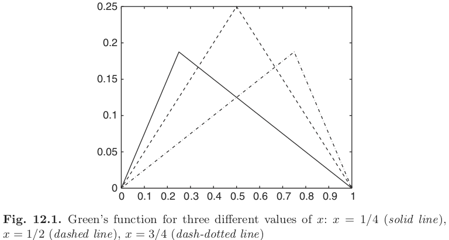
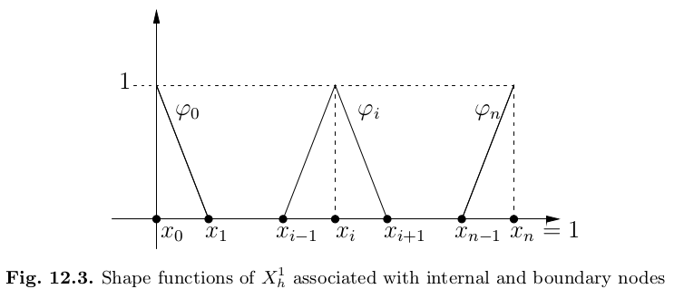

## Finite elements and boundary-value problems

This chapter is devoted to the analysis of approximation methods for two-point boundary value problems for differential equations of elliptic type.

A **boundary-value problem** is a differential equation together with a set of additional constraints, called the **boundary conditions**. A solution to a boundary value problem is a solution to the differential equation which also satisfies the boundary conditions.

<!--The **boundary-value problems** are differential problems set either in an **unidimensional** ($d=1$) or **multidimensional** ($d=2,3$) space for which the value of the unknown solution is given at **endpoints / boundary** (1D/2-3D).-->

<!--For the unidimensional case we have a problem set on an interval $(0,1)$ of the real line $\mathbb R$, where $0$ and $1$ are the endpoints.-->

<!--\begin{cases}-->
<!---u''(x) = f(x), & x \in (0,1) \\-->
<!--u(9) = u(1) = 0-->
<!--\end{cases}-->

<!--For the multidimensional case we have a multidimensional region $\Omega \in \mathbb R^d$ instead, with boundary $\partial \Omega$. In this case the differential equation involves the use of **partial derivatives** w.r.t. spatial coordinates-->

<!--\begin{cases}-->
<!---\Delta u(x) = f(x) & x \in \Omega \\-->
<!--u(x) = 0 & x \in \partial \Omega-->
<!--\end{cases},-->

<!--where $\Delta u = \sum_{i=1}^d \frac{\partial^2 u}{\partial x_i^2}$.-->

<!--The equation $-u''(x) = f(x)$ and $-\Delta u = f$ are called **Poisson equations**. Other settings for boundary-value problems are the **heat** and **wave equations**. More specifically, a boundary-value problem using the Poisson equation with prescribed boundary values is called a **Dirichlet boundary-value problem**. In this setting, $\exist! u \in C^2([0,1])$.-->

<!--In the **Neumann problem**, instead of the regular boundary conditions of the Dirichlet problem, we use $u'(0) = \gamma$ and $u'(1) = \delta$ s.t.--> 

<!--\gamma - \delta = \int_a^b f(x)dx.-->
<!--\nonumber-->

<!--The equivalent for the multidimensional case is prescribing-->

<!--\frac{\partial u}{\partial n} = \nabla u(x) \cdot n(x) = h(x)-->
<!--\nonumber-->

<!--for $h \in \partial \Omega$, where $h$ is a function s.t. $\int_{\partial \Omega} h = -\int_\Omega f$ and $n$ is the normal direction to the boundary $\partial \Omega$.-->

<!--We can use either **finite differences** or **finite elements** to solve these types of problems, partitioning $[0, 1]$ into intervals $I_j = [x_j, x_{j+1}], \forall j=0, \ldots, n$ of length $h = 1/n$, where all $x_j = jh$ are called **nodes**.-->

### A model problem

To start with, let us consider the two-point boundary value problem, called **Poisson's equation in one dimension**
$$
\begin{cases}
−u''(x) = f(x), & 0 < x < 1, \\
u(0) = u(1) = 0.
\end{cases}
\label{eq:Poiss}
$$
From the fundamental theorem of calculus, if $u \in C^2([0, 1])$ and satisfies the differential equation in $\eqref{eq:Poiss}$ then
$$
u(x) = c_1 + c 2 x - \int_0^x F(s) ds,
\nonumber
$$
where $c_1$ and $c_2$ are arbitrary constants and $F(s) = \int_0^s f(t) dt$. Using integration by parts one has
$$
\int_0^x F(s) ds = \Big[sF(s)\Big]^x_0  - \int^x_0 sF'(s) ds = \int^x_0 (x - s)f(s) ds.
\nonumber
$$
The constants $c_1$ and $c_2$ can be determined by enforcing the boundary conditions. The condition $u(0) = 0$ implies that $c_1 = 0$, and then $u(1) = 0$ yields $c_2 = \int_0^1 (1 - s) f(s) ds$. Consequently, the *solution* of $\eqref{eq:Poiss}$ can be written in the following form
$$
u(x) = x \int_0^1 (1 - s) f(s) ds - \int_0^x (x - s) f(s) ds
\nonumber
$$
or, more compactly, the **analytic solution** is
$$
u(x) = \int_0^1 G(x, s) f(s) ds,
\label{eq:Poisssolution}
$$
where, for any fixed $x$, we have defined
$$
G(x, s) = \begin{cases}
s(1 - x) & \text{if } 0 \le s \le x, \\
x(1 − s) & \text{if } x \le s \le 1.
\end{cases}
$$
The function $G$ is called **Green’s function** for the boundary value problem $\eqref{eq:Poiss}$. It is a piecewise linear function of $x$ for fixed $s$, and vice versa. It is continuous, symmetric (i.e., $G(x, s) = G(s, x)$ for all $x, s \in [0, 1]$), non-negative, null if $x$ or $s$ are equal to $0$ or $1$, and $\int^1_0 G(x, s) ds = \frac12 x(1 - x)$. The function is plotted in Figure $12.1$.

We can therefore conclude that for every $f \in C^0([0, 1])$ there is a unique solution $u \in C^2([0, 1])$ of the boundary value problem $\eqref{eq:Poiss}$ which admits the representation $\eqref{eq:Poisssolution}$. Further smoothness of $u$ can be derived by the differential equation in $\eqref{eq:Poiss}$; indeed, if $f \in C^m([0, 1])$ for some $m \ge 0$ then $u \in C^{m+2}([0, 1])$.

An interesting property of the solution $u$ is that if $f \in C^0([0, 1])$ is a non-negative function, then $u$ is also nonnegative. This is referred to as the **monotonicity property**, and follows directly from $\eqref{eq:Poisssolution}$, since $G(x, s) \ge 0$ for all $x, s \in [0, 1]$. The next property is called the **maximum principle** and states that if $f \in C^0([0, 1])$,
$$
||u||_\infty \le \frac18 ||f||_\infty,
\label{eq:inequf}
$$
where $u = \max_{0 \le x \le 1} |u(x)|$ is the maximum norm. Indeed, since $G$ is nonnegative,
$$
|u(x)| \le \int^1_0 G(x, s) |f(s)| ds \le ||f||_\infty \int_0^1 G(x, s) ds = \frac12 x(1 - x) ||f||_\infty
\nonumber
$$
from which the inequality $\eqref{eq:inequf}$ follows.

### Finite difference approximation

By following the same approach we used to approximate $u'(x)$ through finite differences, to approximate $u''(x)$ we apply the Taylor expansion up to the third derivative of $u(x+h)$ and $u(x-h)$ (we have that $x$ is $x_0$ in the formula, while $x \pm h$ is the $x$):
$$
\begin{align*}
u(x+h) &= u(x) + u'(x)h + u''(x) \frac{h^2}2 + u'''(x) \frac{h^3}{6} + O(h^{(4)})\\
u(x-h) &= u(x) - u'(x)h + u''(x) \frac{h^2}2 - u'''(x) \frac{h^3}{6} + O(h^{(4)})
\end{align*}
$$
if we sum them we obtain
$$
u(x+h) + u(x-h) = 2 u(x) + u''(x) h^2 + O(h^{(4)})
\nonumber
$$
So we have that
$$
u''(x) = \frac{u(x+h) + u(x-h) - 2u(x)}{h^2}
\nonumber
$$
This result is valid if $u: [0,1] \to \mathbb R$ is sufficiently smooth in a neighbourhood of $x \in [0,1]$: $u \in C^3([0,1])$.

We introduce on $[0, 1]$ the grid points $\{x_j\}_{j=0}^n$ given by $x_j = jh$, where $n \ge 2$ is an integer and $h = 1/n$ is the grid spacing. Replacing $u''(x_j)$ by its second order  **centered finite differences** the Poisson problem becomes
$$
\begin{cases}
-\frac{u_{j+1} - 2u_j + u_{j-1}}{h^2} = f(x_j), & j=1,\ldots,n-1 \\
u_0 = u_n = 0
\end{cases}
\label{eq:Poisscfd}
$$
where $u_j$ is an approximation of $u(x_j) = u(x_0 + jh)$. So the approximation to the solution $u$ is a finite sequence $\{u_j\}_{j=0}^n$ defined only at the grid points.

If we set $\mathbf u_h = (u_1, \ldots, u_{n-1})^T$ (the unknowns), $\mathbf f = (f_1, f_2, \ldots, f_{n-1})^T$ with $f_i = f(x_i)$, it is a simple matter to see that $\eqref{eq:Poisscfd}$ can be written in a more compact form as a linear system
$$
A_\text{fd} \mathbf u_h = \mathbf f
\label{eq:linsyst}
$$
where $A_\text{fd}$ is the symmetric $(n - 1) \times (n - 1)$ finite difference matrix defined
as
$$
A_\text{fd} = h^{-2}\text{tridiag}_{n-1}(-1,2,-1) = \frac1{h^2}\begin{bmatrix}
-2 & 1 & 0 & & \cdots & & 0 \\
1 & -2 & 1 & 0 & \cdots & & 0 \\
0 & 1 & -2 & 1 & 0 & \cdots & 0 \\
\vdots & & & & & & \vdots \\
0 & & \cdots & & 0 & 1 &  -2
\end{bmatrix}.
\nonumber
$$
This matrix is diagonally dominant by rows; moreover, it is positive definite since for any vector $\mathbf x \in \mathbb R^{n-1}$
$$
\mathbf x^T A_\text{fd} \mathbf x = h^{-2} \left[ x^2_1 + x^2_{n-1} + \sum_{i=2}^{n-1} (x_i - x_{i-1})^2 \right] > 0.
\nonumber
$$
So, $A$ being symmetric and positive definite implies that $\eqref{eq:linsyst}$ admits a unique solution, and can be solved with the Thomas algorithm.

For small $h$ (large $N$), the matrix $A$ is ill-conditioned, since $K(A) = \frac{\lambda_\max}{\lambda_\min} = Ch^{-2}$. Thus appropriate methods and precautions should be used.

In order to rewrite $\eqref{eq:Poisscfd}$ in operator form, let $V_h$ be a collection of discrete functions defined at the grid points $x_j$ for $j = 0, \ldots, n$. If $v_h \in V_h$, then $v_h(x_j)$ is defined for all $j$ and we sometimes use the shorthand notation $v_j$ instead of $v_h(x_j)$. Next, we let $V_h^0$ be the subset of $V_h$ containing discrete functions that are zero at the endpoints $x_0$ and $x_n$. For a function $w_h$ we define the operator $L_h$ by
$$
(L_h w_h)(x_j) = -\frac{w_{j+1} - 2w_j + w_{j-1}}{h^2}, \quad\quad j = 1, \ldots, n  - 1,
$$
and reformulate the finite difference problem $\eqref{eq:Poisscfd}$ equivalently as: *find $u_h \in
V_h^0$ such that*
$$
(L_h u_h)(x_j) = f(x_j) \quad\quad \text{for } j = 1, \ldots, n - 1.
$$
Notice that, in this formulation, the boundary conditions are taken care of by the requirement that $u_h \in V_h^0$.

Finite differences can be used to provide approximations of higher-order differential operators than the one considered in this section. An example is carrying out the finite difference centered discretization of the fourth-order derivative $-u^{(iv)}(x)$ by applying twice the discrete operator $L_h$. Again, extra care is needed to properly handle the boundary conditions.

In general, finite differences requires too much regularity ($u \in C^2$ and $f \in C^1$) so more flexible methods are used, like **finite elements**.

For two discrete functions $w_h, v_h \in V_h$ we define the **discrete inner product**
$$
(w_h, v_h)_h = h \sum_{k=0}^n c_k w_k v_k,
\nonumber
$$
with $c_0 = c_n = 1/2$ and $c_k = 1$ for $k = 1, \ldots, n-1$. This is nothing but the composite trapezoidal rule which is here used to evaluate the inner product $(w, v) = \int_0^1 w(x)v(x)dx$. Clearly,
$$
||v_h||_h = (v_h, v_h)_h^{1/2}
\nonumber
$$
is a norm on $V_h$.

### Integral formulation of boundary value problems

Let's perform a reformulation of the Poisson problem.

We multiply both sides of the so-called **strong formulation** of the Poisson equation $-u''(x) = f(x), \;x \in (0, 1)$, by $v \in C^1([0,1])$, hereafter called a “test function”, and integrate over the interval $[0,1]$:
$$
-\int_0^1 u''(x)v(x) dx = \int_0^1 f(x)v(x) dx, \quad \forall v \in V
\nonumber
$$
where $V$ is the test function space: it consists of all functions $v$ that are continuous, vanish at $x = 0$ and $x = 1$ and whose first derivative is *piecewise continuous*, i.e., continuous everywhere except at a finite number of points in $[0, 1]$ where the left and right limits $v'_-$ and $v'_+$ exist but do not necessarily coincide. $V$ is actually a vector space which is denoted by $H^1_0(0, 1)$. Precisely,
$$
\begin{equation}
  \begin{aligned}
  H^1_0(0, 1) &= \{ v \in L^2(0, 1): v' \in L^2(0, 1), v(0) = v(1) = 0\}\\
  &= \{v: \int_0^1 v^2 < + \infty, \int_0^1 v' < +\infty, v(0)=v(1)=0 \},
  \end{aligned}
\end{equation}
$$
where $v'$ is the distributional derivative of $v$. It is an Hilbert space where the integral of the square is finite ($L^2$) (it is a Sobolev  space).

By using integration by parts on the left integral ($f'=u''$ and $g=v$), we obtain
$$
-\Big[u'(x)v(x)\Big]_0^1 + \int_0^1 u'(x)v'(x) dx = \int_0^1 f(x)v(x)dx
\nonumber
$$
and assuming that $v$ vanishes at endpoints $x=0$ and $x=1$, since $v \in V$ follows boundary conditions, we get:
$$
\begin{cases}
\int_0^1 u'(x)v'(x) dx = \int_0^1 f(x)v(x)dx & \forall v \in C^1([0,1]) \\
v(0)=v(1)=0.
\end{cases}
\nonumber
$$
We have therefore shown that if a function $u \in C^2([0, 1])$ satisfies $\eqref{eq:Poiss}$, then $u$ is also a solution of the following problem
$$
\text{find } u \in V = H^1_0(0, 1): \; a(u, v) = (f, v) \; \text{ for all } v \in V = H^1_0(0, 1),
\label{pb:Poissweak}
$$
where now $(f, v) = \int^1_0 f v \; dx$ denotes the scalar product of $L^2(0, 1)$ and
$$
a(u, v) = \int_0^1 u' v' dx
$$
is a **bilinear form**, i.e. it is linear with respect to both arguments $u$ and $v$. Problem $\eqref{pb:Poissweak}$ is called the **weak formulation** of problem $\eqref{eq:Poiss}$. Since $\eqref{pb:Poissweak}$ contains only the first derivative of $u$ it might cover cases in which a classical solution $u \in C^2 ([a, b])$ of $\eqref{eq:Poiss}$ does not exist although the physical problem is well defined.

### The Galerkin method

We now derive the Galerkin approximation of problem $\eqref{eq:Poiss}$, which is the basic ingredient of the finite element method, widely employed in the numerical approximation of boundary value problems.

Unlike the finite difference method which stems directly from the differential (or *strong*) form $\eqref{eq:Poiss}$, the Galerkin method is based on the weak formulation $\eqref{pb:Poissweak}$. If $V_h$ is a finite dimensional vector subspace of $V$, $V_h \subseteq V$, the **Galerkin method** consists of approximating $\eqref{pb:Poissweak}$ by the problem
$$
\text{find } u_h \in V_h: a(u_h, v_h) = (f, v_h) \quad \forall v_h \in V_h.
\label{pb:Poissmethod}
$$
This is a finite dimensional problem. Actually, let $\{\phi_1, \ldots, \phi_N\}$ denote a basis of $V_h$, i.e. a set of $N$ linearly independent functions of $V_h$. Then we can write
$$
u_h(x) = \sum_{j=1}^N u_j \varphi_j(x).
\nonumber
$$
The integer $N$ denotes the dimension of the vector space $V_h$. Taking $v_h = \varphi_i$ for $i=1,\ldots,N$ in $\eqref{pb:Poissmethod}$, it turns out that the Galerkin problem $\eqref{pb:Poissmethod}$ is equivalent to seeking $N$ unknown coefficients $\{u_1, \ldots, u_N\}$ such that
$$
\sum_{j=1}^N u_j a(\varphi_j, \varphi_i) = (f, \varphi_i) \quad \forall i = 1, \ldots, N,
\label{eq:newpb}
$$
where we have used the linearity of $a(\cdot, \cdot)$ with respect to its first argument, since
$$
a(\sum_{j=1}^N u_j \varphi_j, \varphi_i) = \int_0^1 \left(\sum_{j=1}^N u_j \varphi_j\right)' \varphi'_i dx = \int_0^1 \sum_{j=1}^N u_j \varphi_j' \varphi'_i dx = \sum_{j=1}^N u_j \int_0^1 \varphi_j' \varphi'_i dx = \sum_{j=1}^N u_j a(\varphi_j, \varphi_i).
\nonumber
$$
If we introduce the matrix $A_G = (a_{ij})$, $a_{ij} = a(\varphi_j, \varphi_i$) (called the **stiffness matrix**), the unknown vector $\mathbf u = [u_1, \ldots, u_N]^T$ and the right-hand side vector $\mathbf f_G = [f_1, \ldots, f_N]^T$, with $f_i = (f, \varphi_i) = \int_0^1 f\varphi_i \, dx$, we see that $\eqref{eq:newpb}$ is equivalent to the linear system
$$
A_G \mathbf u = \mathbf f_G.
\label{eq:stiffness}
$$
The structure of $A_G$, as well as the degree of accuracy of $u_h$, depends on the form of the basis functions $\{\varphi_i\}$, and therefore on the choice of $V_h$.

There are two remarkable instances, the finite element method, where $V_h$ is a space of piecewise polynomials over subintervals of $[0, 1]$ of length not greater than $h$ which are continuous and vanish at the endpoints $x = 0$ and $1$, and the spectral method in which $V_h$ is a space of algebraic polynomials still
vanishing at the endpoints $x = 0, 1$.

### The finite element method

The **finite element method (FEM)** is an alternative to the finite differences for boundary-value problems, derived from a reformulation of the Poisson problem. It is a special technique for constructing a subspace $V_h$ in $\eqref{pb:Poissmethod}$ based on the piecewise polynomial interpolation.

With this aim, we introduce a partition $\mathcal T_h$ of $[0,1]$ into $n$ subintervals $I_j = [x_j , x_{j+1}]$, $n \ge 2$, of width $h_j = x_{j+1} - x_j$, $j = 0, \ldots, n-1$, with
$$
0 = x_0 < x_1 < \ldots < x_{n-1} < x_n = 1
\nonumber
$$
and let $h = \max_{\mathcal T_h} (h_j)$. Since functions in $H^1_0(0, 1)$ are continuous it makes sense to consider for $k \ge 1$ the family of piecewise polynomials $X_h^k$ defined as
$$
X_h^k = \{v \in C^0([0,1]): v|_{I_j} \in \mathbb P^k(I_j), \forall I_j \in \mathcal T_h \}
$$
<!--which is the space of the continuous functions over $[0,1]$ whose restrictions on each $I_j$ are polynomials of degree $\le k$.-->

Any function $v_h \in X_h^k$ is a continuous piecewise polynomial (finite elements) over $[0, 1]$ and its restriction over each interval $I_j \in \mathcal T_h$ is a polynomial of degree $\le k$. In the following we shall mainly deal with the cases $k = 1$ and $k = 2$.

Then, we set
$$
V_h = X_h^{k,0} = \{ v_h \in X_h^k: v_h(0) = v_h(1) = 0 \}.
$$
The dimension $N$ of the finite element space $V_h$ is equal to $nk - 1$.

<!--To solve the weak formulation, we build $V_h \subset V$ a finite subspace such that-->

<!--V_h = \text{span}\{v_i\}_{i=0}^{N_h}, \quad \dim(V_h) = N_h + 1-->
<!--\nonumber-->

<!--and project the problem in that space, called the **finite elements space** of degree $1$.-->

Let us now focus on how to generate a suitable basis $\{\varphi_j\}$ for the finite element space $X_h^k$ in the special cases $k = 1$. The basic point is to *choose* appropriately a set of degrees of freedom for each element $I_j$ of the partition $\mathcal T_h$ (i.e., the parameters which permit uniquely identifying a function in $X_h^k$). The generic function $v_h$ in $X_h^k$ can therefore be written as
$$
v_h(x) = \sum_{i=0}^{nk} v_i \varphi_i(x),
\nonumber
$$
where $\{v_i\}$ denote the set of the degrees of freedom of $v_h$ and the **basis functions** $\varphi_i$ (which are also called **shape functions**) are assumed to satisfy the **Lagrange interpolation property** $\varphi_i (x_j) = \delta_{ij}$, $i, j = 0, \ldots, n$, where $\delta_{ij}$ is the Kronecker symbol.

**The space $X_h^1$**
This space consists of all continuous and piecewise linear functions over the partition $\mathcal T_h$. Since a unique straight line passes through two distinct nodes the number of degrees of freedom for $v_h$ is equal to the number $n + 1$ of nodes in the partition. As a consequence, $n + 1$ shape functions $\varphi_i , i = 0, \ldots, n$, are needed to completely span the space $X_h^1$. The most **natural choice** for $\varphi_i, i = 1, \ldots, n - 1$, is
$$
\varphi_i(x) = \begin{cases}
\frac{x-x_{i-1}}{x_i - x_{i-1}} & \text{for } x_{i-1} \le x \le x_i, \\
\frac{x_{i+1} - x}{x_{i+1} - x_i} & \text{for } x_i \le x \le x_{i+1}, \\
0 & \text{elsewhere.}
\end{cases}
$$
The shape function $\varphi_i$ is thus piecewise linear over $\mathcal T_h$, its value is $1$ at the node $x_i$ and $0$ at all the other nodes of the partition. Its support (i.e., the subset of $[0, 1]$ where $\varphi_i$ is nonvanishing) consists of the union of the intervals $I_{i-1}$ and $I_i$ if $1 \le i \le n - 1$ while it coincides with the interval $I_0$ (respectively $I_{n-1}$) if $i = 0$ (resp., $i = n$).

<!--Functions in $V_h$ are piecewise polynomial (finite elements) (linear in $V_h^0$, else or order $n$) which can be expressed thanks to a *specific* function basis $\varphi$, defined as:-->

<!--v_h(x) = \sum_{j=1}^N v_h(x_j) \varphi_j(x) \quad \text{where} \quad \varphi_j(x) = \begin{cases}
\frac{x-x_{j-1}}{x_j - x_{j-1}} & \text{for } x_{j-1} \le x \le x_j, \\-->
<!--\frac{x_{j+1} - x}{x_{j+1} - x_j} & \text{for } x_j \le x \le x_{j+1}, \\-->
<!--0 & \text{elsewhere}-->
<!--\end{cases}-->
<!--\nonumber-->

<!--The functions $\varphi_j, \; j=1,\ldots,N$ are called **shape** or **hat functions** and provide a basis for $V_h^0$.-->

Let's take the weak formulation equation $\int_0^1 u_h'(x)v_h'(x) dx = \int_0^1 f(x)v_h(x)dx$.

We want to find $u_h \in V_h$ s.t. $u_h(0) = \alpha, u_h(1) = \beta$ and:
$$
\forall v_h \in V_h^0 \quad\quad \sum_{i=0}^N \int_{x_i}^{x_{i+1}} u'_h(x)v'_h(x) dx = \int_0^1 f(x)v_h(x)dx
\nonumber
$$
Since $|x_j - x_{j-1}|=h$ and the derivative of $\varphi_i(x)$ correspond to the shape of the line, we have that
$$
\varphi'_i(x) = \begin{cases}
\frac1h & x \in [x_{i-1}, x_i] \\
-\frac1h & x \in [x_i, x_{i+1}] \\
0 & \text{otherwise}
\end{cases}
\nonumber
$$
So we have that $u_h(x) = \sum_{j=1}^N u_j \varphi_j(x)$, that leads to $u'_h(x) = \left(\sum_{j=1}^N u_j \varphi_j(x)\right)' = \sum_{j=1}^N u_j \varphi'_j(x)$, and we take $v_h(x) = \varphi_i(x), \; \forall i=1,\ldots,N$, that leads to $v'_h(x) = \varphi'_i(x)$, and we can rewrite as
$$
\begin{align*}
\int_0^1 \sum_{j=1}^N u_j \varphi'_j(x) \cdot \varphi'_i(x) dx &= \int_0^1 f(x) \varphi_i(x) dx\\
\sum_{j=1}^N u_j \int_0^1 \varphi'_j(x)\varphi'_i(x) dx &= \int_0^1 f(x) \varphi_i(x) dx
\end{align*}
$$
for all $i = 1,\ldots,N$, finding the system
$$
A_\text{fe} \mathbf u = \mathbf f
\nonumber
$$
where $\mathbf u=(u_1,\ldots,u_N)$ is the vector of the unknowns coefficients $u_j$, $\mathbf f=(f_1,\ldots,f_N)$ is the vector of $f_i = \int_0^1 f(x)\varphi_i(x)dx$ and $A_\text{fe} =(a_{ij})$ where $a_{ij} = a(\varphi_j, \varphi_i) = \int_0^1 \varphi'_j(x) \varphi'_i(x)dx$.

Then using the precedent formulation of the basis $\varphi_i$ we have that
$$
A_\text{fe} = \begin{cases}
0 & \text{when } |i - j| \ge 2 \\
\int_{x_{i-1}}^{x_{i+1}} \varphi'_i(x)^2 dx = \frac1{h^2}\int_{x_{i-1}}^{x_{i+1}} dx = \frac{2h}{h^2} = \frac2h & \text{when } i=j\\
\int_{x_i}^{x_{i+1}} \varphi'_i(x) \varphi'_{i-1}(x) dx = -\frac1{h^2}\int_{x_i}^{x_{i+1}} dx = -\frac{h}{h^2} = -\frac1h & \text{when } |i-j|=1
\end{cases}
\nonumber
$$
so we have that
$$
A_\text{fe} = \frac1h \begin{bmatrix}
-2 & 1 & 0 & & \cdots & & 0 \\
1 & -2 & 1 & 0 & \cdots & & 0 \\
0 & 1 & -2 & 1 & 0 & \cdots & 0 \\
\vdots & & & & & & \vdots \\
0 & & \cdots & & 0 & 1 &  -2
\end{bmatrix}
\nonumber
$$
The matrix is similar to the one of the finite difference, $A_\text{fd}$, but with $\frac1h$ instead of $\frac1{h^2}$.

The final system has different right-hand side and different solution than the FD one, but have the same accuracy w.r.t. $h$.

FD works (converges) for $f \in C^2([0, 1])$ while FE converges if $\int_0^1 f^2(x)dx < \infty$. Using polynomials with $d>1$ allows for greater convergence, and leads to different matrices.

Let us now examine the structure and the basic properties of the stiffness matrix associated with system $\eqref{eq:stiffness}$ in the case of the finite element method ($A_G = A_\text{fe}$). Since the finite element basis functions for $X_h^k$ have a local support, $A_\text{fe}$ is sparse. In the particular case $k = 1$, the support of the shape function $\varphi_i$ is the union of the intervals $I_{i-1}$ and $I_i$ if $1 \le i \le n - 1$, and it coincides with the interval $I_0$ (respectively $I_{n-1}$) if $i = 0$ (resp., $i = n$). As a consequence, for a fixed $i = 1, \ldots, n - 1$, only the shape functions $\varphi_{i-1}$ and $\varphi_{i+1}$ have a nonvanishing support intersection with that of $\varphi_i$, which implies that $A_\text{fe}$ is tridiagonal since $a_{ij} = 0$ if $j \not\in \{i - 1, i, i + 1\}$.

The condition number of $A_\text{fe}$ is a function of the grid size $h$; indeed, it holds
$$
K_2 (A_\text{fe}) = ||A_\text{fe}||_2 \, ||A^{-1}_\text{fe}||_2 = O(h^{-2})
\nonumber
$$
which demonstrates that the conditioning of the finite element system $\eqref{eq:stiffness}$ grows rapidly as $h \to 0$. This is clearly conflicting with the need of increasing the accuracy of the approximation and, in multidimensional problems, demands suitable preconditioning techniques if iterative solvers are used.

**Remark** (Elliptic problems of higher order)**.** The Galerkin method in general, and the finite element method in particular, can also be applied to other type of elliptic equations, for instance to those of fourth order. In that case, the numerical solution (as well as the test functions) should be continuous together with their first derivative.

### Analysis of the Galerkin method

We will state a couple of general results that hold for any Galerkin problem $\eqref{pb:Poissmethod}$.

**Theorem** (Lax-Milgram Lemma)**.** *Let $V$ be an Hilbert space, endowed with norm $||\cdot||_V$, and let $a(\cdot,\cdot): V \times V \rightarrow \mathbb R$ be a map that satisfies the following properties:*

- ***bilinearity****: $\forall u, v \in V, a(u, \cdot)$ and $a(\cdot, v)$ are linear, a.k.a. it is linear in both variables: $\forall \alpha,\beta \in \mathbb R, \forall u, v, w \in V$*
  $$
  a(\alpha u + \beta v, w) = \alpha a(u,w) + \beta a(v, w) \\
  a(u, \alpha v + \beta w) = \alpha a(u,v) + \beta a(u, w).
  \nonumber
  $$

- **continuity**: $\exist M > 0$ s.t. $|a(u,v)| \le M ||u||_V ||v||_V, \; \forall u,v \in V$.

- **coercivity**: $\exist \alpha_0 > 0$ s.t. $a(v,v) \ge \alpha_0 ||v||_V^2, \; \forall v \in V$.

*Moreover, let the following inequality hold*
$$
|(f,v)| \le K ||v||_V \quad\quad \forall v \in V.
\nonumber
$$
*Then both problems $\eqref{pb:Poissweak}$ and $\eqref{pb:Poissmethod}$ admit unique solutions that satisfies*
$$
||u||_V \le \frac M{\alpha_0}, \quad\quad ||u_h||_V \le \frac M{\alpha_0}.
\nonumber
$$
So the Lax-Milgram theorem is used to prove the existence and uniqueness for both the weak formulation of Poisson problem and the Galerkin method.

**Remark.** For every $v_h \in V_h^0$, the grid function $v_h$ whose grid values are $(v_{j+1} - v_j)/h$, $j = 0, \ldots, n - 1$, can be regarded as a discrete derivative of $v_h$.

**Poincaré inequality.** *For every interval $[a,b]$ there exists a constant $C_P > 0$ such that*
$$
||v||_{L^2(a,b)} \le C_P ||v^{(1)}||_{L^2(a,b)}
$$
*for all $v \in C^1([a,b])$ such that $v(a)=v(b)=0$ and where $||\cdot||_{L^2(a,b)}$ is the norm in $L^2(a,b)$*:
$$
||f||_{L^2(a,b)} = \left( \int_a^b |f(x)|^2 dx \right)^{1/2},
\nonumber
$$
*and the space $L^2(a,b)$ is defined as*
$$
L^2(a,b) = \left\{ f: (a,b) \rightarrow \mathbb R, \int_a^b |f(x)|^2 dx < + \infty \right\}.
\nonumber
$$
We endow the space $H^1_0(0, 1)$ with the following norm
$$
|v|_{H^1}(0,1) = \left\{ \int^1_0 |v'(x)|^2 dx \right\}^{1/2}.
\nonumber
$$
**Property:** *Provided that $f \in L^2(0,1)$, the norm of the Galerkin solution $u_h$ remains bounded:*
$$
|u_h|_{H^1(0,1)} = \frac{C_P}{\alpha_0} ||f||_{L^2(0,1)}
\label{eq:stability}
$$
**Proof.** Taking $v_h = u_h$ in $\eqref{pb:Poissmethod}$, we obtain
$$
\alpha_0 |u_h|^2_{H^1(0,1)} \le \int_0^1 u'_hu'_h dx = a(u_h,u_h) = (f, u_h) \le ||f||_{L^2(0,1)}||u_h||_{L^2(0,1)}
\nonumber
$$
where we have used the *Cauchy-Schwartz inequality*
$$
\left| \int_\alpha^\beta u(x) v(x) dx \right| \le \left( \int_\alpha^\beta u^2(x)dx \right)^{1/2} \left( \int_\alpha^\beta v^2(x)dx \right)^{1/2}
\nonumber
$$
to set the right-hand side inequality. Owing to the Poincaré inequality we have the inequality $\eqref{eq:stability}$.

This represents a **stability** result for the solution of the Galerkin problem $\eqref{pb:Poissmethod}$, since we have that it admits a unique solution depending continuously on the data.

<!--Also, given the Lax-Milgram Lemma, on a finite dimensional subspace $V_h \subset V$ with $V_h = \text{span} \{v_i\}_{i=0}^N$, we have that $\exist!$ a solution $u_h \in V_h$ to the problem $a(u_h, v) = (f,v), \; \forall v \in V_h$. So we have that the system $Au=F$  where $A=(a_{ij}), a_{ij} = a(v_j, v_i)$ and $F_i = (f,v_i)$.-->

**Céa's Lemma.** *The following error inequality holds*
$$
||u-u_h||_V \le \frac M{\alpha_0} \min_{w_h \in V_h} ||u-w_h||_V.
\nonumber
$$
**Proof.** Subtracting $\eqref{pb:Poissmethod}$ from $\eqref{pb:Poissweak}$ (where we use $v_h \in V_h \subset V$), owing to the bilinearity of the form $a(\cdot,\cdot)$, we obtain
$$
a(u,v_h) - a(u_h, v_h) = (f,v_h) - (f,v_h)  \quad \Longrightarrow \quad a(u-u_h,v_h) = 0 \quad\quad\forall v_h \in V_h
\label{eq:step1}
$$
Besides, we have that
$$
\begin{align*}
\alpha_0 ||u-u_h||_V^2 &\le a (u-u_h, u-u_h)  &\text{[coercivity]} \\
&= a(u-u_h, u-w_h) + a(u-u_h, w_h - u_h) \quad \forall w_h \in V_h &\text{[linearity]} \\
&= a(u-u_h,u-w_h) + 0  \quad \forall w_h \in V_h  &\text{[for }\eqref{eq:step1} \text{ since } w_h-u_h \in V_h\text{]} \\
&\le M ||u-u_h||_V \; ||u-w_h||_V \quad \forall w_h \in V_h & \text{[continuity]}
\end{align*}
$$
So we have that $||u-u_h||_V \le \frac M{\alpha_0} ||u-w_h||_V, \forall w_h \in V_h$,  which is also valid for the minimum, so $||u-u_h||_V \le \frac M{\alpha_0} \min_{w_h \in V_h} ||u-w_h||_V$, which proves the theorem.

So this proves the **convergence** of the Galerkin problem, since $e(x) = u(x) - u_h(x)$ is the error.

<!--Instead, the **consistency** is proven since both sides of the Poisson equation vanish when $h \to 0$, thus-->

<!--\lim_{h \to 0} \tau_h(x_i,y_i) = 0, \quad\quad (x_i,y_i) \in \Delta_h/\partial\Delta_h-->
<!--\nonumber-->

<!--and so the Galerkin method is valid (?!? → see pag. 545 of the book *Numerical Mathematics*).-->

